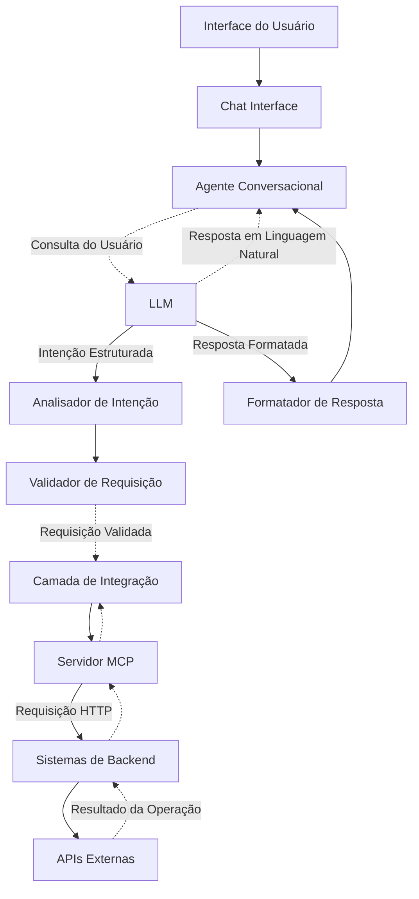

# TCC - Transformando APIs em Interfaces Conversacionais

[](https://deepwiki.com/Castrozan/tcc)

> **Validação da Abordagem OpenAPI-MCP para Agentes Baseados em IA**  
> *Trabalho de Conclusão de Curso - Engenharia de Software*  
> **Autor:** Lucas de Castro Zanoni | **Orientador:** Thyerri Fernandes Mezzari  
> **Instituição:** Centro Universitário UniSATC

## 📖 Navegação Rápida

| 🎯 **Seu Objetivo**          | 📋 **Comece Aqui**                                                      | ⏱️ **Tempo** |
| --------------------------- | ---------------------------------------------------------------------- | ----------- |
| **Entender a pesquisa**     | [📚 Guia Rápido - Acadêmico](QUICK_START.md#📖-sou-acadêmicopesquisador) | 5-15 min    |
| **Usar a ferramenta**       | [💻 Guia Rápido - Desenvolvedor](QUICK_START.md#💻-sou-desenvolvedor)    | 5-10 min    |
| **Reproduzir experimentos** | [🔬 Guia Rápido - Pesquisador](QUICK_START.md#🔬-sou-pesquisador-em-ia)  | 20 min      |
| **Avaliar comercialmente**  | [🏢 Guia Rápido - Empresa](QUICK_START.md#🏢-sou-profissionalempresa)    | 15 min      |
| **Navegar documentação**    | [📚 Índice Completo](DOCUMENTATION_INDEX.md)                            | Referência  |

---

## 📖 Sobre a Pesquisa

Este TCC investiga como **especificações OpenAPI podem ser automaticamente convertidas em servidores MCP** (Model Context Protocol), permitindo que modelos de linguagem de grande escala (LLMs) interajam com sistemas existentes através de **interfaces conversacionais naturais**.

### 🎯 Problema de Pesquisa
> *"Como a combinação da especificação OpenAPI com o protocolo MCP pode facilitar a integração eficiente e segura de agentes conversacionais baseados em IA com sistemas web existentes, contribuindo para a democratização do acesso a tecnologias complexas?"*

### 🎯 Principais Objetivos
- **Desenvolver** um gerador automático de servidores MCP a partir de especificações OpenAPI
- **Implementar** um cliente de chat capaz de gerenciar múltiplos servidores MCP simultaneamente
- **Validar** a abordagem através de testes experimentais rigorosos
- **Avaliar** desempenho, segurança e experiência do usuário

---

## 🏆 Principais Contribuições Científicas

### ✅ Resultados Experimentais Validados

| **Métrica**                     | **Resultado**                   | **Observações**               |
| ------------------------------- | ------------------------------- | ----------------------------- |
| **Conversão OpenAPI→MCP**       | 100% sucesso (10/10 endpoints)  | Automação completa            |
| **Taxa de Sucesso Operacional** | 100% (8/8 consultas)            | Robustez funcional            |
| **Experiência do Usuário**      | 4.0/5.0                         | Satisfação geral              |
| **Proteção de Segurança**       | 100% (16/16 ataques bloqueados) | Resistência a ataques básicos |
| **Tempo de Resposta Médio**     | 3.757ms                         | Variação: 1.335-5.823ms       |

### 🔬 Inovações Técnicas
1. **Geração Automática de Ferramentas MCP**: Conversão sistemática OpenAPI→MCP
2. **Orquestração Multi-Servidor**: Coordenação inteligente de múltiplos servidores MCP
3. **Integração Padronizada**: Ponte entre LLMs e APIs existentes
4. **Metodologia Reproduzível**: Framework experimental com métricas objetivas

---

## 🏗️ Arquitetura da Solução



### 🧩 Componentes Principais

#### 1. **Gerador Automático de Servidores MCP** (`mcp-openapi-server/`)
- **Análise Sintática**: Parser e validação de especificações OpenAPI 3.0+
- **Mapeamento Semântico**: Conversão inteligente OpenAPI → ferramentas MCP
- **Geração de Ferramentas**: Criação automática de servidores MCP funcionais
- **Transporte Dual**: Suporte para stdio e HTTP

#### 2. **Cliente de Chat Multi-Servidor** (`chat-client/`)
- **Interface Minimalista**: Design padronizado para testes objetivos
- **Coordenação Distribuída**: Gerenciamento de múltiplos servidores MCP
- **Descoberta Automática**: Identificação dinâmica de ferramentas disponíveis
- **Testes E2E**: Suite completa com Playwright

#### 3. **Aplicações de Teste** (`equipments-dummy-app/` & `professionals-dummy-app/`)
- **APIs RESTful**: Implementações com Hono.js, TypeScript e PostgreSQL
- **Documentação OpenAPI**: Especificações completas para validação
- **Cenários Reais**: Simulação de sistemas empresariais

#### 4. **Framework de Validação**
- **Testes Automatizados**: Métricas de performance, segurança e UX
- **Red Teaming**: Testes adversários para validação de segurança
- **Instrumentação**: Coleta objetiva de dados experimentais

---

## 📚 Documentação Acadêmica

### 📄 Artigo Completo
- **[📖 Artigo Principal](article/article.pdf)** - Documento completo em PDF
- **[📝 Fonte Markdown](article/article.md)** - Texto fonte em Markdown
- **[📚 Referências](article/references.bib)** - Bibliografia em BibTeX

### 📋 Documentação de Pesquisa
- **[🎯 Pré-Projeto](pre-projeto.md)** - Objetivos, problema e justificativa
- **[📖 Notas de Desenvolvimento](notes.md)** - Anotações e ideias durante o desenvolvimento
- **[💡 Ideias de Tema](theme-ideas.md)** - Processo de escolha e refinamento do tema
- **[🔖 Bookmarks](bookmarks/bookmarks.json)** - Links de pesquisa organizados

### 🔬 Metodologia Científica
- **Abordagem Experimental**: Validação empírica com controle de variáveis
- **Métricas Objetivas**: Performance, segurança e experiência do usuário
- **Testes Reproduzíveis**: Framework automatizado para validação
- **Análise Estatística**: Dados quantitativos com intervalos de confiança

---

## 🚀 Começando

### 📋 Pré-requisitos
- Node.js 20+
- npm ou yarn
- Git

### ⚡ Instalação Rápida

```bash
# 1. Clone o repositório
git clone https://github.com/Castrozan/TCC.git
cd TCC

# 2. Configure o ambiente
npm install

# 3. Inicie o MCP Server Manager
cd mcp-openapi-server
npm install
npm run build

# 4. Inicie o cliente de chat
cd ../chat-client
npm install
npm run dev
```

### 🧪 Executando os Testes

```bash
# Testes E2E do cliente de chat
cd chat-client
npm test

# Testes do servidor MCP
cd ../mcp-openapi-server
npm test
```

---

## 🛠️ Uso Prático

### 1. **Gerando Servidores MCP Automaticamente**

```bash
# Via NPX (recomendado)
npx @ivotoby/openapi-mcp-server \
  --api-base-url https://api.exemplo.com \
  --openapi-spec https://api.exemplo.com/openapi.json \
  --headers "Authorization:Bearer token123"

# Modo HTTP para clientes web
npx @ivotoby/openapi-mcp-server \
  --transport http \
  --port 3000
```

### 2. **Configurando Cliente de Chat**
- Acesse `http://localhost:5500` após iniciar o cliente
- Configure novos servidores MCP via interface gráfica
- Execute comandos em linguagem natural

### 3. **Integrando com Claude Desktop**

```json
{
  "mcpServers": {
    "openapi": {
      "command": "npx",
      "args": ["-y", "@ivotoby/openapi-mcp-server"],
      "env": {
        "API_BASE_URL": "https://api.exemplo.com",
        "OPENAPI_SPEC_PATH": "https://api.exemplo.com/openapi.json"
      }
    }
  }
}
```

---

## 📊 Resultados de Pesquisa

### 🎯 Performance Validada
- **100% de conversão** OpenAPI → MCP bem-sucedida
- **Tempo médio de resposta**: 3.757ms (variação controlada)
- **Taxa de sucesso**: 100% em cenários testados

### 🔒 Segurança Comprovada
- **Proteção contra ataques básicos**: 100% eficácia
- **Validação de entrada**: Schemas OpenAPI como primeira linha de defesa
- **Resistência a prompt injection**: Testes de red teaming aprovados

### 😊 Experiência do Usuário
- **Satisfação geral**: 4.0/5.0
- **Utilidade das informações**: 4.3/5.0
- **Clareza da comunicação**: 4.0/5.0

---

## 🔮 Trabalhos Futuros

### 🎯 Próximos Passos Identificados
1. **Otimização de Performance**: Implementar cache inteligente e estratégias de otimização
2. **Validação Empresarial**: Testes em ambientes de produção de larga escala
3. **Segurança Avançada**: Avaliar ameaças sofisticadas e ataques persistentes
4. **Escalabilidade**: Coordenação de dezenas/centenas de servidores MCP
5. **Comparação**: Estudos comparativos com outras abordagens de integração
6. **Especificações Adicionais**: Suporte para GraphQL e outros padrões

### 🌟 Impacto Esperado
- **Democratização Tecnológica**: Acesso simplificado a sistemas complexos
- **Redução de Complexidade**: Eliminação de desenvolvimento manual recorrente
- **Inclusão Digital**: Interfaces mais acessíveis e intuitivas
- **Inovação Empresarial**: Facilitação de adoção de IA conversacional

---

## 🔄 Workflow de Desenvolvimento Acadêmico

### 📝 Por que este Workflow?

Este TCC foi desenvolvido seguindo um **workflow orientado a código e versionamento**, com várias vantagens:

1. **📚 Versionamento Completo**: Todo conteúdo (código + texto acadêmico) versionado com Git
2. **✍️ Markdown + LaTeX**: Facilidade de escrita + poder de formatação acadêmica
3. **🔗 Gestão de Referências**: BibTeX para consistência bibliográfica
4. **⚙️ Automação**: Scripts para conversão Markdown → LaTeX → PDF
5. **🔧 Integração**: Código e documentação no mesmo repositório
6. **🔁 Reprodutibilidade**: Qualquer pessoa pode reproduzir o ambiente
7. **👥 Colaboração**: Formato texto facilita revisões e sugestões

### 🛠️ Comandos Úteis

```bash
# Gerar o artigo em PDF
cd article
make pdf

# Salvar bookmarks de pesquisa
make save-bookmarks

# Aplicar configuração do Claude
make apply-claude-config
```

---

## 📁 Estrutura do Projeto

```
TCC/
├── 📄 README.md                     # Este arquivo
├── 📄 pre-projeto.md                # Proposta inicial da pesquisa
├── 🛠️ Makefile                     # Comandos de automação
│
├── 📚 article/                      # Documentação acadêmica
│   ├── 📖 article.md               # Artigo principal (fonte)
│   ├── 📄 article.pdf              # Artigo final compilado
│   ├── 📚 references.bib           # Referências bibliográficas
│   ├── 🖼️ images/                  # Figuras e diagramas
│   └── ⚙️ Makefile                 # Compilação LaTeX
│
├── 🤖 mcp-openapi-server/          # Gerador automático MCP
│   ├── 📦 package.json
│   ├── 🔧 src/                     # Código fonte
│   ├── 🧪 test/                    # Testes unitários
│   └── 📖 README.md                # Documentação técnica
│
├── 💬 chat-client/                  # Cliente multi-servidor
│   ├── 🌐 chat.html                # Interface web
│   ├── ⚙️ backend-server.js        # Servidor backend
│   ├── 🧪 tests/                   # Testes E2E
│   └── 📊 test-results/            # Resultados experimentais
│
├── 🏭 equipments-dummy-app/         # App teste - Equipamentos
├── 👥 professionals-dummy-app/      # App teste - Profissionais
│
└── 🔖 bookmarks/                    # Pesquisa organizada
    ├── 📚 bookmarks.json           # Links de referência
    └── 💾 save-bookmarks.sh        # Script de backup
```

---

## 🏅 Reconhecimentos

### 📈 Métricas do Projeto
- **⭐ Contribuição Científica**: Validação inicial OpenAPI-MCP
- **🔬 Rigor Metodológico**: Framework experimental reproduzível
- **💻 Implementação Técnica**: 4 componentes funcionais integrados
- **📊 Validação Empírica**: Dados quantitativos objetivos
- **🌟 Inovação**: Primeira validação sistemática da abordagem

### 🎓 Contexto Acadêmico
- **Curso**: Engenharia de Software
- **Modalidade**: Trabalho de Conclusão de Curso (TCC)
- **Área**: Inteligência Artificial + Engenharia de Software
- **Abordagem**: Pesquisa experimental aplicada

---

## 📚 Citação Acadêmica

### 📄 **BibTeX Format**
```bibtex
@mastersthesis{zanoni2025openapi,
  title = {Transformando APIs em Interfaces Conversacionais: Validação da Abordagem OpenAPI-MCP para Agentes Baseados em IA},
  author = {Zanoni, Lucas de Castro},
  school = {Centro Universitário UniSATC},
  year = {2025},
  type = {Trabalho de Conclusão de Curso},
  program = {Engenharia de Software},
  address = {Criciúma, SC, Brasil},
  url = {https://github.com/Castrozan/TCC}
}
```

📋 **Outros formatos** (ABNT, APA, IEEE): [CITATION.md](CITATION.md)

---

## 👤 Autor & Contato

**Lucas de Castro Zanoni**  
📧 castro.lucas290@gmail.com  
🐙 [@Castrozan](https://github.com/Castrozan)  
🎓 Graduando em Engenharia de Software - UniSATC

**Orientador**: Prof. Thyerri Fernandes Mezzari  
📧 thyerri.mezzari@satc.edu.br

---

## 📄 Licença

Este projeto está sob a licença MIT. Veja o arquivo [LICENSE](LICENSE) para detalhes.

---

## 🚀 Status do Projeto

✅ **Pesquisa Completa** | ✅ **Implementação Funcional** | ✅ **Validação Experimental** | ✅ **Documentação Acadêmica**

> *"Esta pesquisa estabelece evidências preliminares convincentes sobre a possibilidade de grandes avanços na facilitação da integração entre sistemas existentes e LLMs, promovendo maior acessibilidade, usabilidade e democratização do acesso a tecnologias complexas."*
