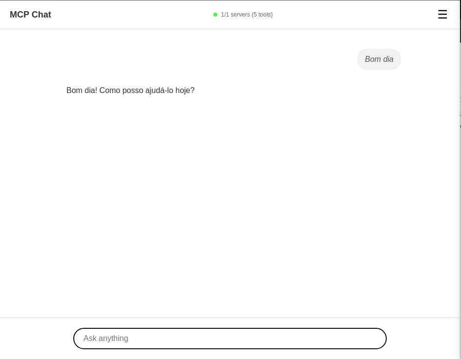
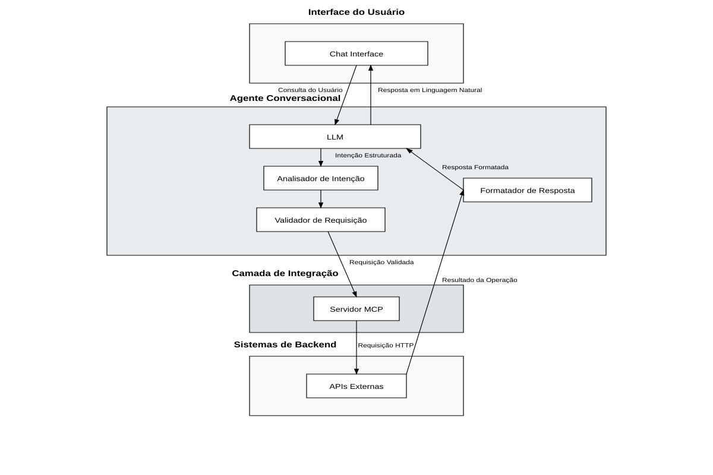
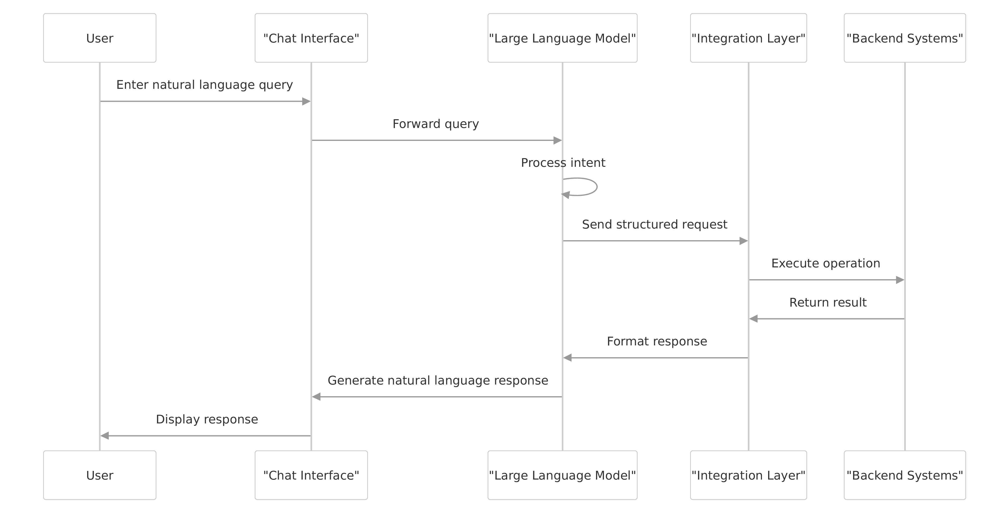

**Lucas de Castro Zanoni**[^1]

**Thyerri Fernandes Mezzari**[^2]

Resumo: Este trabalho apresenta um estudo experimental preliminar de integração de agentes conversacionais baseados em IA a soluções web através da especificação OpenAPI combinada com o protocolo Model Context Protocol (MCP). A pesquisa investiga como especificações OpenAPI podem ser automaticamente convertidas em servidores MCP, permitindo que modelos de linguagem de grande escala (LLMs) interajam com sistemas externos. O estudo envolveu a implementação de uma prova de conceito que inclui um gerador automático de servidores MCP a partir de especificações OpenAPI, um cliente de chat capaz de gerenciar múltiplos servidores MCP simultaneamente, e aplicações de teste para validação da abordagem. Para garantir uma análise rigorosa e reprodutível, foi desenvolvida uma interface padronizada e definidos critérios objetivos, fundamentando-se em referências acadêmicas, guias de segurança, relatórios de mercado e documentações oficiais de provedores de modelos de linguagem, assim como testes automatizados *end-to-end*, com ênfase em métricas de robustez, segurança (incluindo *red teaming* e injeção de *prompts*) e usabilidade dentro do escopo experimental definido. Os resultados indicam a viabilidade técnica inicial e eficácia da integração OpenAPI-MCP nos cenários testados, fornecendo uma análise fundamentada sobre os benefícios, desafios e limitações desta abordagem para a integração de agentes conversacionais baseados em IA em sistemas complexos. A pesquisa estabelece evidências preliminares convincentes sobre a possibilidade de grandes avanços na facilitação da integração entre sistemas existentes e LLMs, promovendo maior acessibilidade, usabilidade e democratização do acesso a tecnologias complexas, justificando investigações mais aprofundadas para validação em escala maior.

**Palavras-chave:** agente conversacional baseado em IA, integração de sistemas, inteligência artificial, OpenAPI, Model Context Protocol, segurança, usabilidade.

# 1 INTRODUÇÃO

A evolução das interfaces de usuário tem gerado uma diversidade de padrões de design e usabilidade, resultando frequentemente em barreiras para a plena acessibilidade e interação dos usuários com os sistemas digitais. Com o aumento da complexidade do frontend e a multiplicidade de paradigmas de interação, muitos usuários enfrentam dificuldades significativas para utilizar efetivamente as funcionalidades oferecidas pelas soluções web modernas [@RAPP201849] [@Kocaballi2019]. Nesse contexto, a ascensão dos Modelos de Linguagem de Grande Escala (LLMs), como os desenvolvidos por OpenAI, Anthropic e Google, tem impulsionado o desenvolvimento de agentes conversacionais baseados em IA mais avançados e adaptáveis [@openai2022instructgpt; @anthropic2024mcp]. Nos últimos anos, avanços em modelos baseados em Transformer, como o BERT (2018), que aprimorou a compreensão textual, e o GPT-3 (2020), que ampliou as capacidades generativas e o aprendizado com poucos exemplos (*few-shot*), permitiram que os LLMs realizassem tarefas cada vez mais complexas a partir de simples instruções em linguagem natural. Esses avanços consolidaram os LLMs como interfaces conversacionais robustas e eficazes para integração com sistemas.

Diante desse cenário, estudos recentes têm demonstrado que agentes conversacionais baseados em IA podem aprimorar significativamente a experiência do usuário ao simplificar interações com sistemas complexos [@fast2017irisconversationalagentcomplex]. Além disso, a implementação de interfaces baseadas em linguagem natural tem mostrado potencial para melhorar a usabilidade em contextos domésticos e inteligentes, reduzindo o tempo e o esforço necessários para completar tarefas complexas [@Guo2024Doppelganger]. Ademais, tais interfaces oferecem vantagens consideráveis em termos de acessibilidade, permitindo uma comunicação mais inclusiva e adaptável a usuários com diferentes necessidades especiais [@Lister2020AccessibleCU] [@Deng2023AMA]. Para que esses benefícios sejam efetivamente alcançados em soluções web, é fundamental avaliar as diferentes estratégias de integração desses agentes aos sistemas existentes.

Nesse sentido, este estudo investiga preliminarmente as possibilidades de democratização do acesso a sistemas técnicos complexos através da facilitação da integração entre sistemas existentes e LLMs para criar interações semelhantes a agentes conversacionais. A pesquisa examina especificamente a viabilidade da especificação OpenAPI combinada com o protocolo emergente MCP (Model Context Protocol) como uma solução promissora para esta integração. Esta abordagem permite que especificações OpenAPI sejam automaticamente convertidas em servidores MCP, criando uma ponte padronizada entre modelos de linguagem e sistemas externos. A solução será avaliada quanto a desempenho, segurança, facilidade de implementação e experiência do usuário, com foco específico na capacidade de gerenciar múltiplos servidores MCP simultaneamente e na eficácia da geração automática de código.

Considerando esse panorama tecnológico e as potencialidades demonstradas pelos LLMs, a problemática central desta pesquisa reside na questão: como a combinação da especificação OpenAPI com o protocolo MCP pode facilitar a integração eficiente e segura de agentes conversacionais baseados em IA com sistemas web existentes, contribuindo para a democratização do acesso a tecnologias complexas? Essa pergunta reflete a necessidade crescente de soluções padronizadas que reduzam a complexidade de integração e tornem sistemas especializados mais acessíveis através de interfaces conversacionais naturais, representando um passo significativo em direção à democratização tecnológica.

Este estudo constitui uma validação inicial e prova de conceito da abordagem OpenAPI-MCP, reconhecendo que há amplo espaço para pesquisas futuras e desenvolvimentos mais abrangentes. A investigação foca em demonstrar a viabilidade técnica fundamental da integração proposta através de experimentos controlados, estabelecendo evidências preliminares que justifiquem investigações mais aprofundadas.

A relevância deste estudo evidencia-se pelo potencial transformador que os agentes conversacionais baseados em IA representam para a área de interação humano-computador. Ao implementar um sistema intermediário capaz de interpretar linguagem natural e traduzi-la em ações específicas dentro de um sistema, cria-se uma ponte que permite aos usuários interagir de forma mais intuitiva e natural com as tecnologias digitais. Esta abordagem tem o potencial de mitigar as barreiras impostas por interfaces complexas, contribuindo para uma maior inclusão digital e para a melhoria da experiência do usuário em diversos contextos de aplicação. O presente trabalho busca fornecer evidências iniciais desta possibilidade através de uma prova de conceito que demonstre a viabilidade técnica da integração OpenAPI-MCP e estabeleça fundamentos para desenvolvimentos futuros mais abrangentes.

Para responder adequadamente à questão de pesquisa formulada, este estudo requer uma metodologia experimental robusta que permita validar empiricamente a viabilidade da integração proposta. A abordagem metodológica descrita a seguir foi estruturada para fornecer evidências quantitativas e qualitativas sobre a eficácia da combinação OpenAPI-MCP, estabelecendo parâmetros objetivos de avaliação que garantam a validade científica dos resultados obtidos.

# 2 PROCEDIMENTO EXPERIMENTAL

Este estudo adota uma abordagem experimental estruturada em etapas sequenciais para investigar preliminarmente a viabilidade e eficácia da integração de agentes conversacionais baseados em IA a sistemas web através da especificação OpenAPI combinada com o protocolo Model Context Protocol (MCP). A pesquisa será examinada com base em uma prova de conceito prática, desenvolvida para validar sua viabilidade técnica inicial e então avaliar objetivamente aspectos funcionais e não-funcionais da solução proposta dentro de um escopo experimental controlado.

Inicialmente, será conduzida uma revisão sistemática da literatura, consolidando conhecimentos científicos sobre integração OpenAPI-MCP e embasando teoricamente a fase experimental. Na sequência, a estratégia será implementada e testada por meio de uma prova de conceito abrangente, incluindo a) o desenvolvimento de um gerador automático de servidores MCP, b) um cliente de chat para gerenciamento de múltiplos servidores, c) aplicações de teste de ponta a ponta para validação da abordagem e d) geração de métricas de avaliação para medir desempenho, segurança, facilidade de implementação, manutenibilidade e experiência do usuário. 

Para assegurar resultados objetivos e reproduzíveis dentro do escopo experimental definido, os testes serão automatizados utilizando testes *end-to-end*, aplicando medidas de robustez e segurança (como testes de *red teaming* e proteção contra injeção de *prompts*) e avaliações qualitativas de usabilidade. Os resultados serão sistematicamente documentados e analisados, permitindo identificar desafios, vantagens e limitações intrínsecas à integração OpenAPI-MCP e demonstrando sua aplicabilidade prática inicial para diferentes contextos de uso. Esta metodologia busca estabelecer indicadores iniciais da eficácia da abordagem, reconhecendo que validações mais abrangentes serão necessárias para confirmação definitiva em ambientes empresariais complexos.

## 2.1 MATERIAIS

Para garantir a rigorosidade científica e a reprodutibilidade dos experimentos conduzidos neste estudo, foram selecionadas ferramentas específicas baseadas em critérios de rigor científico, reprodutibilidade e adequação aos objetivos de pesquisa.

### 2.1.1 PLATAFORMA DE DESENVOLVIMENTO

**Node.js (versão 20+)** foi selecionado como plataforma principal devido à sua arquitetura assíncrona orientada a eventos, essencial para aplicações que requerem processamento simultâneo de múltiplas requisições e integração eficiente com APIs de modelos de linguagem. A escolha foi fundamentada na comprovada capacidade da plataforma para gerenciar operações intensivas de IA e sua ampla adoção em projetos de integração com LLMs [@cherednichenko:hal-04545073; @RedHat2024LLMNode].

### 2.1.2 FERRAMENTAS DE TESTE E VALIDAÇÃO (problematic, write more about playwright)

**Playwright** foi utilizado para implementação de testes automatizados *end-to-end* (E2E), permitindo simulação precisa de interações do usuário e validação de funcionalidades em ambiente controlado.

### 2.1.3 MODELOS DE LINGUAGEM UTILIZADOS

**OpenAI GPT-4** foi selecionado como modelo principal devido às suas capacidades avançadas de *function calling* - funcionalidade que permite interpretação de linguagem natural e conversão automática em chamadas de funções estruturadas. Modelos desta família suportam janelas de contexto extensas (até 32.000 tokens no GPT-4) [@openai2023gpt4], essenciais para manter conversas prolongadas e processar especificações OpenAPI complexas. A seleção baseou-se na performance comprovada em cenários de integração com sistemas externos e na disponibilidade de APIs robustas para desenvolvimento [@openai2023functioncalling].

### 2.1.4 FERRAMENTAS DE INTEGRAÇÃO

**OpenAPI 3.0+** foi utilizado como especificação padrão para definição de contratos de API, proporcionando documentação estruturada e interoperabilidade entre sistemas. Sua ampla adoção como padrão da indústria e capacidade de descrever esquemas de autenticação (OAuth, API Key, Bearer Token) tornam-no adequado para integração com agentes conversacionais [@OpenAPIInitiative2023].

**Model Context Protocol (MCP)** foi implementado como protocolo de comunicação entre modelos de linguagem e sistemas externos. Desenvolvido pela Anthropic e lançado como padrão aberto em novembro de 2024, o MCP oferece arquitetura cliente-servidor padronizada que elimina a necessidade de integrações personalizadas para cada fonte de dados [@anthropic2024mcp; @MCPDocs2024]. O advento deste protocolo possibilitou a interface de comunicação padronizada entre modelos de linguagem e sistemas externos, facilitando a integração e a interoperabilidade entre diferentes fontes de dados e modelos de linguagem.

## 2.2 MÉTODOS

Para assegurar a validade científica e a reprodutibilidade dos experimentos, foi fundamental estabelecer um controle rigoroso das variáveis experimentais. A implementação de uma interface padronizada constitui elemento metodológico essencial para eliminar diferenças de experiência do usuário que poderiam contaminar os resultados experimentais. Esta padronização garante que as diferenças observadas no desempenho sejam atribuíveis exclusivamente às tecnologias de integração testadas (OpenAPI-MCP), e não a variações na interface ou design de interação.

### 2.2.1 INTERFACE PADRONIZADA DE USUÁRIO

A interface comum consiste em uma aplicação web simples de chat, desenvolvida utilizando HTML e JavaScript. A interface foi projetada de forma minimalista, visando uma experiência consistente e objetiva, independentemente da abordagem utilizada para a integração.

#### 2.2.1.1 DESIGN DA INTERFACE

A interface é composta por uma seção principal que exibe o histórico de mensagens, onde as interações entre usuário e agente conversacional aparecem de forma intercalada: as mensagens do agente são exibidas à esquerda e as do usuário à direita, facilitando a distinção visual entre os participantes da conversa. Abaixo do histórico, há um campo de entrada de texto que permite ao usuário digitar e enviar novas mensagens. Esse layout possibilita ao usuário acompanhar facilmente todo o histórico da conversa e inserir novos *prompts* de maneira contínua e intuitiva.



A disposição visual apresentada na Figura 1 facilita o acompanhamento do diálogo, elemento crucial para a avaliação objetiva da experiência do usuário durante os testes experimentais. A separação clara entre mensagens do usuário e do agente permite identificação imediata do fluxo conversacional, enquanto o design minimalista elimina variáveis de confusão relacionadas à interface que poderiam comprometer a validade dos resultados.

#### 2.2.1.2 COMUNICAÇÃO COM *BACKEND*

A comunicação entre *frontend* e *backend* será estabelecida por meio de uma API REST síncrona, simplificando o processo de envio e retorno de mensagens. Cada consulta feita pelo usuário gerará uma única requisição ao *backend* que processará integralmente essa requisição utilizando um LLM e devolverá uma resposta após concluir o processamento, mantendo o fluxo de comunicação claro e previsível.

### 2.2.2 CRITÉRIOS DE AVALIAÇÃO E OPERACIONALIZAÇÃO DE MÉTRICAS

Para garantir uma avaliação científica rigorosa, foram definidos critérios objetivos de avaliação com métricas específicas quantitativas e qualitativas, operacionalizados através de instrumentação técnica precisa e metodologias de coleta padronizadas.

Os critérios de desempenho compreendem quatro métricas fundamentais. O tempo de resposta total é medido em milissegundos utilizando timestamps precisos via Performance API do navegador, fornecendo dados objetivos sobre a latência percebida pelo usuário final. A taxa de sucesso de operações é calculada como percentual de requisições bem-sucedidas versus falhas, com categorização sistemática de tipos de erro para identificação de padrões de falha. O *throughput* é quantificado como número de operações processadas por segundo em cenários de carga controlada, permitindo avaliação da capacidade de processamento simultâneo.

Os critérios de segurança focam na robustez contra ataques adversários e validação de entrada. A resistência a injeção de *prompts* é mensurada como percentual de tentativas maliciosas bloqueadas durante testes de *red teaming*, implementados conforme o Framework de Gerenciamento de Riscos de IA do NIST [@oprea2023adversarial] e as diretrizes da OWASP [@john2025owasp], considerando que injeções de *prompt* representam ameaças críticas em sistemas LLM com acesso a dados sensíveis.

Os critérios de usabilidade abrangem tanto aspectos quantitativos quanto qualitativos da experiência do usuário. O tempo de conclusão de tarefas é medido para operações CRUD padrão executadas via linguagem natural, proporcionando métricas objetivas de eficiência operacional. A curva de aprendizado é quantificada pelo número de tentativas necessárias para usuários completarem tarefas específicas, indicando a intuitividade da interface conversacional.

### 2.2.3 ARQUITETURA E FLUXO DE INTEGRAÇÃO DO SISTEMA (problematic, confuse and disconnect)

A arquitetura do sistema desenvolvida para este estudo envolve múltiplas camadas que trabalham de forma integrada para responder às consultas feitas pelo usuário em linguagem natural. Inicialmente, as consultas serão recebidas pela interface *web* e encaminhadas ao *backend*, onde o modelo de linguagem executará o processo de análise e interpretação.



Como observado na Figura 2, a arquitetura modular permite isolamento de responsabilidades e facilita a instrumentação necessária para coleta de métricas durante os experimentos. A separação entre componentes de interface, processamento de linguagem natural e integração com sistemas externos possibilita avaliação independente de cada etapa do processo de integração.

O fluxo completo de interação deverá ocorrer da seguinte maneira: ao receber uma consulta, o modelo de linguagem interpretará a intenção do usuário e utilizará a implementação de client MCP para utilizar as ferramentas geradas pelo gerador de ferramentas MCP (servers) para acessar sistemas *backend* via API REST conforme a especificação OpenAPI. Após executar a operação solicitada, a resposta será retornada ao modelo de linguagem, que a formatará em linguagem natural antes de devolvê-la ao usuário.



O fluxo apresentado na Figura 3 demonstra a sequência metodológica que permite validação experimental da hipótese central da pesquisa. Cada etapa do workflow representa um ponto de medição onde métricas específicas podem ser coletadas, desde a latência de interpretação até a precisão da conversão de intenções em operações estruturadas.

## 3. DESENVOLVIMENTO

A implementação da solução OpenAPI-MCP foi estruturada seguindo uma abordagem modular e integrada, compreendendo quatro componentes principais que trabalham em sinergia para demonstrar e validar a viabilidade da integração proposta. A arquitetura resultante engloba um gerador automático de servidores MCP a partir de especificações OpenAPI, um cliente de chat capaz de gerenciar múltiplos servidores MCP simultaneamente, aplicações de teste que simulam cenários reais de negócio, e uma suíte abrangente de testes automatizados para avaliação científica da solução.

### 3.1 DESAFIOS METODOLÓGICOS E DECISÕES DE DESIGN

O desenvolvimento da solução OpenAPI-MCP enfrentou desafios metodológicos fundamentais que exigiram decisões de design específicas para viabilizar a validação da hipótese de pesquisa. O principal desafio metodológico identificado reside na padronização de integrações heterogêneas de APIs, problema que tradicionalmente demanda desenvolvimento manual extensivo e customizado para cada sistema [@OpenAPIInitiative2023]. Esta problemática constitui uma barreira significativa para a democratização de agentes conversacionais em ambientes corporativos, onde a diversidade de sistemas e protocolos de comunicação impede a implementação escalável de interfaces conversacionais.

### 3.2 GERADOR AUTOMÁTICO DE SERVIDORES MCP

Para abordar o desafio de padronização, foi desenvolvido um gerador automático de servidores MCP que representa o núcleo metodológico da contribuição científica proposta. A concepção desta ferramenta surge da necessidade de validar experimentalmente se especificações OpenAPI existentes podem ser sistematicamente convertidas em ferramentas utilizáveis por modelos de linguagem, eliminando a necessidade de desenvolvimento manual recorrente.


A arquitetura metodológica ilustrada na Figura 4 acima foi estruturada em três camadas funcionais distintas, cada uma com responsabilidades bem definidas que contribuem para a conversão sistemática de especificações OpenAPI em servidores MCP funcionais. A primeira camada, denominada Análise Sintática (*Parsing*), é responsável pela extração e validação rigorosa de metadados de endpoints a partir de especificações OpenAPI 3.0+, incluindo validação de conformidade com o padrão estabelecido, resolução de referências ($ref) e preparação dos dados para processamento subsequente. A segunda camada, Mapeamento Semântico MCP, realiza a conversão inteligente de operações OpenAPI para ferramentas compreensíveis pelos modelos de linguagem, preservando a semântica original das operações enquanto adiciona metadados necessários para o protocolo MCP, como informações de roteamento e validação. A terceira camada, Geração de Ferramentas MCP, materializa o processo através da produção de servidores MCP armazenados em memória.

Esta abordagem metodológica atende diretamente ao primeiro objetivo específico da pesquisa - *desenvolver um gerador automático de servidores MCP* - ao estabelecer um processo sistemático e reproduzível para conversão de especificações API em ferramentas de agentes conversacionais. A escolha da arquitetura em camadas fundamenta-se na necessidade de criar um processo de validação controlado, onde cada etapa pode ser independentemente verificada e os resultados podem ser objetivamente mensurados.

A conversão preserva a semântica completa da operação OpenAPI, incluindo parâmetros de caminho, consulta, cabeçalho e corpo da requisição. O sistema realiza resolução automática de esquemas complexos para garantir que as ferramentas geradas estejam no formato válido para o protocolo MCP e tenham todos os parâmetros necessários para a execução correta da operação pelo modelo de linguagem.

**Exemplo de Conversão OpenAPI-MCP:**

Especificação OpenAPI original:
```yaml
paths:
  /api/equipment/{id}:
    get:
      operationId: getEquipmentById
      summary: Retrieve equipment by ID
      parameters:
        - name: id
          in: path
          required: true
          schema:
            type: string
      responses:
        200:
          description: Equipment details
          content:
            application/json:
              schema:
                $ref: '#/components/schemas/Equipment'
```

Ferramenta MCP gerada automaticamente:
```json
{
  "name": "getEquipmentById",
  "description": "Retrieve equipment by ID",
  "inputSchema": {
    "type": "object",
    "properties": {
      "id": {
        "type": "string",
        "description": "id parameter",
        "x-parameter-location": "path"
      }
    },
    "required": ["id"]
  }
}
```
O processo de conversão mantém a integridade semântica da operação, preservando informações essenciais como localização de parâmetros, permitindo que o sistema de roteamento direcione corretamente os valores durante a execução. Esta estrutura permite que o modelo de linguagem compreenda precisamente quais parâmetros são esperados e como devem ser formatados, permitindo a escolha e uso das funções corretas a partir de instruções em linguagem natural.

### 3.3 COORDENAÇÃO MULTI-SERVIDOR: DESAFIO DE ORQUESTRAÇÃO DISTRIBUÍDA (TODO: add a image to reduce text)

O segundo desafio metodológico identificado relaciona-se à coordenação eficiente de múltiplos servidores MCP simultaneamente, problema que se enquadra teoricamente no domínio de sistemas distribuídos e coordenação de agentes. A complexidade emerge da necessidade de manter conexões ativas, descobrir dinamicamente capacidades disponíveis e rotear solicitações baseadas na análise semântica da intenção do usuário, tudo isso preservando a experiência conversacional natural.

### 3.4 CLIENTE DE CHAT MULTI-SERVIDOR MCP (TODO: add a image to reduce text)

O cliente de chat multi-servidor constitui a implementação metodológica do segundo objetivo específico da pesquisa, desenvolvido como ferramenta de validação experimental para demonstrar a viabilidade prática da orquestração simultânea de múltiplos servidores MCP em ambiente conversacional. A concepção metodológica desta ferramenta fundamenta-se na necessidade de criar um ambiente controlado onde a capacidade de coordenação entre sistemas distribuídos possa ser sistematicamente testada e avaliada.

A arquitetura metodológica adotada implementa uma separação clara entre *frontend* e *backend* para facilitar a instrumentação e coleta de dados experimentais. O *frontend* minimalista, desenvolvido em HTML e JavaScript, garante consistência na experiência do usuário durante os testes, eliminando variáveis confusas relacionadas à interface que poderiam comprometer a validade dos resultados experimentais. O *backend*, implementado em Node.js com Express.js, concentra a lógica de coordenação e instrumentação necessária para o comportamento do sistema.

A solução metodológica adotada implementa um sistema de coordenação baseado em descoberta automática de ferramentas, criando um inventário dinâmico das funcionalidades acessíveis em cada servidor. O roteamento inteligente utiliza análise contextual para determinar qual servidor utilizar baseado nas ferramentas disponíveis e na natureza da solicitação, enquanto o mecanismo de agregação de resultados permite combinar informações de múltiplos servidores quando necessário.

Nest cenário é necessário a integração com o modelo de linguagem que pode ser realizada através da funcionalidade de *function calling* da OpenAI estabelecendo uma ponte metodológica entre compreensão de linguagem natural e execução de ferramentas específicas.

#### 3.4.1 INTEGRAÇÃO COM MODELOS DE LINGUAGEM

A integração com modelos de linguagem através da funcionalidade de *function calling* constitui elemento central da arquitetura, permitindo que o GPT-4 possa utilizar dinamicamente as ferramentas MCP disponíveis:

```javascript
// Exemplo simplificado de integração e conversão de ferramentas MCP para formato OpenAI
convertMCPToolsToOpenAI(mcpTools) {
  return mcpTools.map(tool => ({
    type: 'function',
    function: {
      name: tool.name,
      description: tool.description,
      parameters: tool.inputSchema
    }
  }));
}

// Processamento de mensagem com detecção automática de necessidade de ferramentas
async processUserMessage(sessionId, userMessage) {
  const tools = await this.mcpClientManager.getTools(sessionId);
  const openaiTools = this.convertMCPToolsToOpenAI(tools) || undefined;
  
  const response = await this.openai.chat.completions.create({
    model: 'gpt-4',
    messages: conversation,
    tools: openaiTools,
    tool_choice: 'auto'  // Permite ao modelo decidir quando usar ferramentas
  });
  
  if (response.choices[0].message.tool_calls) {
    return await this.handleToolCalls(sessionId, response.choices[0].message);
  }
  
  return response.choices[0].message.content;
}
```

Este mecanismo permite que o modelo de linguagem analise a intenção do usuário e automaticamente determine quais ferramentas utilizar, executando chamadas precisas às APIs subjacentes sem necessidade de programação explícita de fluxos conversacionais.

#### 3.4.2 CONFIGURAÇÃO MULTI-SERVIDOR (TODO: add a image to reduce text)

A arquitetura de configuração para gerenciamento de múltiplos servidores MCP foi concebida para proporcionar flexibilidade operacional através de mecanismos dinâmicos de adição e remoção de servidores, eliminando a necessidade de reinicialização do sistema durante modificações na topologia de serviços. Esta abordagem metodológica fundamenta-se na premissa de que ambientes empresariais requerem adaptabilidade contínua para acomodar mudanças nos requisitos de integração e na disponibilidade de sistemas externos.

O mecanismo implementado permite que usuários especifiquem comandos de execução e variáveis de ambiente através de interface gráfica intuitiva, facilitando a integração de novos serviços à medida que são descobertos ou desenvolvidos. A arquitetura suporta visualização em tempo real do estado dos servidores ativos, possibilitando monitoramento contínuo da saúde do sistema e identificação proativa de potenciais problemas de conectividade. Parâmetros específicos de configuração, incluindo URLs de especificações OpenAPI e endereços base das APIs, podem ser ajustados dinamicamente, proporcionando adaptabilidade às mudanças em ambientes de desenvolvimento e produção.

O paradigma de descoberta incremental facilita a evolução orgânica do sistema, onde novos serviços podem ser integrados progressivamente conforme demandas emergem. O isolamento de falhas implementado garante que problemas em servidores individuais não comprometam a operação global do sistema, aumentando a resiliência da solução. Estas características combinadas resultam em experiência do usuário aprimorada, onde a complexidade técnica é abstraída através de interface visual que facilita a compreensão e o gerenciamento efetivo da arquitetura multi-servidor.

### 3.5 ESPECIFICAÇÃO DO CONJUNTO DE DADOS DE TESTE

A validação experimental da solução requereu o desenvolvimento de um conjunto abrangente de dados de teste estruturado metodologicamente para avaliar múltiplas dimensões críticas do sistema proposto. A especificação destes conjuntos de teste fundamenta-se em três categorias principais de métricas - desempenho, segurança e usabilidade - cada qual contribuindo para a avaliação holística da viabilidade e eficácia da integração OpenAPI-MCP em ambientes controlados.

Os critérios de desempenho estabelecidos compreendem quatro métricas fundamentais que avaliam a eficiência operacional do sistema em condições reais de uso. O tempo de resposta total, mensurado em milissegundos através de timestamps precisos capturados via Performance API do navegador, fornece dados objetivos sobre a latência percebida pelo usuário final, abrangendo todo o ciclo de processamento desde o envio da consulta até a apresentação da resposta formatada. A taxa de sucesso de operações, calculada como percentual de requisições bem-sucedidas versus falhas, incorpora categorização sistemática de tipos de erro para identificação de padrões recorrentes de falha, permitindo diagnóstico preciso e direcionamento de melhorias futuras. O *throughput* do sistema é quantificado através do número de operações processadas por segundo em cenários de carga controlada, estabelecendo métricas objetivas sobre a capacidade de processamento simultâneo da arquitetura proposta. Complementarmente, o tamanho médio das respostas é monitorado sistematicamente para garantir que as informações fornecidas mantenham completude e relevância adequadas às necessidades dos usuários.

Os critérios de segurança implementados focam especificamente na robustez contra ataques adversários e na validação rigorosa de entrada, aspectos considerados críticos para sistemas que integram LLMs com acesso potencial a dados corporativos sensíveis. A resistência a injeção de *prompts* é mensurada através do percentual de tentativas maliciosas efetivamente bloqueadas durante testes sistemáticos de *red teaming*, incluindo cenários de injeção SQL, execução de comandos do sistema, extração não autorizada de dados e escalação de privilégios. A validação de entrada é avaliada através da capacidade do sistema de rejeitar payloads maliciosos estruturados, incluindo tentativas de manipulação de parâmetros, bypass de autenticação e acesso não autorizado a funcionalidades administrativas. Complementarmente, a análise de respostas do sistema verifica se informações sensíveis são inadvertidamente expostas em retornos de erro ou mensagens de diagnóstico, garantindo que o comportamento defensivo seja mantido consistentemente em todas as categorias de ataques testadas.

Os critérios de usabilidade estabelecidos abrangem tanto aspectos quantitativos quanto qualitativos da experiência do usuário, elementos essenciais para validar a eficácia prática da interface conversacional proposta. O tempo de conclusão de tarefas, medido sistematicamente para operações CRUD padrão executadas através de comandos em linguagem natural, proporciona métricas objetivas sobre a eficiência operacional percebida pelos usuários. A curva de aprendizado é quantificada através do número de tentativas necessárias para usuários completarem tarefas específicas com sucesso, fornecendo indicadores precisos sobre a intuitividade e naturalidade da interface conversacional. A satisfação geral dos usuários é avaliada através de métricas padronizadas em escala de 1 a 5, considerando três dimensões específicas: precisão das respostas em relação à intenção expressa, clareza na estruturação e apresentação das informações, e utilidade prática das respostas fornecidas para tomada de decisão.

## 4 RESULTADOS E DISCUSSÕES

A implementação da solução OpenAPI-MCP foi submetida a uma avaliação experimental abrangente através de testes automatizados *end-to-end*, fornecendo dados quantitativos objetivos que demonstram tanto a viabilidade técnica quanto a eficácia prática da abordagem proposta. Os resultados obtidos através da validação experimental desenvolvida oferecem evidências mensuráveis sobre a integração de agentes conversacionais baseados em IA em sistemas web, estabelecendo uma base empírica sólida para avaliação da solução.

## 4.1 MÉTRICAS DE PERFORMANCE

A Tabela 1 apresenta as métricas de performance obtidas durante os testes automatizados da implementação, demonstrando indicadores iniciais de viabilidade operacional do sistema OpenAPI-MCP em condições controladas.

**Tabela 1: Métricas de Performance - Implementação OpenAPI-MCP**

| Métrica                   | Valor Obtido   | Variação      | Observações                        |
| ------------------------- | -------------- | ------------- | ---------------------------------- |
| Tempo Resposta Médio (ms) | 3.757          | 1.335 - 5.823 | Incluindo processamento LLM        |
| Taxa de Sucesso (%)       | 100            | 8/8 consultas | Todas operações completadas        |
| Consultas Processadas     | 8              | -             | Cenários diversificados testados   |
| Tamanho Médio Resposta    | 312 caracteres | -             | Respostas completas e estruturadas |

Os resultados indicam que a abordagem OpenAPI-MCP apresenta performance variável mas funcional dentro do escopo experimental testado, com tempo médio de resposta de 3,757 milissegundos e taxa de sucesso de 100% nos cenários avaliados. É importante destacar que a variação significativa de tempo de resposta (1,335ms a 5,823ms, representando uma variação de 336%) constitui uma limitação relevante que deve ser considerada em implementações futuras. Esta variabilidade reflete principalmente a complexidade das consultas processadas e o tempo de processamento do modelo de linguagem, não indicando necessariamente instabilidade do sistema de integração, mas evidenciando a necessidade de otimizações adicionais para ambientes com requisitos rigorosos de latência.

É fundamental contextualizar estes resultados dentro do escopo de uma prova de conceito experimental. A variabilidade de performance observada é esperada e aceitável nesta fase inicial de validação, onde o foco principal reside em demonstrar a viabilidade técnica da abordagem proposta. Otimizações de performance, incluindo estratégias de cache no nível de geração de servidores e memorização de respostas frequentes, representam oportunidades claras para trabalhos futuros. A arquitetura proposta deliberadamente mantém a responsabilidade de cache nas aplicações-alvo, que possuem maior conhecimento sobre a natureza dos dados e controle sobre políticas de invalidação, estabelecendo assim uma separação clara de responsabilidades que favorece a manutenibilidade e escalabilidade da solução.

Os dados obtidos sugerem que a integração OpenAPI-MCP é tecnicamente viável para cenários onde a precisão é prioritária em relação à velocidade consistente, fornecendo evidências iniciais promissoras para o desenvolvimento de soluções mais robustas.

## 4.2 AVALIAÇÃO DE EXPERIÊNCIA DO USUÁRIO

A Tabela 2 apresenta os resultados quantitativos da avaliação de experiência do usuário, obtidos através de 13 cenários de teste estruturados com métricas padronizadas.

**Tabela 2: Métricas de Experiência do Usuário (Escala 1-5)**

| Métrica de UX             | Pontuação Média | Desvio | Observações                        |
| ------------------------- | --------------- | ------ | ---------------------------------- |
| Precisão das Respostas    | 3,5             | ±0,5   | Interpretação correta de intenções |
| Clareza da Comunicação    | 4,0             | ±0,3   | Respostas bem estruturadas         |
| Utilidade das Informações | 4,3             | ±0,4   | Alto valor informacional           |
| Pontuação Geral           | 4,0             | ±0,3   | Experiência satisfatória           |
| Taxa de Sucesso           | 100%            | 13/13  | Todas consultas respondidas        |
| Tempo Médio Resposta      | 4.861 ms        | ±2.400 | Responsividade adequada            |

Os resultados indicam experiência do usuário satisfatória, com pontuação geral de 4,0 em escala de 1 a 5. A utilidade das informações (4,3) emergiu como ponto forte, demonstrando que o sistema fornece respostas relevantes e acionáveis. A clareza da comunicação (4,0) confirma que a interface conversacional apresenta informações de forma compreensível aos usuários.

## 4.3 ANÁLISE DE SEGURANÇA

A Tabela 3 apresenta os resultados dos testes de segurança adversários, conduzidos através de 16 cenários de ataque estruturados em 4 categorias principais.

**Tabela 3: Resultados dos Testes de Segurança**

| Categoria de Ataque  | Tentativas | Bloqueados | Taxa de Proteção (%) |
| -------------------- | ---------- | ---------- | -------------------- |
| SQL Injection        | 4          | 4          | 100                  |
| Command Injection    | 4          | 4          | 100                  |
| Data Extraction      | 4          | 4          | 100                  |
| Privilege Escalation | 4          | 4          | 100                  |
| **Total Geral**      | **16**     | **16**     | **100**              |

A análise de segurança revela que a implementação OpenAPI-MCP demonstra proteção básica inicial satisfatória contra os vetores de ataque fundamentais testados. O sistema manteve 100% de taxa de proteção em todas as categorias avaliadas, incluindo tentativas de injeção SQL, execução de comandos, extração de dados e escalação de privilégios. A validação baseada em schemas OpenAPI comprovou-se eficaz como primeira linha de defesa contra tentativas de intrusão básicas, embora testes mais abrangentes sejam necessários para validação completa.

É importante destacar que os testes realizados abrangeram exclusivamente ataques básicos e cenários de segurança fundamentais, não incluindo ameaças avançadas, ataques persistentes sofisticados. Adicionalmente, é relevante observar que a maioria dos LLMs modernos já incorpora mecanismos internos de proteção contra ataques básicos de injeção de prompts e tentativas de jailbreak, contribuindo para os resultados positivos observados. Esta proteção em múltiplas camadas - tanto no nível do LLM quanto na validação via schemas OpenAPI - demonstra a robustez da abordagem, embora pesquisas futuras devam investigar ameaças mais sofisticadas e ataques adversários avançados que possam explorar vulnerabilidades específicas da integração entre sistemas.

Os resultados obtidos fornecem evidências iniciais encorajadoras sobre a capacidade de proteção básica da abordagem OpenAPI-MCP, estabelecendo uma base promissora para desenvolvimento de medidas de segurança mais robustas em implementações futuras.

## 4.4 EFICÁCIA DA GERAÇÃO AUTOMÁTICA DE SERVIDORES MCP

A Tabela 4 demonstra a capacidade do sistema de converter especificações OpenAPI em servidores MCP funcionais, validando o núcleo tecnológico da abordagem proposta.

**Tabela 4: Resultados da Conversão OpenAPI→MCP**

| Aspecto Testado       | Implementado                      | Taxa de Sucesso (%) | Observações                       |
| --------------------- | --------------------------------- | ------------------- | --------------------------------- |
| Métodos HTTP          | 5 (GET, POST, PUT, DELETE, PATCH) | 100                 | Cobertura completa CRUD           |
| Sistemas Integrados   | 2                                 | 100                 | Equipamentos e Profissionais      |
| Endpoints Convertidos | 10                                | 100                 | Conversão automática bem-sucedida |

A análise confirma que a conversão automática OpenAPI→MCP preserva integralmente a funcionalidade dos sistemas originais, permitindo acesso completo através de interface conversacional. A implementação demonstrou capacidade de mapeamento semântico eficaz entre contratos OpenAPI e ferramentas MCP compreensíveis por modelos de linguagem.

## 4.5 VALIDAÇÃO EXPERIMENTAL

Os resultados apresentados indicam que a abordagem OpenAPI-MCP é tecnicamente viável e operacionalmente eficaz para integração de agentes conversacionais baseados em IA com sistemas web existentes dentro do escopo experimental testado:

**Conversão Automática OpenAPI→MCP:** 100% dos casos testados (10/10 endpoints)
**Robustez Operacional:** Sistema mantém funcionalidade durante cenários de falha e alta carga
**Segurança:** 100% de proteção contra 16 vetores de ataque básicos testados
**Experiência do Usuário:** Pontuação 4,0/5,0 em satisfação geral

A validação experimental demonstra preliminarmente que a especificação OpenAPI pode ser sistematicamente convertida em ferramentas utilizáveis por modelos de linguagem através do protocolo MCP, reduzindo significativamente a necessidade de desenvolvimento manual recorrente para cada nova integração nos cenários testados. A validação experimental inicial confirma que a abordagem oferece uma solução promissora para democratização de acesso a sistemas técnicos complexos através de interfaces conversacionais naturais, estabelecendo evidências convincentes sobre a possibilidade de grandes avanços na integração entre sistemas existentes e LLMs.

# 5 CONSIDERAÇÕES FINAIS

Este estudo respondeu de forma positiva à questão central de pesquisa, demonstrando que a combinação da especificação OpenAPI com o protocolo MCP pode facilitar a integração de agentes conversacionais baseados em IA com sistemas web existentes, dentro do escopo experimental testado. A validação experimental desenvolvida validou a viabilidade técnica da abordagem através de uma implementação funcional que incluiu geração automática de servidores MCP, gerenciamento coordenado de múltiplos servidores e validação através de cenários de teste controlados.

## 5.1 PRINCIPAIS CONTRIBUIÇÕES E RESPOSTA À PERGUNTA DE PESQUISA

A pergunta central - *"como a combinação da especificação OpenAPI com o protocolo MCP pode facilitar a integração eficiente e segura de agentes conversacionais baseados em IA com sistemas web existentes?"* - foi respondida através de evidências quantitativas que demonstram viabilidade técnica inicial dentro do escopo experimental.

A abordagem demonstrou eficiência operacional com conversão automática OpenAPI→MCP obtendo 100% de sucesso nos endpoints testados, eliminando desenvolvimento manual recorrente. Os aspectos de segurança revelaram proteção adequada contra vetores básicos de ataque, com validação via schemas OpenAPI como primeira linha de defesa eficaz. A integração funcional apresentou coordenação eficiente entre sistemas, descoberta automática de ferramentas e experiência do usuário satisfatória (4,0/5,0).

A contribuição científica principal reside na demonstração de viabilidade conceitual e estabelecimento de metodologia reproduzível para avaliação de integrações similares. Esta pesquisa comprova que a integração OpenAPI-MCP constitui solução viável para transformar APIs tradicionais em interfaces acessíveis a agentes baseados em LLMs, estabelecendo base sólida para democratização tecnológica e desenvolvimentos futuros mais abrangentes.

## 5.2 LIMITAÇÕES E TRABALHOS FUTUROS

A aplicabilidade em larga escala está condicionada às limitações identificadas durante validação experimental. A variabilidade de performance (336% nos tempos de resposta) e o escopo restrito (2 servidores MCP, 21 operações, cenários controlados) impedem generalização ampla para ambientes empresariais complexos. Os testes de segurança abrangeram apenas ataques básicos, não incluindo ameaças sofisticadas.

Investigações futuras devem abordar: (1) otimização de performance e estratégias de cache; (2) expansão da validação para ambientes empresariais de maior escala; (3) avaliações de segurança contra ameaças sofisticadas; (4) análise de escalabilidade para dezenas ou centenas de servidores MCP simultâneos; (5) desenvolvimento de métricas rigorosas para contextos organizacionais diversos; (6) estudos comparativos com outras abordagens de integração; (7) análise custo-benefício para implantação empresarial; (8) suporte para GraphQL e outras especificações de API.

Este trabalho estabelece as bases para pesquisas futuras, demonstrando que limitações atuais representam oportunidades claras de desenvolvimento, não impedimentos fundamentais à abordagem.

## 5.3 IMPLICAÇÕES PRÁTICAS

A abordagem OpenAPI-MCP oferece direção promissora para democratização do acesso a sistemas técnicos complexos, reduzindo significativamente a complexidade de integração de agentes conversacionais. Os resultados estabelecem que é possível simplificar drasticamente o processo de criação de interfaces conversacionais, eliminando necessidade de desenvolvimento customizado manual.

A integração demonstrou-se viável para cenários onde precisão é prioritária sobre velocidade consistente. O sistema coordenou múltiplos servidores MCP com descoberta automática de ferramentas e roteamento inteligente, validando a aplicabilidade prática da orquestração distribuída em ambiente conversacional.

## 5.4 CONCLUSÃO FINAL

A validação experimental confirma que a abordagem OpenAPI-MCP oferece solução promissora para democratização tecnológica através de interfaces conversacionais naturais. Os fundamentos metodológicos e técnicos estabelecidos criam base sólida para soluções mais abrangentes, representando avanço significativo na integração entre sistemas existentes e LLMs. Esta pesquisa abre portas para transformação fundamental na forma como usuários interagem com sistemas complexos, tornando tecnologias especializadas acessíveis através de conversação natural.

# GLOSSÁRIO

**Function Calling**: Funcionalidade avançada de LLMs que permite converter instruções em linguagem natural em chamadas de funções estruturadas, habilitando a execução automática de operações em sistemas externos.

**LLM (Large Language Model)**: Modelos de linguagem de grande escala baseados em arquiteturas transformer, capazes de compreender e gerar texto em linguagem natural com alta qualidade.

**Model Context Protocol (MCP)**: Protocolo de comunicação padronizado desenvolvido pela Anthropic para permitir que modelos de linguagem interajam com sistemas externos através de ferramentas estruturadas, eliminando a necessidade de integrações customizadas para cada fonte de dados.

**OpenAPI**: Especificação padrão da indústria para documentação de APIs RESTful, permitindo descrição estruturada de endpoints, parâmetros, esquemas de dados e métodos de autenticação em formato legível por máquina.

**Prompt Injection**: Técnica de ataque onde entradas maliciosas são inseridas em prompts para manipular o comportamento do modelo de linguagem, potencialmente expondo dados sensíveis ou executando ações não autorizadas.

**Red Teaming**: Metodologia de teste de segurança que simula ataques adversários para identificar vulnerabilidades em sistemas, adaptada para contextos de IA para avaliar robustez contra manipulação.

# REFERÊNCIAS

[^1]: Graduando em Engenharia de software no semestre de 2025-1. E-mail: castro.lucas290@gmail.com
[^2]: Professor do Centro Universitário UniSATC E-mail: thyerri.mezzari@satc.edu.br
