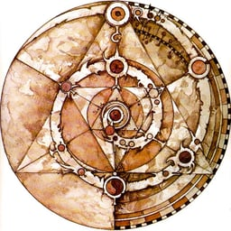

**Lucas de Castro Zanoni**[^1]

**Thyerri Fernandes Mezzari**[^2]

Resumo: Este trabalho apresenta o desenvolvimento de um agente conversacional baseado em inteligência artificial para aprimorar a interação entre usuários e sistemas. Utilizando técnicas avançadas de processamento de linguagem natural, o agente proposto visa simplificar a comunicação em interfaces complexas, proporcionando uma experiência digital unificada e adaptável às necessidades dos usuários. A metodologia inclui o desenvolvimento, implementação e avaliação do agente em ambientes reais de uso. Os resultados demonstram que a solução proposta contribui significativamente para a melhoria da acessibilidade e usabilidade dos sistemas, reduzindo barreiras de interação e promovendo uma comunicação mais fluida e intuitiva.

**Palavras-chaves:** agente conversacional, interação, sistema, inteligência artificial.

# 1 INTRODUÇÃO

A evolução das interfaces de usuário tem gerado uma diversidade de padrões de design e 
usabilidade, resultando frequentemente em barreiras para a plena acessibilidade e interação 
dos usuários com os sistemas digitais. Com o aumento da complexidade do frontend e a 
multiplicidade de paradigmas de interação, muitos usuários enfrentam dificuldades 
significativas para utilizar efetivamente as funcionalidades oferecidas pelos sistemas 
computacionais modernos [@RAPP201849] [@Kocaballi2019].

Nesse cenário, os agentes conversacionais baseados em inteligência artificial emergem 
como uma alternativa promissora para simplificar a comunicação entre humanos e máquinas, 
oferecendo uma camada intermediária de interação que pode traduzir comandos em linguagem 
natural para ações específicas no sistema.

Estudos recentes têm demonstrado que agentes conversacionais podem aprimorar 
significativamente a experiência do usuário ao simplificar interações com sistemas 
complexos [@fast2017irisconversationalagentcomplex]. Além disso, a implementação de 
interfaces baseadas em linguagem natural tem mostrado potencial para melhorar a usabilidade 
em contextos domésticos e inteligentes, reduzindo o tempo e o esforço necessários para 
completar tarefas complexas [@Guo2024Doppelganger]. Ademais, tais interfaces oferecem 
vantagens consideráveis em termos de acessibilidade, permitindo uma comunicação mais 
inclusiva e adaptável a usuários com diferentes necessidades especiais 
[@Lister2020AccessibleCU] [@Deng2023AMA].

A problemática central desta pesquisa reside na questão: de que forma um agente 
conversacional baseado em IA pode potencializar a interação entre usuários e sistemas, 
promovendo uma comunicação fluida mesmo em ambientes com interfaces complexas? Essa 
pergunta reflete a necessidade crescente de soluções que democratizem o acesso à 
tecnologia, reduzindo a curva de aprendizado necessária para a utilização de sistemas 
especializados e tornando-os mais acessíveis para diferentes perfis de usuários.

Adicionalmente, trabalhos recentes indicam que avanços na arquitetura de modelos de 
IA, como o uso de transformers sem camadas de normalização, podem influenciar positivamente 
o desempenho e a eficiência desses agentes [@Zhu2025DyT].

A relevância deste estudo evidencia-se pelo potencial transformador que os agentes 
conversacionais representam para a área de interação humano-computador. Ao implementar um 
sistema intermediário capaz de interpretar linguagem natural e traduzi-la em ações 
específicas dentro de um sistema, cria-se uma ponte que permite aos usuários interagir de 
forma mais intuitiva e natural com as tecnologias digitais. Esta abordagem tem o potencial 
de mitigar as barreiras impostas por interfaces complexas, contribuindo para uma maior 
inclusão digital e para a melhoria da experiência do usuário em diversos contextos de 
aplicação.

# 2 PROCEDIMENTO EXPERIMENTAL

Nesta seção, deve-se descrever o procedimento experimental adotado. Seja
um procedimento experimental realizado em laboratório ou os critérios
analisados para o estudo do caso em questão, dentre outros. Lembrando
que este tópico será dividido em 2.1 MATERIAIS e 2.2 MÉTODOS, ou seja,
todos os recursos utilizados para a avaliação da pesquisa.

## 2.1 MATERIAIS (SUBTÍTULO SEÇÃO SECUNDÁRIA)

Esta seção deve indicar os recursos utilizados para realizar a
pesquisa.  Deve, portanto, apresentar os materiais utilizados na
pesquisa o tamanho da amostra e como ela foi determinada.

## 2.2 MÉTODOS (SUBTÍTULO SEÇÃO SECUNDÁRIA)

Em métodos deve ter uma explicação minuciosa, detalhada, rigorosa e
exata de toda ação desenvolvida no método (caminho) do trabalho de
pesquisa. É necessário descrever quais equipamentos serão utilizados e
todo o procedimento experimental.

É a explicação do tipo de pesquisa, do instrumental utilizado
(softwares, equipamentos, questionários, entrevistas, etc.), do tempo
previsto, do laboratório, das formas de tabulação e tratamento dos
dados, enfim, de tudo aquilo que se utilizou ou será utilizado no
trabalho.

**A seguir regras de formatação para o desenvolvimento do artigo:**

É de extrema importância realizar uma pesquisa bibliográfica, do tema a
ser estudado, baseada em periódicos nacionais e internacionais (artigos,
anais de congressos, revistas especializadas) e também em livros, teses
e dissertações para direcionar os procedimentos experimentais adotados e
os resultados e discussões obtidos. Essas referências deveram ser
citadas ao longo do artigo.

É importante compreender que cópias de trechos deverão ser feitas de
acordo com as normas da ABNT, ou seja: citações diretas e/ou indiretas,
curtas e/ou longas. Cópia de trechos e/ou na íntegra sem os devidos
créditos é considerado plágio (lei nº 9.610, de 19.02.98, que altera,
atualiza e consolida a legislação sobre direitos autorais). Não se
esqueça de nomear a seção.

O trabalho deve ter formato A4 (21 cm × 29,7 cm), digitado em espaço de
1,5. A fonte utilizada deverá ser Arial, em corpo 12 para o texto, em
corpo 10 para as citações longas e igualmente 10 para as notas de
rodapé.

Margens: para superior e esquerda 3 cm, inferior e direita 2,0 cm.

Recuo de primeira linha dos parágrafos: 2 cm.

O número da página deve vir na parte superior da página, à direita.

**O trabalho deve ser escrito totalmente na 3ª pessoa do singular e/ou
plural.**

O título do trabalho deve ser apresentado em letra maiúscula,
centralizado e negritado.

O nome do autor deve ser alinhado à direita da página, em letra
minúscula e negrito. Para a identificação deve-se usar nota de rodapé
que deve conter a titulação e o e-mail.

Os capítulos devem ser divididos de acordo com as necessidades do autor.
A seção primária deve ser apresentada em caixa alta e negrito; a seção
secundária deve ser em caixa alta e sem negrito. A seção terciária deve
ser apresentada em letra minúscula e com negrito.

Os títulos devem ser separados do texto com um espaço de 1,5 e não devem
ficar separados do texto caso ocorra uma quebra de página.

As siglas deverão vir acompanhadas do nome por extenso na primeira vez
que são citadas no texto.

O uso de negrito deve ficar restrito aos títulos, e o itálico, apenas
para destacar conceitos ou grifar palavras estrangeiras.

Quando o pesquisador produz a imagem, a tabela, o quadro é necessário
especificar a fonte. Exemplo: Do autor (2025).

Figuras, quadros e tabelas devem ser inseridos no corpo do texto com
legendas em tamanho 12 e centralizados e com espaçamento simples.

As imagens devem ser de boa qualidade e legíveis.

Nas figuras, quadros e tabelas o título deverá vir acima, ser numerado
de forma crescente e apresentar a fonte de pesquisa (tamanho 10) abaixo.

As unidades de medidas deverão seguir o Sistema Internacional de
Unidades.

**3.1.1 Seção terciária** (usar título relacionado ao tema)

Entre a figura, a tabela, o quadro e a equação e o texto que o antecede
e o sucede, deve-se usar um espaço de 1,5.

A figura deve ser inserida centralizada e próxima do trecho a que se
refere, conforme o projeto gráfico. Preferencialmente, insira figuras e
tabelas após elas serem citadas no texto. Use a abreviação figura 1 para
chamar no texto, mesmo no início de uma frase. Veja, a seguir, o exemplo
com figuras:

> Figura 1: Biblioteca virtual Pearson.

> Fonte: Baseado e/ou Adaptado de [@Silva2018]
>
> Figura 2: Nuvem de palavras.

> Fonte: [@Pacheco2018]

Gráficos são considerados figuras. Veja, a seguir, o gráfico para
exemplificar:

> Figura 2: Sistema de cascata.

Fonte: Adaptado de [@Fonseca2005, p. 61]

Use palavras ao invés de símbolos ou abreviações para evitar confundir o
leitor. Como um exemplo, escrever a quantidade "Magnetização" ou
"Magnetização, M", e não apenas "M". Se incluir unidades no rótulo,
apresentá-las dentro de parênteses. Não rotule os eixos somente com
unidades. No exemplo, escreva "Magnetização (A/m)" e não apenas "A/m".

Dentro da tabela e do quadro utilize fonte em tamanho 10. Veja, agora,
exemplos com tabela, tabela. 1 e tabela. 2:

> Tabela 1: Melhor configuração (tensão constante).

| **Variáveis** | **Valores Otimizados**   **(sem saturação)** |
|---------------|------------------------------------------------|
| Fator de Potência | 0,7000 |
| Torque Médio (N.m) | 15,3934 |
| Ângulo de Carga (graus) | 33,6239 |
| Espessura da barreira (mm) | 1,9999 |
| Ld (mH) | 289,8727 |
| Lq(mH) | 56,3546 |
| Ld/Lq | 5,1437 |
| Ld-Lq (mH) | 233,5180 |

Fonte: Baseado e/ou Adaptado de [@Silva2018, p. 10]

Tabela 2: Produção de uvas no Brasil, em toneladas.

| **Estado/ano** | **2013** | **2014** | **2015** |
|----------------|----------|----------|----------|
| Ceará          | 664      | 573      | 940      |
| Pernambuco     | 228.727  | 236.767  | 237.376  |

Fonte: Do autor (2018)

Exemplo de quadro, quadro 1:

Quadro 1: Gêneros e aparatos de edição do jornal.

| **Gêneros** | | **Aparatos de Edição** | |
|-------------|-------------|-------------------|--------------|
| **<u>Presos</u>:** | **<u>Livres</u>:** | | |
| Editorial | Notícia | Manchete | Exemplo |
| Carta do leitor | Nota | Lide | Perfil |
| Expediente | Crítica | Lista | Selo |
| Chamada | Comentário | Painel | |
| Índice | Opinião | Chapéu | |
| Cabeçalho | Reportagem | Olho | |
| | Entrevista | Tabela | |
| | Claquete | Gráfico | |
| | | Citação | |

Fonte: [@Bonini2001]

Exemplo do uso de equação, utiliza-se a equação (1):

| $$AT = \frac{n \times N \times 1000}{V}$$ | \(1\) |
|-------------------------------------------|-------|

Onde:

AT = acidez total (meq/L);

n = volume da solução de hidróxido de sódio gastos na titulação (mL);

N = normalidade da solução de hidróxido de sódio (N);

V = volume da amostra (mL).

Quando em uma equação for citada uma grandeza adimensional, é necessário
especificar desta forma:

Onde:

Re = número de Reynolds (\-\--);

As reações químicas ao longo do texto devem ser mencionadas conforme
exemplo a seguir. Não sendo necessário deixar um espaço entre a reação
química e o texto.

A reação de formação da água é representada pela Reação (1).

| $$H_{2} + \frac{1}{2}O_{2} \rightarrow H_{2}O$$ | \(1\) |
|-------------------------------------------------|-------|

Ao mencionar tabelas, figuras, quadros e equações no texto, os mesmos
devem vir abreviados: Fig., Tab., Qd., Eq.

Veja, a seguir, um texto com alíneas:

O questionário será organizado a partir de três critérios, a saber:

a)  idade:

    - de 30 a 40 anos;

    - mais de 40 anos.

b)  sexo;

c)  estado civil.

As citações devem seguir o padrão da ABNT NBR 10520/2023.

- Citação indireta (paráfrase).

A citação indireta trata-se de uma reprodução das ideias de um autor com
outras palavras. Para fazer uma citação indireta leia e releia o texto
original até que seja capaz de reescrevê-lo com suas próprias palavras;
não use aspas nas citações indiretas/paráfrases; anote os dados
referentes à fonte: sobrenome do autor, seguido do ano de publicação da
obra.

Atenção: quando a obra apresentar mais de três autores, indica-se apenas
o primeiro, acrescentando-se a expressão et al.

Exemplos:

A fim de garantir que seu passado seja preservado e salvaguardado, a
criação de um acervo fotográfico permitirá a disseminação da história e
da memória institucional [@Sousa2014].

Segundo @Sousa2014, a fim de garantir que seu passado seja preservado e
salvaguardado, a criação de um acervo fotográfico permitirá a
disseminação da história e da memória institucional.

- Citação direta curta (até 03 linhas) -- cópia literal:

O acervo fotográfico, "visa contribuir para o processo do que deve se
tornar memorável em âmbito institucional" [@Mendonca2016, p. 91].

- Citação direta longa (mais de 03 linhas) - cópia literal:

Segundo @Filippi2002 [p. 11]:

> Nos últimos vinte anos, a fotografia deixou definitivamente de ser um
> mero instrumento ilustrativo da pesquisa para assumir o status de
> documento, uma matéria-prima fundamental na produção do conhecimento
> sobre determinados períodos da história, acontecimentos e grupos
> sociais.

Em caso de dúvidas, consulte a ABNT NBR 10520/2023 que se
refere a "Informações e documentação -- citações em documentos".

O autor deverá escolher a forma de apresentação das referências:

- **ordem alfabética**: as referências devem ser reunidas no final do
  artigo em uma única ordem alfabética por sobrenome do autor;

- **ordem numérica**: as referências devem seguir a mesma ordem numérica
  crescente utilizada no texto.

- As referências devem vir reunidas no final do artigo em uma única
  ordem (alfabética ou numérica)

- Todos os endereços de páginas na internet (URLs) incluídas no texto
  deverão estar ativos e prontos para o acesso;

- Referência alinhada à esquerda, espaçamento simples, separadas por
  dois (2) espaços simples;

- Quando tratar de consulta on-line, será necessário indicar o endereço
  eletrônico e a data em que foi acessado, se a obra estiver em suporte
  eletrônico (DVD, CD-ROM), esta informação também deve constar após a
  sua identificação;

- Para referência de documentos consultar a ABNT 6023;

- As citações e referências utilizadas nesse manual são meramente
  ilustrativas.

# 3 RESULTADOS E DISCUSSÕES

Nos Resultados e Discussões, deve-se apresentar os resultados obtidos no
Procedimento Experimental e fazer uma discussão e análise sobre os
mesmos sempre que possível referenciando a literatura pesquisada.

# 4 CONSIDERAÇÕES FINAIS

Etapa esta que servirá para você evidenciar as conquistas alcançadas com
o estudo e indicar as limitações e as reconsiderações. Além disso, você
poderá apontar a relação entre fatos verificados e teoria e mostrar a
contribuição da pesquisa para o meio acadêmico, empresarial e/ou para o
desenvolvimento da ciência e tecnologia. Além disso, você poderá sugerir
temas complementares a sua pesquisa para estudos futuros. Responda aqui
a sua pergunta-problema de pesquisa.

# REFERÊNCIAS

[Exemplo numérico:]{.mark}

\[1\] MARCONI, Marina de Andrade; LAKATOS, Eva Maria. **Fundamentos de
metodologia científica. **7. ed. São Paulo: Atlas, 2010. 297 p. ISBN
9788522457588.

\[2\] ALBUQUERQUE, Ana Cristina de. **Catalogação e descrição de
documentos fotográficos em bibliotecas e arquivos**: uma aproximação
comparativa dos códigos AACR2 e ISAD (G). 2006. 188f. Dissertação
(Mestrado) -- Faculdade de Filosofia e Ciências, Universidade Estadual
Paulista, Marília, 2006. Disponível em: \<
https://www.marilia.unesp.br/Home/Pos-Graduacao/CienciadaInformacao/Dissertacoes/albuquerque_ac_me_mar.pdf\>.
Acesso em: 12 setembro 2017.

\[3\] RAUEN, Fábio José. **Roteiros de pesquisa**. Rio do Sul: Nova Era,
2006.

\[4\] BONINI, A.; et al*.* Mídia, suporte e hipergênero: os gêneros
textuais e suas relações. **Revista Brasileira de Linguística
Aplicada**. Belo Horizonte, v. 11, n. 3, p. 679-704, 2011.

\[5\] MARCONI, Marina de Andrade. Cultura e sociedade. In: LAKATOS, Eva
Maria. **Sociologia***.* 6. ed. São Paulo: Atlas, 1991.

\[6\] ALCÂNTARA, Eurípedes. A redoma do atraso. **Veja***,* São Paulo,
v. 24, n. 25, p. 42-43, jun. 1991.

\[7\] RIBEIRO, Efrém. Garimpeiros voltam a invadir área ianomani.
**Folha de S. Paulo***,* São Paulo, p. 1-10, 18 jun. 1991.

[Exemplo alfabético:]{.mark}

ALCÂNTARA, Eurípedes. A redoma do atraso. **Veja***,* São Paulo, v. 24,
n. 25, p. 42-43, jun. 1991.

BONINI, A.; et al*.* Mídia, suporte e hipergênero: os gêneros textuais e
suas relações. **Revista Brasileira de Linguística Aplicada**. Belo
Horizonte, v. 11, n. 3, p. 679-704, 2011.

MARCONI, Marina de Andrade. Cultura e sociedade. In: LAKATOS, Eva Maria.
**Sociologia***.* 6. ed. São Paulo: Atlas, 1991.

MARCONI, Marina de Andrade; LAKATOS, Eva Maria. **Fundamentos de
metodologia científica. **7. ed. São Paulo: Atlas, 2010. 297 p. ISBN
9788522457588.

RIBEIRO, Efrém. Garimpeiros voltam a invadir área ianomani. **Folha de
S. Paulo***,* São Paulo, p. 1-10, 18 jun. 1991.

RAUEN, Fábio José. **Roteiros de pesquisa**. Rio do Sul: Nova Era, 2006.

**AGRADECIMENTOS**

Este item é opcional e deve conter no máximo 5 linhas. Além de poder
agradecer a pessoas que contribuíram para a realização do trabalho, é
possível agradecer empresas e financiadores.

**LISTA DE SÍMBOLOS**

A lista de símbolos deve ser utilizada somente quanto o trabalho conter
muitas equações. Caso necessário é possível que a lista de símbolos
contenha duas colunas e o tamanho da letra seja 10.

| $$\beta$$            | \[K^-1^\]  | Coeficiente de expansão térmica |     |
|----------------------|------------|---------------------------------|-----|
| $$\mathrm{ΔT}T$$     | \[K\]      | Variação de temperatura         |     |
| $$\eta_{a}$$         | \[\-\--\]  | Eficiência da aleta             |     |
| $$\nu$$              | \[m^2^/s\] | Viscosidade cinemática          |     |
| $$A_{c}$$            | \[m^2^\]   | Área da seção transversal       |     |
| $$A_{sp}$$           | \[m^2^\]   | Área da superfície da placa     |     |
| $$\cos\theta$$       | \[\-\--\]  | Fator de potência               |     |
| $$d$$                | \[m\]      | Braço de momento                |     |
| $$F$$                | \[N\]      | Força de momento                |     |
| $$g$$                | \[m/s^2^\] | Aceleração da gravidade         |     |

[^1]: Graduando em Engenharia de software no semestre letivo de 2024-2. E-mail: castro.lucas290@gmail.com

[^2]: Professor do Centro Universitário UniSATC E-mail: thyerri.mezzari@satc.edu.br
