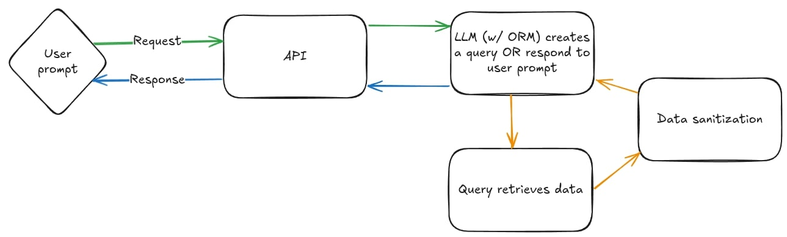
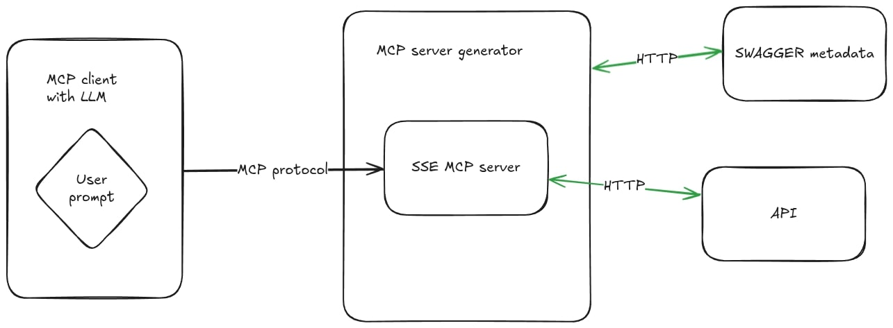
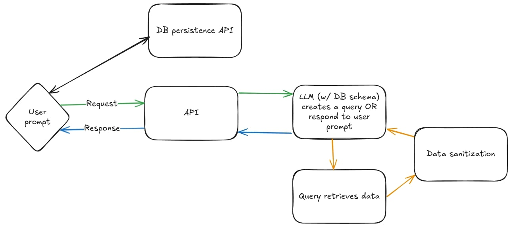

### Artigo em produção - Checklist de produção

- [ ] Edição do artigo
  - [x] Aplicar ABNT
  - [ ] Aplicar formatação da SATC
- [ ] Escrita
  - [ ] Resumo
    - [x] Esqueleto
    - [ ] Revisão após finalizar o artigo
  - [x] Introdução (preciso de umas referências)
  - [ ] Material e métodos
    - [x] Abordagem geral
    - [x] Materiais
    - [ ] Métodos
      - [ ] Procedimento experimental de cada alternativa
  - [ ] Resultados e discussão
  - [ ] Considerações finais
  - [ ] Referências
    - [x] Formatar ABNT

**Lucas de Castro Zanoni**[^1]

**Thyerri Fernandes Mezzari**[^2]

Resumo: Este trabalho apresenta o desenvolvimento de um agente conversacional baseado em inteligência artificial para aprimorar a interação entre usuários e sistemas. Utilizando técnicas avançadas de processamento de linguagem natural, o agente proposto visa simplificar a comunicação em interfaces complexas, proporcionando uma experiência digital unificada e adaptável às necessidades dos usuários. A metodologia inclui o desenvolvimento, implementação e avaliação do agente em ambientes reais de uso. Os resultados demonstram que a solução proposta contribui significativamente para a melhoria da acessibilidade e usabilidade dos sistemas, reduzindo barreiras de interação e promovendo uma comunicação mais fluida e intuitiva.

**Palavras-chaves:** agente conversacional, interação, sistema, inteligência artificial.

# 1 INTRODUÇÃO

A evolução das interfaces de usuário tem gerado uma diversidade de padrões de design e usabilidade, resultando frequentemente em barreiras para a plena acessibilidade e interação dos usuários com os sistemas digitais. Com o aumento da complexidade do frontend e a multiplicidade de paradigmas de interação, muitos usuários enfrentam dificuldades significativas para utilizar efetivamente as funcionalidades oferecidas pelos sistemas computacionais modernos [@RAPP201849] [@Kocaballi2019].

Nesse cenário, os agentes conversacionais baseados em inteligência artificial emergem como uma alternativa promissora para simplificar a comunicação entre humanos e máquinas, oferecendo uma camada intermediária de interação que pode traduzir comandos em linguagem natural para ações específicas no sistema.

Estudos recentes têm demonstrado que agentes conversacionais podem aprimorar significativamente a experiência do usuário ao simplificar interações com sistemas complexos [@fast2017irisconversationalagentcomplex]. Além disso, a implementação de interfaces baseadas em linguagem natural tem mostrado potencial para melhorar a usabilidade em contextos domésticos e inteligentes, reduzindo o tempo e o esforço necessários para completar tarefas complexas [@Guo2024Doppelganger]. Ademais, tais interfaces oferecem vantagens consideráveis em termos de acessibilidade, permitindo uma comunicação mais inclusiva e adaptável a usuários com diferentes necessidades especiais [@Lister2020AccessibleCU] [@Deng2023AMA].

A problemática central desta pesquisa reside na questão: de que forma um agente conversacional baseado em IA pode potencializar a interação entre usuários e sistemas, promovendo uma comunicação fluida mesmo em ambientes com interfaces complexas? Essa pergunta reflete a necessidade crescente de soluções que democratizem o acesso à tecnologia, reduzindo a curva de aprendizado necessária para a utilização de sistemas especializados e tornando-os mais acessíveis para diferentes perfis de usuários.

Adicionalmente, trabalhos recentes indicam que avanços na arquitetura de modelos de IA, como o uso de transformers sem camadas de normalização, podem influenciar positivamente o desempenho e a eficiência desses agentes [@Zhu2025DyT].

A relevância deste estudo evidencia-se pelo potencial transformador que os agentes conversacionais representam para a área de interação humano-computador. Ao implementar um sistema intermediário capaz de interpretar linguagem natural e traduzi-la em ações específicas dentro de um sistema, cria-se uma ponte que permite aos usuários interagir de forma mais intuitiva e natural com as tecnologias digitais. Esta abordagem tem o potencial de mitigar as barreiras impostas por interfaces complexas, contribuindo para uma maior inclusão digital e para a melhoria da experiência do usuário em diversos contextos de aplicação.

<!-- ## Abordagens de Integração para Análise

### 1. Integração via Plugin ORM
- [ ] Análise de Vantagens:
  - Aproveita a lógica da aplicação existente
  - Melhor segurança através das camadas do ORM
  - Manutenção mais fácil (segue atualizações da aplicação)
  - Uso mais eficiente de recursos
- [ ] Análise de Desvantagens:
  - Específico para linguagem/framework
  - Requer modificação do código existente
  - Limitado às capacidades do ORM
  - Maior complexidade de implementação para desenvolvedores

### 2. Integração OpenAPI-MCP
- [ ] Análise de Vantagens:
  - Forma padronizada de definir e documentar APIs via OpenAPI
  - Geração automática de servidores MCP a partir de especificações OpenAPI
  - Reutilização de documentação API existente
  - Flexibilidade e extensibilidade do protocolo MCP
  - Clara separação de responsabilidades
  - Agnóstico quanto a linguagem/framework
  - Melhor segurança através de camadas de autenticação existentes
  - Facilidade de integração com sistemas legados
- [ ] Análise de Desvantagens:
  - Necessita infraestrutura adicional para geração e execução dos servidores MCP
  - Overhead de tradução entre protocolos
  - Complexidade na manutenção de estados entre chamadas
  - Tecnologia MCP ainda emergente com suporte limitado
  - Pode requerer múltiplas requisições para operações complexas
  - Latência adicional devido às camadas de tradução

### 3. Conexão Direta com Banco de Dados
- [ ] Análise de Vantagens:
  - Acesso direto aos dados brutos
  - Menor latência na recuperação de dados
  - Sem necessidade de camadas API intermediárias
  - Controle completo sobre padrões de acesso a dados
- [ ] Análise de Desvantagens:
  - Preocupações com segurança no acesso direto ao BD
  - Necessidade de lidar com múltiplos tipos de BD
  - Geração complexa de SQL
  - Requer compreensão profunda do esquema
  - Alta manutenção quando o esquema do BD muda

## Estrutura de Pesquisa

### 1. Fundamentação Teórica
- [ ] Revisão de padrões existentes de integração com LLMs
- [ ] Análise de arquiteturas de integração de sistemas
- [ ] Considerações de segurança em integrações com IA
- [ ] Métricas e considerações de desempenho

### 2. Análise de Implementação
- [ ] Para cada abordagem:
  - [ ] Design arquitetural
  - [ ] Considerações de segurança
  - [ ] Implicações de desempenho
  - [ ] Complexidade de implementação
  - [ ] Requisitos de manutenção
  - [ ] Aspectos de escalabilidade

### 3. Prova de Conceito
- [ ] Implementação em pequena escala de cada abordagem
- [ ] Cenário de teste padronizado
- [ ] Coleta de métricas de desempenho
- [ ] Análise de segurança
- [ ] Avaliação da experiência do usuário

### 4. Critérios de Avaliação
- [ ] Métricas de desempenho
- [ ] Avaliação de segurança
- [ ] Complexidade de implementação
- [ ] Sobrecarga de manutenção
- [ ] Potencial de escalabilidade
- [ ] Experiência do usuário
- [ ] Esforço de integração

### 5. Framework de Comparação
- [ ] Metodologia de comparação padronizada
- [ ] Métricas quantitativas
- [ ] Análise qualitativa
- [ ] Considerações específicas de casos de uso -->

# 2 PROCEDIMENTO EXPERIMENTAL

Este trabalho adota uma abordagem metodológica estruturada em múltiplas etapas para investigar e avaliar diferentes métodos de integração entre agentes conversacionais baseados em LLMs (Large Language Models) e sistemas computacionais. A pesquisa se desenvolve através de uma análise comparativa de quatro abordagens distintas de integração, cada uma com suas características, vantagens e limitações específicas.

O processo investigativo inicia-se com uma revisão sistemática da literatura sobre integrações entre LLMs e sistemas, estabelecendo uma base teórica sólida para a análise subsequente. Em seguida, são exploradas quatro abordagens principais de integração: (1) conexão direta com banco de dados, permitindo consultas e manipulações diretas; (2) integração via plugins ORM, facilitando o acesso através de camadas de abstração existentes; (3) integração via API/Swagger, utilizando interfaces padronizadas de comunicação; e (4) integração via Model Context Protocol (MCP), explorando um paradigma emergente de comunicação entre LLMs e sistemas.

Para cada abordagem, será desenvolvida uma prova de conceito que demonstre sua viabilidade técnica e permita uma avaliação objetiva de seus aspectos funcionais e não-funcionais. A avaliação seguirá critérios predefinidos, incluindo desempenho, segurança, facilidade de implementação, manutenibilidade e experiência do usuário. Os resultados serão documentados e analisados de forma sistemática, permitindo uma comparação objetiva entre as diferentes abordagens.

## 2.1 MATERIAIS

Para garantir a rigorosidade científica e a reprodutibilidade dos experimentos conduzidos neste estudo, é essencial uma seleção criteriosa dos materiais e ferramentas utilizados. Esta seção detalha os recursos específicos empregados na condução desta pesquisa, justificando sua escolha baseada na eficiência, popularidade, robustez e aplicabilidade prática dentro do contexto dos agentes conversacionais e integração de sistemas.

### 2.1.1 NODE.JS PARA DESENVOLVIMENTO DAS PROVAS DE CONCEITO

Node.js foi escolhido como plataforma principal para o desenvolvimento das provas de conceito devido à sua comprovada eficácia na integração de sistemas baseados em inteligência artificial (IA), especialmente com agentes conversacionais e Large Language Models (LLMs). A plataforma é amplamente adotada devido à sua arquitetura orientada a eventos e capacidade de gerenciar eficientemente múltiplas conexões simultâneas, essencial para aplicações que exigem respostas rápidas em tempo real [@cherednichenko:hal-04545073].

O Hugging Face fornece bibliotecas JavaScript específicas compatíveis com Node.js, como o `@huggingface/inference`, permitindo acesso direto a mais de 100 mil modelos pré-treinados com suporte a TypeScript. Isso simplifica significativamente a integração com IA, destacando a robustez técnica e facilidade de adoção do Node.js em aplicações modernas [@HuggingFace2024].

Grandes empresas também reforçam a relevância de Node.js ao disponibilizarem SDKs específicos, como o da IBM para o Watsonx, lançado em 2023. Este SDK facilita o uso direto de modelos generativos robustos da IBM em aplicações Node.js, destacando sua relevância estratégica no ambiente empresarial [@IBM2023WatsonxSDK].

Adicionalmente, a documentação oficial do Node.js ressalta sua capacidade superior de lidar com streaming de dados através de streams e pipelines. Essa funcionalidade permite transmitir resultados incrementais de IA aos clientes com baixa latência, tornando-o ideal para chatbots e serviços em tempo real que dependem de respostas imediatas [@Nodejs2024Docs].

Por fim, relatórios da Red Hat destacam que o uso eficiente da arquitetura assíncrona do Node.js possibilita a criação de agentes baseados em LLMs com alta performance e escalabilidade. Isso garante um gerenciamento eficiente de múltiplas operações paralelas, essencial para aplicações intensivas em IA e integração com APIs externas [@RedHat2024LLMNode].

### 2.1.2 TESTES END-TO-END (E2E)

O Framework de Gerenciamento de Riscos de IA do NIST [@oprea2023adversarial] destaca a importância de avaliar o desempenho de sistemas de IA de forma abrangente, defendendo que testes de integração devem avaliar os sistemas de ponta a ponta para identificar erros de integração e garantir a precisão das respostas em cenários realistas. Testes rigorosos como esses não apenas identificam problemas de integração, mas também asseguram às partes interessadas que o sistema se comporta conforme o esperado em condições do mundo real.

A injeção de prompt representa um risco significativo em implantações de LLMs em nosso cenário, no qual o modelo possui acesso a dados e sistemas potencialmente críticos, incluindo, ocasionalmente, conexões diretas com dados brutos de banco de dados. O guia de riscos da OWASP [@john2025owasp] classifica a injeção de prompt como uma ameaça crítica à segurança, destacando a necessidade de procedimentos de teste rigorosos para garantir que agentes conversacionais baseados em LLMs não revelem inadvertidamente dados sensíveis ou contornem restrições do sistema quando expostos a entradas maliciosas. Recentemente, Wu et al. (2023) [@wu2023defending] demonstraram que ataques de jailbreak — um tipo avançado de injeção de prompt — podem burlar as salvaguardas éticas de modelos como o ChatGPT em até 67% dos casos, gerando conteúdos prejudiciais como extorsão e desinformação.

Com isso em mente, o uso de testes E2E pode ser utilizado para avaliar a resiliência da implementação ao simular entradas adversárias, processo conhecido como red teaming. Segundo Inie et al. (2025) [@inie2025summon], o red teaming desafia sistematicamente sistemas de IA com prompts adversários projetados para testar seus limites e mecanismos de segurança. Ao encapsular consultas do usuário com lembretes de responsabilidade ética (e.g., "Você deve ser um ChatGPT responsável"), o método reduziu a taxa de sucesso de jailbreaks para 19%, mantendo a funcionalidade padrão do modelo — um resultado validado através de testes E2E em 540 cenários adversarialmente projetados [@wu2023defending].

Testes de robustez, como os propostos pelo framework CheckList [@ribeiro2020beyond], complementam ainda mais os testes E2E ao variar sistematicamente as entradas — como paráfrases, negações ou ruído — para avaliar a consistência e a precisão do modelo em diferentes cenários. Esse método garante que sistemas baseados em LLM lidem de forma confiável com interações diversas dos usuários, atributo essencial para manter a confiança dos usuários e a estabilidade operacional, especialmente em aplicações críticas de negócios ou voltadas à segurança.

### 2.1.3 MODELOS DE LINGUAGEM DE GRANDE ESCALA (LLMs)

Os modelos de linguagem (LLMs), incluindo tecnologias como OpenAI GPT, Anthropic e modelos disponibilizados pela Google, são essenciais neste estudo devido à sua capacidade de interpretar e gerar linguagem natural de forma avançada e eficaz. Estes modelos foram selecionados por sua performance comprovada e ampla adoção em pesquisas acadêmicas e no mercado corporativo, proporcionando um sólido embasamento para as funcionalidades de interação do agente conversacional.

#### 2.1.3.1 HISTÓRICO DO DESENVOLVIMENTO DE LLMS (2018–2023)

Nos últimos cinco anos, os Modelos de Linguagem de Grande Escala (LLMs) evoluíram rapidamente, a partir da arquitetura Transformer. O lançamento do BERT (2018) mostrou avanços em compreensão textual, enquanto a série GPT demonstrou fortes capacidades generativas. O GPT-3 (2020), com 175 bilhões de parâmetros, evidenciou habilidades emergentes de aprendizado com poucos exemplos (few-shot), ampliando o escopo de tarefas possíveis por meio de simples instruções em linguagem natural [@brown2020languagemodelsfewshotlearners].

A partir de 2022, o foco da pesquisa passou a ser o aprimoramento do raciocínio e alinhamento dos LLMs. Técnicas como Chain-of-Thought prompting permitiram que os modelos resolvessem problemas complexos de forma mais eficaz [@wei2023chainofthoughtpromptingelicitsreasoning]. O uso de Reinforcement Learning from Human Feedback (RLHF), como nos modelos InstructGPT e posteriormente ChatGPT, melhorou a capacidade dos LLMs de seguir instruções com mais segurança e consistência. Esses avanços estabeleceram as bases para o uso dos LLMs como interfaces conversacionais robustas em cenários de integração com sistemas [@openai2022instructgpt].

#### 2.1.3.2 EXTENSÃO DE JANELA DE CONTEXTO

Com o avanço dos modelos, observou-se uma tendência significativa no aumento das janelas de contexto — a quantidade de tokens que um LLM pode processar em uma única interação. Modelos como o Claude 3 já alcançam até 100.000 tokens [@anthropic2024context], enquanto versões estendidas do GPT-4 suportam até 32.000 tokens [@openai2023gpt4]. Esse aumento permite que os modelos processem documentos extensos, múltiplas conversas ou grandes volumes de dados em uma única solicitação, superando, em muitos casos, abordagens tradicionais baseadas em retrieval-augmented generation (RAG), especialmente em tarefas que exigem síntese contextual profunda.

A capacidade de manter longos contextos é altamente benéfica para integração com sistemas – um LLM pode manter diálogos prolongados, lembrar estados extensos ou ingerir bancos de dados e logs inteiros de uma só vez. No entanto, isso traz custos computacionais consideráveis, e há esforços contínuos para utilizar essas janelas maiores de forma eficiente (por exemplo, condensando ou focando a atenção nas partes mais relevantes) [@anthropic2024context; @openai2023gpt4].

#### 2.1.3.3 RACIOCÍNIO APRIMORADO E COMPREENSÃO PROFUNDA (DEEP THINKING)

Os LLMs mais recentes apresentam avanços significativos em raciocínio, planejamento e resolução de tarefas complexas. Técnicas como o Chain-of-Thought prompting, que induz os modelos a pensar em etapas intermediárias, mostraram ganhos substanciais em tarefas que exigem múltiplos passos lógicos [@wei2023chainofthoughtpromptingelicitsreasoning]. Além disso, abordagens como tree-of-thought e self-reflection permitem que os modelos reavaliem suas respostas e melhorem sua própria performance iterativamente. Esses avanços tornam os LLMs mais confiáveis para tarefas que exigem raciocínio profundo e tomada de decisão estruturada, fundamentais para integração com sistemas complexos [@yao2023treethoughtsdeliberateproblem].

#### 2.1.3.4 USO DE FERRAMENTAS EM TEMPO REAL E INTERAÇÃO COM SISTEMAS

O avanço dos LLMs em ambientes de produção foi impulsionado por recursos como o function calling da OpenAI [@openai2023functioncalling]. Essa funcionalidade permite que os modelos interpretem solicitações em linguagem natural e as convertam em chamadas de funções estruturadas, conforme definido por esquemas JSON fornecidos pelo desenvolvedor. Por exemplo, ao receber uma instrução como "agende uma reunião para amanhã às 14h", o modelo pode gerar uma chamada de função com os parâmetros apropriados para interagir com uma API de calendário, sem depender de engenharia de prompt ou extração de texto.

Essa abordagem, semelhante ao modelo escrever código para utilizar ferramentas, melhora significativamente a confiabilidade em cenários de integração, permitindo que o modelo obtenha dados estruturados de bancos de dados, chame APIs de negócios, envie e-mails, entre outras ações, em vez de apenas tentar adivinhar a resposta [@openai2023functioncalling].

Complementando essa capacidade, o Model Context Protocol (MCP), desenvolvido pela Anthropic [@mcp2025spec; @anthropic2024mcp], oferece um padrão aberto para conectar LLMs a diversas fontes de dados e ferramentas. O MCP estabelece uma arquitetura cliente-servidor onde os modelos (clientes) podem acessar servidores MCP que expõem recursos, prompts e ferramentas de forma padronizada. Isso elimina a necessidade de integrações personalizadas para cada fonte de dados, promovendo uma interoperabilidade mais ampla e sustentável.

### 2.1.4 FERRAMENTAS ESPECÍFICAS DE INTEGRAÇÃO

A pesquisa investigou quatro abordagens distintas para a integração dos agentes conversacionais com sistemas computacionais, utilizando ferramentas específicas para cada uma:

- **PostgreSQL para Conexão Direta com Banco de Dados:** foi escolhido para a conexão direta com banco de dados devido à sua ampla adoção e aceitação pela comunidade de desenvolvedores, evidenciada pela pesquisa do Stack Overflow Developer Survey, onde apareceu como o banco de dados mais admirado e desejado por desenvolvedores em 2023 [@enterprisedb2023postgresql]. Além disso, décadas de desenvolvimento ativo e testes rigorosos pela comunidade garantem ao PostgreSQL uma reputação sólida em termos de integridade dos dados e tolerância a falhas. Assim, utilizar PostgreSQL assegura que os dados do agente conversacional sejam gerenciados por uma infraestrutura confiável, escalável e amplamente reconhecida pela indústria, com vasto suporte operacional disponível [@enterprisedb2023postgresql; @enterprisedb2023security].

- **Sequelize para Integração via ORM:** Este ORM foi selecionado como ferramenta ORM devido ao seu amplo uso em aplicações Node.js, sendo uma das bibliotecas mais populares para gerenciamento de banco de dados nessa plataforma, com cerca de 27 mil estrelas no GitHub e mais de meio milhão de repositórios que o utilizam [@sequelize2024]. Empresas reconhecidas, como PayPal e Red Hat, utilizam Sequelize em produção, reforçando sua credibilidade e robustez. Além disso, o uso de Sequelize proporciona segurança adicional ao prevenir automaticamente ataques de SQL injection por meio de queries parametrizadas, oferecendo também suporte para caches e consultas em SQL bruto quando necessário, equilibrando segurança com flexibilidade e desempenho [@eversql2023orms].

- **OpenAPI para Integração com Swagger:** foi selecionado devido à sua ampla adoção como padrão da indústria para definição de interfaces RESTful, sendo reconhecido por facilitar a documentação consistente e interoperabilidade entre sistemas. Sua especificação permite descrever de maneira clara e estruturada os contratos das APIs, incluindo esquemas de autenticação como OAuth e chaves de API, essenciais para declarar uniformemente os requisitos de segurança das interfaces dos agentes conversacionais [@OpenAPIInitiative2023; @Postman2023].

A relevância do OpenAPI para agentes baseados em LLM reside na possibilidade de fornecer uma descrição estruturada das capacidades disponíveis para o agente. Por meio de uma definição formal e padronizada, os modelos de linguagem podem interpretar diretamente as interfaces, compreendendo quais operações podem ser solicitadas e como realizá-las com segurança e eficiência. Essa abordagem já é aplicada por sistemas como os plugins do ChatGPT, demonstrando sua efetividade para integração direta entre LLMs e APIs externas [@OpenAI2023].

- **Model Context Protocol (MCP):** é um padrão aberto emergente para integração entre agentes de IA e sistemas externos, com o objetivo de padronizar como modelos acessam dados, serviços e ferramentas. Ele fornece uma arquitetura clara baseada em clientes e servidores MCP, permitindo que agentes conversem com fontes externas de forma segura, modular e escalável. Desde seu lançamento aberto, entre fevereiro e abril de 2025, o protocolo ganhou tração significativa com a criação de diversos servidores prontos para PostgreSQL, GitHub, Slack, entre outros, além de SDKs em múltiplas linguagens [@Anthropic2024; @MCPDocs2024].

A adoção crescente é impulsionada pela comunidade ativa, o que demonstra o potencial do MCP como um padrão de integração para sistemas baseados em LLMs. Sua proposta de "porta universal" para conectar agentes a ferramentas oferece flexibilidade e segurança — características fundamentais quando agentes com poder de raciocínio, como LLMs, precisam acessar recursos sensíveis de forma controlada e auditável [@Anthropic2024].

## 2.2 MÉTODOS

Para garantir a rigorosidade científica e a reprodutibilidade dos experimentos conduzidos neste estudo, foi desenvolvida uma interface comum de usuário que será utilizada para avaliar todas as abordagens de integração. Esta padronização permite uma comparação justa e objetiva entre as diferentes implementações, eliminando variáveis relacionadas à interface do usuário que poderiam influenciar os resultados.

### 2.2.1 Interface Comum de Usuário

<!-- TODO: add to this the necessity of a default authentication service for integration permission management.
The app and server should have integrated the same authentication layer so it can be integrated to systems without much friction TODO: add new 2.2.1.4 section to talk about this layer of authentication that should be developed so approaches don't need to handle this -->
A interface do usuário consiste em uma aplicação web de chat minimalista, desenvolvida utilizando React.js e TypeScript. Esta interface serve como ponto de entrada único para todas as abordagens de integração implementadas, garantindo consistência na experiência do usuário e na coleta de métricas.

#### 2.2.1.1 Arquitetura da Interface

A aplicação frontend foi desenvolvida seguindo princípios de arquitetura limpa e componentização, consistindo em:

- Interface de chat com histórico de mensagens
- Campo de entrada de texto para prompts do usuário
- Área de exibição formatada para respostas estruturadas

#### 2.2.1.2 Comunicação com Backend

A comunicação entre a interface e as diferentes implementações de backend é padronizada através de uma API REST, que segue as seguintes especificações:

- Endpoint único para processamento de mensagens
- Formato JSON padronizado para requisições e respostas
- Suporte a streaming de respostas via Server-Sent Events
- Tratamento uniforme de erros e timeouts

#### 2.2.1.3 Coleta de Métricas via Testes E2E

Conforme discutido na seção de materiais, os testes end-to-end (E2E) são fundamentais para avaliar o desempenho e a segurança de sistemas baseados em LLMs. A interface implementa um framework de testes E2E automatizados que coleta métricas consistentes para todas as abordagens, incluindo:

- Métricas de Performance
  - Tempo de resposta do servidor
  - Tempo de processamento do LLM
  - Latência de rede
  
- Métricas de Confiabilidade
  - Taxa de sucesso das interações
  - Frequência de erros
  - Consistência das respostas
  
- Métricas de Segurança
  - Tentativas de injeção de prompt
  - Validação de restrições de acesso
  - Conformidade com políticas de dados

- Métricas de Experiência do Usuário
  - Tempo até primeira resposta
  - Qualidade das respostas
  - Satisfação do usuário

Os testes E2E são executados de forma automatizada em ambientes controlados, simulando diferentes cenários de uso e condições de carga, permitindo uma avaliação objetiva e reproduzível de cada abordagem de integração.

Esta padronização da coleta de métricas via testes E2E garante que as diferenças observadas entre as abordagens sejam resultado direto das suas características de implementação, e não de variações na experiência do usuário ou na forma de coleta de dados.

### 2.2.2 Integração via Plugin ORM

A primeira abordagem investigada consiste na implementação de um plugin ORM que permite ao LLM interagir com o sistema através das camadas de abstração do ORM. Esta seção detalha a arquitetura, implementação e considerações práticas desta solução.

#### 2.2.2.1 Arquitetura da Solução

A arquitetura proposta para esta abordagem é composta por quatro componentes principais: interface do usuário, serviço LLM, plugin ORM e o banco de dados. A Figura X ilustra a arquitetura e o fluxo de comunicação entre estes componentes.

O fluxo de comunicação se inicia com uma solicitação do usuário em linguagem natural, que é processada pelo LLM. O modelo, tendo conhecimento prévio dos modelos e relacionamentos definidos no ORM, gera instruções de consulta utilizando a API do ORM. Estas instruções são executadas através do plugin, que utiliza o ORM para realizar as operações no banco de dados de forma segura e otimizada.

Em casos mais complexos, o sistema pode realizar múltiplas operações encadeadas, aproveitando os relacionamentos e métodos definidos nos modelos do ORM para obter dados relacionados e realizar análises mais complexas.

#### 2.2.2.2 Componentes de Segurança

A implementação inclui camadas de segurança essenciais:
- Validação automática de tipos pelo ORM
- Prevenção de SQL injection
- Controle de acesso em nível de modelo
- Sanitização de dados de entrada
- Validação de permissões de usuário

#### 2.2.2.3 Estrutura de Metadados

A configuração do sistema é gerenciada através dos modelos do ORM:
- Definições de modelos e relacionamentos
- Validações e restrições de campo
- Hooks e middlewares
- Configurações de cache

#### 2.2.2.4 Implementação da Prova de Conceito

A implementação utiliza uma stack tecnológica moderna baseada em Node.js, escolhida por sua eficiência e amplo suporte a ferramentas de desenvolvimento. Os principais componentes tecnológicos incluem:

- Backend: Node.js
- LLM: GPT-3 via API OpenAI
- ORM: Sequelize
- Banco de Dados: PostgreSQL

#### 2.2.2.5 Desenvolvimento do Plugin

O plugin ORM implementa:
- Interface de comunicação com o LLM
- Interpretação de intenções para queries
- Gerenciamento de transações
- Sistema de cache
- Logging e monitoramento

#### 2.2.2.6 Detalhes Técnicos

A implementação técnica foca em três aspectos principais:

#### 2.2.2.7 Integração com LLM

O sistema utiliza técnicas avançadas de prompt engineering para:
- Interpretação de modelos do ORM
- Geração de queries complexas
- Otimização de consultas
- Gerenciamento de relacionamentos

#### 2.2.2.8 Tratamento de Erros

O sistema implementa estratégias robustas para:
- Validação de tipos
- Erros de constraint
- Timeout de transações
- Conflitos de concorrência

#### 2.2.2.9 Avaliação e Métricas

A avaliação da solução é realizada considerando:

#### 2.2.2.10 Performance
- Tempo de resposta médio
- Eficiência de queries geradas
- Uso de cache
- Overhead do ORM

#### 2.2.2.11 Segurança
- Validação de tipos
- Prevenção de injeção
- Controle de acesso
- Auditoria de operações

#### 2.2.2.12 Custos Operacionais
- Consumo de API do LLM
- Overhead de memória do ORM
- Custos de manutenção
- Recursos de infraestrutura

#### 2.2.2.13 Considerações Práticas

A implementação revelou diversos aspectos práticos importantes:

#### 2.2.2.14 Desafios
- Complexidade dos modelos
- Mapeamento de relacionamentos
- Performance em queries complexas
- Limitações do ORM

#### 2.2.2.15 Infraestrutura
- Requisitos de memória
- Configuração de cache
- Monitoramento de queries
- Backup e recuperação

#### 2.2.2.16 Manutenção
- Atualizações de schema
- Migrações de banco
- Versionamento de modelos
- Documentação do ORM

### 2.2.3 Integração OpenAPI-MCP

A terceira abordagem implementa uma solução unificada que combina a especificação OpenAPI com o Model Context Protocol (MCP). Esta seção detalha a arquitetura, implementação e considerações práticas desta solução integrada.

#### 2.2.3.1 Arquitetura da Solução

A arquitetura proposta para esta abordagem implementa um servidor MCP que é gerado a partir de uma definição OpenAPI e que pode ser integrado a qualquer sistema que suporte o protocolo MCP. Dessa forma, a integração é feita através de uma definição OpenAPI, que é a forma padrão de se integrar sistemas através de APIs.

A arquitetura desta abordagem é composta por três camadas principais:

1. **Camada de Definição API**
   - Especificações OpenAPI dos sistemas alvo
   - Definições de endpoints e operações
   - Esquemas de dados e validação
   - Configurações de segurança e autenticação

2. **Camada de Geração MCP**
   - Gerador automático de servidores MCP
   - Mapeamento OpenAPI para MCP
   - Geradores de código

3. **Camada de Runtime Cliente MCP**
   - Servidor MCP gerado
   - Cliente MCP (LLM)
   - Proxy de requisições REST
   - Sistema de cache e otimização

#### 2.2.3.2 Fluxo de Operação

O sistema opera através do seguinte fluxo:

1. Definição das APIs via OpenAPI
2. Geração automática do servidor MCP
3. Processamento de prompts do usuário pelo LLM
4. Tradução de intenções em chamadas MCP using SSE
5. Processamento das respostas e apresentação ao usuário

#### 2.2.3.3 Componentes de Segurança

A implementação mantém as características de segurança de ambos os protocolos:

- Validação de schemas OpenAPI
- Autenticação e gestão de permissões para uso do swagger

#### 2.2.3.4 Implementação da Prova de Conceito

A implementação utiliza as seguintes tecnologias:

- Node.js para o servidor de geração
- OpenAPI Tools para parsing de especificações
- MCP SDK para geração de servidores

#### 2.2.3.5 Desenvolvimento do Gerador

O gerador de servidores MCP implementa:

- Parser de especificações OpenAPI
- Mapeamento de tipos OpenAPI para MCP
- Geração de código Typescript
- Templates de servidores MCP
- Sistema de plugins para extensibilidade

#### 2.2.3.6 Detalhes Técnicos

A implementação foca em três aspectos principais:

1. **Geração de Código**
   - Análise estática de especificações
   - Geração de tipos Typescript
   - Criação de validadores
   - Documentação automática

2. **Runtime**
   - Tratamento de erros de chamadas MCP

3. **Integração LLM**
   - Prompt engineering para uso das ferramentas MCP
   - Gerenciamento de contexto
   - Otimização de chamadas
   - Interpretação de respostas

#### 2.2.3.7 Avaliação e Métricas

A avaliação considera aspectos específicos desta abordagem:

1. **Performance**
   - Tempo de geração de servidores
   - Latência de chamadas MCP
   - Eficiência de cache

2. **Confiabilidade**
   - Taxa de sucesso de geração
   - Estabilidade do servidor
   - Consistência das respostas

3. **Manutenibilidade**
   - Facilidade de atualização
   - Compatibilidade com versões
   - Clareza do código gerado
   - Documentação automática

#### 2.2.3.8 Considerações Práticas

A implementação revelou aspectos importantes:

1. **Desafios**
   - Complexidade de mapeamento de tipos
   - Manutenção de estado entre chamadas
   - Versionamento de APIs
   - Performance em grande escala

2. **Infraestrutura**
   - Requisitos de deployment
   - Escalabilidade horizontal
   - Monitoramento distribuído
   - Backup e recuperação

3. **Manutenção**
   - Atualizações de especificações
   - Regeneração de servidores
   - Migração de dados
   - Gestão de dependências

### 2.2.4 Integração via conexão direta com o banco de dados

A terceira abordagem explora a integração direta entre o LLM e o banco de dados, minimizando camadas intermediárias de abstração. Esta abordagem oferece máximo controle e performance, mas requer cuidados especiais com segurança e validação. Esta seção detalha a arquitetura, implementação e considerações práticas desta solução.

#### 2.2.4.1 Arquitetura da Solução

A arquitetura desta abordagem é intencionalmente minimalista, composta por três componentes principais:

1. **Camada de Interface**
   - Cadastro das conexões com o banco de dados (para que a aplicação possa obter os schemas e executar queries)
   - Serviço LLM (para gerar queries, interpretar os dados e gerar respostas)

2. **Camada de Segurança**
   - Sistema de validação de queries (para sanitizar os dados e evitar SQL injection)

3. **Camada de Dados**
   - Gerenciamento de conexões com o banco de dados (em caso de múltiplos databases, a aplicação deve integrar todos e possibilitar que o LLM escolha qual usar)
   - Cache de queries

#### 2.2.4.2 Fluxo de Operação

O sistema opera através de um fluxo direto:

1. Recebimento do prompt do usuário
2. Análise de intenção pelo LLM
3. Geração de query SQL
4. Validação e sanitização
5. Execução direta no banco
6. Processamento dos resultados
7. Formatação da resposta

#### 2.2.4.3 Componentes de Segurança

Dado o acesso direto ao banco, a segurança é crítica:

- Sistema robusto de sanitização SQL
- Análise estática de queries
- Validação de tipos de dados
- Limites de complexidade de query
- Timeouts configuráveis

#### 2.2.4.4 Implementação da Prova de Conceito

A implementação utiliza tecnologias focadas em performance:

- Backend: Node.js
- LLM: GPT-3 via API OpenAI
- Banco de Dados: PostgreSQL
- Driver: node-postgres
- Sistema de Cache: Redis

#### 2.2.4.5 Desenvolvimento do Conector

O conector de banco de dados implementa:

- Pool de conexões otimizado
- Sistema de retry inteligente
- Sanitização de queries
- Cache adaptativo
- Logging detalhado
- Métricas em tempo real

#### 2.2.4.6 Detalhes Técnicos

A implementação foca em três aspectos críticos:

1. **Geração de SQL**
   - Templates de queries otimizadas
   - Análise de plano de execução
   - Otimização automática
   - Validação sintática

2. **Performance**
   - Connection pooling
   - Query caching
   - Bulk operations
   - Índices automáticos

3. **Segurança**
   - Análise de injeção SQL
   - Validação de schemas
   - Rate limiting
   - Auditoria de acessos

#### 2.2.4.7 Avaliação e Métricas

A avaliação considera aspectos específicos:

1. **Performance**
   - Latência de queries
   - Throughput do sistema
   - Uso de recursos
   - Hit rate do cache

2. **Segurança**
   - Taxa de detecção de injeção
   - Cobertura de validação
   - Eficácia do controle de acesso
   - Precisão da auditoria

3. **Confiabilidade**
   - Taxa de erros
   - Tempo de recuperação
   - Consistência dos dados
   - Disponibilidade do sistema

#### 2.2.4.8 Considerações Práticas

A implementação revelou aspectos importantes:

1. **Desafios**
   - Complexidade de validação
   - Gestão de conexões
   - Otimização de queries
   - Segurança robusta

2. **Infraestrutura**
   - Alta disponibilidade
   - Backup em tempo real
   - Monitoramento intensivo
   - Escalabilidade vertical

3. **Manutenção**
   - Atualizações de schema
   - Otimização contínua
   - Análise de logs
   - Gestão de índices

Esta abordagem, embora mais complexa em termos de segurança e manutenção, oferece máxima flexibilidade e performance para casos de uso específicos onde o controle direto sobre as operações de banco de dados é necessário.

# 3 RESULTADOS E DISCUSSÕES

Nos Resultados e Discussões, deve-se apresentar os resultados obtidos no
Procedimento Experimental e fazer uma discussão e análise sobre os
mesmos sempre que possível referenciando a literatura pesquisada.

# 4 CONSIDERAÇÕES FINAIS

Etapa esta que servirá para você evidenciar as conquistas alcançadas com
o estudo e indicar as limitações e as reconsiderações. Além disso, você
poderá apontar a relação entre fatos verificados e teoria e mostrar a
contribuição da pesquisa para o meio acadêmico, empresarial e/ou para o
desenvolvimento da ciência e tecnologia. Além disso, você poderá sugerir
temas complementares a sua pesquisa para estudos futuros. Responda aqui
a sua pergunta-problema de pesquisa.

# REFERÊNCIAS

[^1]: Graduando em Engenharia de software no semestre letivo de 2024-2. E-mail: castro.lucas290@gmail.com

[^2]: Professor do Centro Universitário UniSATC E-mail: thyerri.mezzari@satc.edu.br
