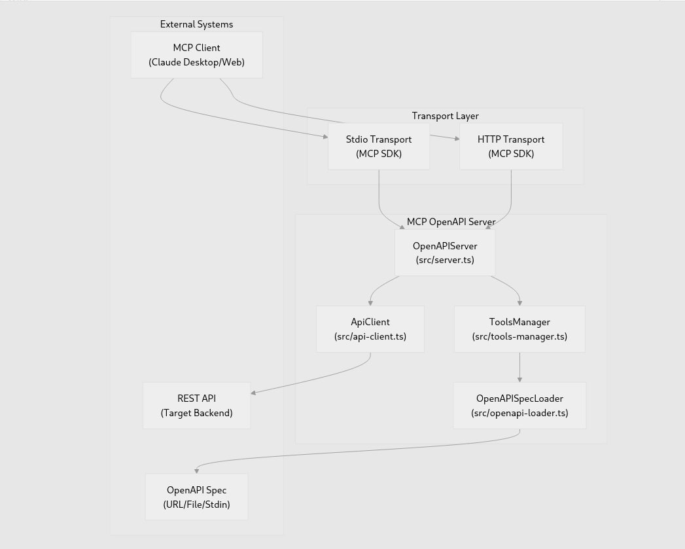
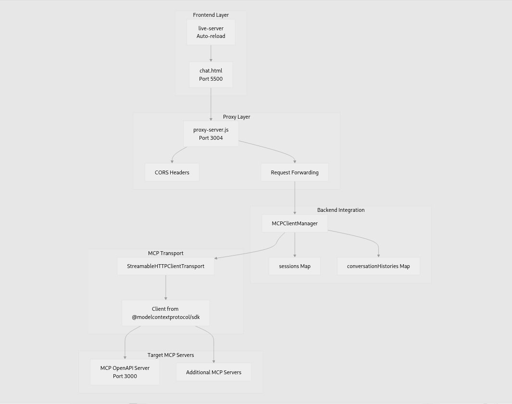

<!-- ### Artigo em produção - Checklist de produção

- [ ] Edição do artigo
  - [ ] Aplicar formatação da SATC
    - [ ] Definir o template do .docx com o Word
  - [x] Referências
    - [x] Formatação ABNT
- [ ] Escrita
  - [x] Resumo
  - [x] Introdução
  - [x] Material e métodos
  - [x] Revisão e entrega parcial (nota 4.5/5)
  - [x] Desenvolvimento
  - [x] Resultados e discussão
  - [x] Considerações finais
  - [ ] Revisão após finalizar o artigo -->

**Lucas de Castro Zanoni**[^1]

**Thyerri Fernandes Mezzari**[^2]

<!-- 📍 CORREÇÃO RESUMO - ANÁLISE DETALHADA DOS PROBLEMAS:

PROBLEMA 1 - EXTENSÃO EXCESSIVA:
- Atualmente: ~180 palavras (excede recomendação de máximo 150-250 palavras)
- CORREÇÃO: Reduzir focando apenas em: problema central, método principal, resultado principal, conclusão
- REMOVER: detalhes metodológicos excessivos, explicações de ferramentas específicas

PROBLEMA 2 - CONCORDÂNCIA VERBAL:
- ERRO: "foi desenvolvida uma interface padronizada" (concordância inadequada)
- CORREÇÃO: "Para garantir uma análise rigorosa e reprodutível, desenvolveu-se uma interface padronizada"

PROBLEMA 3 - ESTRANGEIRISMOS SEM EXPLICAÇÃO:
- "end-to-end" → "testes automatizados *end-to-end* (ponta a ponta)"
- "red teaming" → "*red teaming* (testes adversários/simulação de ataques)"
- "prompts" → "*prompts* (comandos de entrada para modelos de linguagem)"

PROBLEMA 4 - OBJETIVOS ESPECÍFICOS AUSENTES:
- FALTA: mencionar objetivos específicos claros
- ADICIONAR: objetivos mensuráveis e específicos da pesquisa

PROBLEMA 5 - ESTRUTURA RECOMENDADA PARA REESCRITA:
- Frase 1: Contextualização + problema central
- Frase 2: Método principal + objetivos específicos
- Frase 3: Breve toque nas referências acadêmicas
- Frase 4: Principais resultados quantitativos
- Frase 5: Conclusão + implicações práticas
-->

Resumo: Este trabalho apresenta um estudo experimental de integração de agentes conversacionais baseados em inteligência artificial a soluções web através da especificação OpenAPI combinada com o protocolo Model Context Protocol (MCP). A pesquisa investiga como especificações OpenAPI podem ser automaticamente convertidas em servidores MCP, permitindo que modelos de linguagem de grande escala (LLMs) interajam de forma padronizada e segura com sistemas externos. Para garantir uma análise rigorosa e reprodutível, foi desenvolvida uma interface padronizada e definidos critérios objetivos, fundamentando-se em referências acadêmicas, guias de segurança, relatórios de mercado e documentações oficiais de provedores de modelos de linguagem. O estudo envolveu a implementação de uma prova de conceito que inclui um gerador automático de servidores MCP a partir de especificações OpenAPI, um cliente de chat capaz de gerenciar múltiplos servidores MCP simultaneamente, e aplicações de teste para validação da abordagem. Foram aplicados testes automatizados *end-to-end*, com ênfase em métricas de robustez, segurança (incluindo *red teaming* e injeção de *prompts*) e usabilidade. Os resultados demonstram a viabilidade e eficácia da integração OpenAPI-MCP, fornecendo uma análise fundamentada sobre os benefícios, desafios e limitações desta abordagem para a integração de agentes conversacionais em sistemas complexos, promovendo acessibilidade, usabilidade e confiabilidade.

**Palavras-chave:** agente conversacional, integração de sistemas, inteligência artificial, OpenAPI, Model Context Protocol, segurança, usabilidade.

# 1 INTRODUÇÃO

A evolução das interfaces de usuário tem gerado uma diversidade de padrões de design e usabilidade, resultando frequentemente em barreiras para a plena acessibilidade e interação dos usuários com os sistemas digitais. Com o aumento da complexidade do frontend e a multiplicidade de paradigmas de interação, muitos usuários enfrentam dificuldades significativas para utilizar efetivamente as funcionalidades oferecidas pelas soluções web modernas [@RAPP201849] [@Kocaballi2019]. Nesse contexto, a ascensão dos Modelos de Linguagem de Grande Escala (LLMs), como os desenvolvidos por OpenAI, Anthropic e Google, tem impulsionado o desenvolvimento de agentes conversacionais mais avançados e adaptáveis [@openai2022instructgpt; @anthropic2024mcp]. Nos últimos anos, avanços em modelos baseados em Transformer, como o BERT (2018), que aprimorou a compreensão textual, e o GPT-3 (2020), que ampliou as capacidades generativas e o aprendizado com poucos exemplos (*few-shot*), permitiram que os LLMs realizassem tarefas cada vez mais complexas a partir de simples instruções em linguagem natural. Esses avanços consolidaram os LLMs como interfaces conversacionais robustas e eficazes para integração com sistemas.

Diante desse cenário, estudos recentes têm demonstrado que agentes conversacionais podem aprimorar significativamente a experiência do usuário ao simplificar interações com sistemas complexos [@fast2017irisconversationalagentcomplex]. Além disso, a implementação de interfaces baseadas em linguagem natural tem mostrado potencial para melhorar a usabilidade em contextos domésticos e inteligentes, reduzindo o tempo e o esforço necessários para completar tarefas complexas [@Guo2024Doppelganger]. Ademais, tais interfaces oferecem vantagens consideráveis em termos de acessibilidade, permitindo uma comunicação mais inclusiva e adaptável a usuários com diferentes necessidades especiais [@Lister2020AccessibleCU] [@Deng2023AMA]. Para que esses benefícios sejam efetivamente alcançados em soluções web, é fundamental avaliar as diferentes estratégias de integração desses agentes aos sistemas existentes.

Nesse sentido, este estudo aborda experimentalmente a integração de agentes conversacionais baseados em IA a sistemas web através da especificação OpenAPI combinada com o protocolo emergente MCP (Model Context Protocol). Esta abordagem permite que especificações OpenAPI sejam automaticamente convertidas em servidores MCP, criando uma ponte padronizada entre modelos de linguagem e sistemas externos. A solução será avaliada quanto a desempenho, segurança, facilidade de implementação e experiência do usuário, com foco específico na capacidade de gerenciar múltiplos servidores MCP simultaneamente e na eficácia da geração automática de código.

Considerando esse panorama tecnológico e as potencialidades demonstradas pelos LLMs, a problemática central desta pesquisa reside na questão: como a combinação da especificação OpenAPI com o protocolo MCP pode facilitar a integração eficiente e segura de agentes conversacionais baseados em IA com sistemas web existentes? Essa pergunta reflete a necessidade crescente de soluções padronizadas que democratizem o acesso à tecnologia, reduzindo a complexidade de integração e tornando sistemas especializados mais acessíveis através de interfaces conversacionais naturais.

A relevância deste estudo evidencia-se pelo potencial transformador que os agentes conversacionais representam para a área de interação humano-computador. Ao implementar um sistema intermediário capaz de interpretar linguagem natural e traduzi-la em ações específicas dentro de um sistema, cria-se uma ponte que permite aos usuários interagir de forma mais intuitiva e natural com as tecnologias digitais. Esta abordagem tem o potencial de mitigar as barreiras impostas por interfaces complexas, contribuindo para uma maior inclusão digital e para a melhoria da experiência do usuário em diversos contextos de aplicação.

# 2 PROCEDIMENTO EXPERIMENTAL

Este estudo adota uma abordagem experimental estruturada em etapas sequenciais para investigar a viabilidade e eficácia da integração de agentes conversacionais baseados em IA a sistemas web através da especificação OpenAPI combinada com o protocolo Model Context Protocol (MCP). A pesquisa será examinada com base em uma prova de conceito prática, desenvolvida para validar sua viabilidade técnica e avaliar objetivamente aspectos funcionais e não-funcionais da solução proposta.

Inicialmente, será conduzida uma revisão sistemática da literatura, consolidando conhecimentos científicos sobre integração OpenAPI-MCP e embasando teoricamente a fase experimental. Na sequência, a estratégia será implementada e testada por meio de uma prova de conceito abrangente, incluindo a) o desenvolvimento de um gerador automático de servidores MCP, b) um cliente de chat para gerenciamento de múltiplos servidores, c) aplicações de teste de ponta a ponta para validação da abordagem e d) geração de métricas de avaliação para medir desempenho, segurança, facilidade de implementação, manutenibilidade e experiência do usuário. 

Para assegurar resultados objetivos e reproduzíveis, os testes serão automatizados utilizando testes *end-to-end*, aplicando medidas de robustez e segurança (como testes de *red teaming* e proteção contra injeção de *prompts*) e avaliações qualitativas de usabilidade. Os resultados serão sistematicamente documentados e analisados, permitindo identificar desafios, vantagens e limitações intrínsecas à integração OpenAPI-MCP e demonstrando sua aplicabilidade prática para diferentes contextos de uso.

<!-- 📍 CORREÇÃO FORMATAÇÃO DE FIGURAS - PROBLEMAS IDENTIFICADOS:
PROBLEMA 1 - LEGENDAS INSUFICIENTEMENTE DESCRITIVAS:
- ATUAL: "Interface do Usuário" (muito genérica)
- PROBLEMA: Legenda não explica o que está sendo mostrado especificamente
- CORREÇÃO: Figura e o número são inseridos automaticamente, só ajuste a legenda para "Interface web minimalista 
desenvolvida para testes padronizados da integração OpenAPI-MCP, mostrando área de histórico de mensagens e campo 
de entrada do usuário"

PROBLEMA 2 - FALTA DE CONTEXTO NO TEXTO:
- PROBLEMA: Figuras aparecem sem preparação textual adequada
- NECESSÁRIO: Parágrafo anterior deve mencionar que "a interface será apresentada na figura seguinte" ou similar

PROBLEMA 3 - AUSÊNCIA DE ANÁLISE/DISCUSSÃO DAS FIGURAS:
- PROBLEMA: Figuras não são analisadas ou discutidas após apresentação
- NECESSÁRIO: Explicar aspectos específicos mostrados na figura

EXEMPLO DE CORREÇÃO COMPLETA:
TEXTO ANTES: "A interface desenvolvida para este estudo segue princípios de design minimalista, conforme 
ilustrado na Figura 1."
FIGURA: "Figura 1: Interface web de chat utilizada nos testes experimentais, destacando a separação visual entre 
mensagens do usuário (direita) e do agente (esquerda), além do campo de entrada inferior para novos comandos."
TEXTO APÓS: "Como observado na Figura 1, a disposição visual facilita o acompanhamento do diálogo, elemento 
crucial para a avaliação objetiva da experiência do usuário."
-->

## 2.1 MATERIAIS

Para garantir a rigorosidade científica e a reprodutibilidade dos experimentos conduzidos neste estudo, foram selecionadas ferramentas específicas baseadas em critérios de robustez, popularidade acadêmica e aplicabilidade prática para desenvolvimento da prova de conceito.

### 2.1.1 PLATAFORMA DE DESENVOLVIMENTO

**Node.js (versão 20+)** foi selecionado como plataforma principal devido à sua arquitetura assíncrona orientada a eventos, essencial para aplicações que requerem processamento simultâneo de múltiplas requisições e integração eficiente com APIs de modelos de linguagem. A escolha foi fundamentada na comprovada capacidade da plataforma para gerenciar operações intensivas de IA e sua ampla adoção em projetos de integração com LLMs [@cherednichenko:hal-04545073; @RedHat2024LLMNode].

### 2.1.2 FERRAMENTAS DE TESTE E VALIDAÇÃO

**Playwright** foi utilizado para implementação de testes automatizados *end-to-end* (E2E), permitindo simulação precisa de interações do usuário e validação de funcionalidades em ambiente controlado. Para avaliação de segurança, foram implementadas técnicas de *red teaming* - testes adversários sistemáticos que simulam ataques de injeção de *prompts* e tentativas de *jailbreak*. O *Framework* de Gerenciamento de Riscos de IA do NIST [@oprea2023adversarial] e as diretrizes da OWASP [@john2025owasp] orientaram a definição dos cenários de teste, considerando que injeções de *prompt* representam ameaças críticas em sistemas LLM com acesso a dados sensíveis.

### 2.1.3 MODELOS DE LINGUAGEM UTILIZADOS

**OpenAI GPT-4** foi selecionado como modelo principal devido às suas capacidades avançadas de *function calling* - funcionalidade que permite interpretação de linguagem natural e conversão automática em chamadas de funções estruturadas. Modelos desta família suportam janelas de contexto extensas (até 32.000 tokens no GPT-4) [@openai2023gpt4], essenciais para manter conversas prolongadas e processar especificações OpenAPI complexas. A seleção baseou-se na performance comprovada em cenários de integração com sistemas externos e na disponibilidade de APIs robustas para desenvolvimento [@openai2023functioncalling].

### 2.1.4 FERRAMENTAS DE INTEGRAÇÃO

**OpenAPI 3.0+** foi utilizado como especificação padrão para definição de contratos de API, proporcionando documentação estruturada e interoperabilidade entre sistemas. Sua ampla adoção como padrão da indústria e capacidade de descrever esquemas de autenticação (OAuth, API Key, Bearer Token) tornam-no adequado para integração com agentes conversacionais [@OpenAPIInitiative2023].

**Model Context Protocol (MCP)** foi implementado como protocolo de comunicação entre modelos de linguagem e sistemas externos. Desenvolvido pela Anthropic e lançado como padrão aberto em novembro de 2024, o MCP oferece arquitetura cliente-servidor padronizada que elimina a necessidade de integrações personalizadas para cada fonte de dados [@anthropic2024mcp; @MCPDocs2024]. O advento deste protocolo possibilitou a interface de comunicação padronizada entre modelos de linguagem e sistemas externos, facilitando a integração e a interoperabilidade entre diferentes fontes de dados e modelos de linguagem.

## 2.2 MÉTODOS

Para assegurar a validade científica e a reprodutibilidade dos experimentos, foi fundamental estabelecer um controle rigoroso das variáveis experimentais. A implementação de uma interface padronizada constitui elemento metodológico essencial para eliminar diferenças de experiência do usuário que poderiam contaminar os resultados experimentais. Esta padronização garante que as diferenças observadas no desempenho sejam atribuíveis exclusivamente às tecnologias de integração testadas (OpenAPI-MCP), e não a variações na interface ou design de interação. Sem este controle experimental, seria impossível determinar se melhorias na usabilidade decorrem da abordagem proposta ou de fatores externos relacionados ao design da interface.

### 2.2.1 Interface Padronizada de Usuário

A interface comum consiste em uma aplicação web simples de chat, desenvolvida utilizando HTML e JavaScript. A interface foi projetada de forma minimalista, visando uma experiência consistente e objetiva, independentemente da abordagem utilizada para a integração.

#### 2.2.1.1 DESIGN DA INTERFACE

A interface é composta por uma seção principal que exibe o histórico de mensagens, onde as interações entre usuário e agente conversacional aparecem de forma intercalada: as mensagens do agente são exibidas à esquerda e as do usuário à direita, facilitando a distinção visual entre os participantes da conversa. Abaixo do histórico, há um campo de entrada de texto que permite ao usuário digitar e enviar novas mensagens. Esse layout possibilita ao usuário acompanhar facilmente todo o histórico da conversa e inserir novos *prompts* de maneira contínua e intuitiva.

#### 2.2.1.2 Comunicação com *Backend*

A comunicação entre *frontend* e *backend* será estabelecida por meio de uma API REST síncrona, simplificando o processo de envio e retorno de mensagens. Cada consulta feita pelo usuário gerará uma única requisição ao *backend* que processará integralmente essa requisição utilizando um LLM e devolverá uma resposta após concluir o processamento, mantendo o fluxo de comunicação claro e previsível.

### 2.2.2 Critérios de Avaliação e Operacionalização de Métricas

Para garantir uma avaliação científica rigorosa, foram definidos critérios objetivos de avaliação com métricas específicas quantitativas e qualitativas, operacionalizados através de instrumentação técnica precisa e metodologias de coleta padronizadas.

Os critérios de desempenho compreendem quatro métricas fundamentais. O tempo de resposta total é medido em milissegundos utilizando timestamps precisos via Performance API do navegador, fornecendo dados objetivos sobre a latência percebida pelo usuário final. A taxa de sucesso de operações é calculada como percentual de requisições bem-sucedidas versus falhas, com categorização sistemática de tipos de erro para identificação de padrões de falha. O *throughput* é quantificado como número de operações processadas por segundo em cenários de carga controlada, permitindo avaliação da capacidade de processamento simultâneo.

Os critérios de segurança focam na robustez contra ataques adversários e validação de entrada. A resistência a injeção de *prompts* é mensurada como percentual de tentativas maliciosas bloqueadas durante testes de *red teaming*, implementados conforme o Framework de Gerenciamento de Riscos de IA do NIST [@oprea2023adversarial] e as diretrizes da OWASP [@john2025owasp], considerando que injeções de *prompt* representam ameaças críticas em sistemas LLM com acesso a dados sensíveis.

Os critérios de usabilidade abrangem tanto aspectos quantitativos quanto qualitativos da experiência do usuário. O tempo de conclusão de tarefas é medido para operações CRUD padrão executadas via linguagem natural, proporcionando métricas objetivas de eficiência operacional. A curva de aprendizado é quantificada pelo número de tentativas necessárias para usuários completarem tarefas específicas, indicando a intuitividade da interface conversacional.

### 2.2.3 Arquitetura e Fluxo de Integração do Sistema

A arquitetura do sistema que será desenvolvida para este estudo envolverá múltiplas camadas que trabalharão de forma integrada para responder às consultas feitas pelo usuário em linguagem natural. Inicialmente, as consultas serão recebidas pela interface *web* e encaminhadas ao backend, onde o modelo de linguagem executará o processo de análise e interpretação.

O fluxo completo de interação deverá ocorrer da seguinte maneira: ao receber uma consulta, o modelo de linguagem interpretará a intenção do usuário e utilizará a implementação de client MCP para utilizar as ferramentas geradas pelo gerador de ferramentas MCP (servers) para acessar sistemas *backend* via API REST conforme a especificação OpenAPI. Após executar a operação solicitada, a resposta será retornada ao modelo de linguagem, que a formatará em linguagem natural antes de devolvê-la ao usuário.

### 2.2.5 Metodologia de Testes Automatizados *End-to-End*

A instrumentação e coleta de dados foram implementadas através de um conjunto integrado de ferramentas especializadas para garantir precisão e abrangência na captura de métricas. O Playwright Test Framework foi configurado para capturar métricas de performance via Performance API, proporcionando medições precisas de latência e throughput em condições reais de uso.

Esta metodologia de testes automatizados pretende garantir que os dados sejam resultado direto das características de implementação, e não de variações na experiência do usuário ou na forma de coleta de dados. A instrumentação detalhada permite análise reproduzível e comparação objetiva entre diferentes estratégias de integração, estabelecendo uma base empírica sólida para as conclusões científicas da pesquisa.

## 3. DESENVOLVIMENTO

<!-- 📍 CORREÇÃO SEÇÃO DESENVOLVIMENTO - ANÁLISE DETALHADA DOS PROBLEMAS:

PROBLEMA 1 - ABORDAGEM MUITO TÉCNICA, POUCO ACADÊMICA:
- DIAGNÓSTICO: Seção lê mais como documentação técnica do que análise acadêmica
- CONSEQUÊNCIA: Perde foco nas decisões metodológicas e desafios de pesquisa
- CORREÇÃO: Rebalancear para focar em:
  * Desafios metodológicos identificados
  * Decisões de design e suas justificativas
  * Limitações identificadas durante implementação
  * Critérios de sucesso para cada componente

PROBLEMA 2 - FALTA DE ANÁLISE CRÍTICA:
- ATUAL: Descrição técnica de "como foi feito"
- NECESSÁRIO: Análise de "por que foi feito assim" e "quais foram os desafios"
- ADICIONAR: Discussão sobre alternativas consideradas e descartadas

PROBLEMA 3 - AUSÊNCIA DE MÉTRICAS E VALIDAÇÃO:
- PROBLEMA: Não menciona como foi validado que cada componente funciona adequadamente
- FALTANDO: Critérios de aceitação, testes unitários, métricas de qualidade
- NECESSÁRIO: Indicadores objetivos de que a implementação atende aos requisitos

PROBLEMA 4 - ESTRANGEIRISMOS E FORMATAÇÃO:
- "_parsing_" → "análise (*parsing*)" ou usar apenas "análise sintática"
- "frontend" e "backend" → "*frontend*" e "*backend*" (formatação consistente)
- "*function calling*" → seguir como já explicado anteriormente, breve explicação e itálico

PROBLEMA 5 - ESTRUTURA INADEQUADA PARA ARTIGO CIENTÍFICO:
- ATUAL: Foco na implementação técnica
- IDEAL: Foco nos aspectos metodológicos e científicos
- SUGESTÃO: Reestruturar como:
  * 3.1 Desafios metodológicos identificados
  * 3.2 Decisões de design e justificativas
  * 3.3 Implementação e validação
  * 3.4 Limitações e adaptações necessárias

PROBLEMA 6 - FALTA DE CONEXÃO COM OBJETIVOS DE PESQUISA:
- AUSENTE: Como cada componente desenvolvido contribui para atingir os objetivos específicos
- NECESSÁRIO: Mapear cada desenvolvimento com os objetivos declarados na introdução
-->

A implementação da solução OpenAPI-MCP foi estruturada seguindo uma abordagem modular e integrada, compreendendo quatro componentes principais que trabalham em sinergia para demonstrar e validar a viabilidade da integração proposta. A arquitetura resultante engloba um gerador automático de servidores MCP a partir de especificações OpenAPI, um cliente de chat capaz de gerenciar múltiplos servidores MCP simultaneamente, aplicações de teste que simulam cenários reais de negócio, e uma suíte abrangente de testes automatizados para avaliação científica da solução.

### 3.1 Gerador Automático de Servidores MCP (mcp-openapi-server)

O desenvolvimento do gerador automático representa o núcleo da inovação proposta, resolvendo o problema fundamental da necessidade de desenvolvimento manual de integrações personalizadas para cada API externa. A arquitetura foi concebida em três camadas distintas e interconectadas: a camada de análise OpenAPI, responsável pela análise sintática (*parsing*) e validação de especificações OpenAPI 3.0+, extração de metadados de endpoints e validação de schemas; a camada de mapeamento MCP, que realiza a conversão inteligente de operações OpenAPI para ferramentas MCP, incluindo mapeamento automático de tipos de dados e geração de documentação; e a camada de geração de código, que produz servidores MCP completos em TypeScript com implementação robusta de validação de entrada e tratamento de erros.

O processo de geração segue um fluxo estruturado que demonstra a automação completa da integração. Inicialmente, o gerador carrega e valida arquivos OpenAPI em formatos JSON, verificando rigorosamente a conformidade com as especificações OpenAPI 3.0+. Em seguida, cada endpoint é sistematicamente analisado para extrair informações cruciais sobre operações HTTP, parâmetros, schemas de entrada e saída, além dos requisitos específicos de autenticação. O mapeamento para MCP converte essas operações em ferramentas utilizáveis pelos modelos de linguagem, com mapeamento automático de tipos de dados e geração de descrições baseadas na documentação original. Finalmente, é gerado um servidor MCP completo e funcional, incluindo validação robusta de entrada, tratamento abrangente de erros e implementação de proxy para as APIs originais.

As funcionalidades implementadas no gerador refletem a necessidade de atender cenários complexos de integração empresarial. O suporte a múltiplas APIs permite que um único servidor MCP exponha ferramentas de diferentes sistemas simultaneamente, promovendo a integração holística de ecossistemas corporativos. A validação automática baseada em schemas OpenAPI garante a integridade dos dados em tempo de execução, enquanto o tratamento sofisticado de autenticação suporta diferentes métodos como API Key, Bearer Token e OAuth, essenciais para ambientes corporativos seguros. O sistema de gestão de erros implementa mapeamento inteligente para códigos de status HTTP apropriados, e o logging integrado fornece capacidades de auditoria e debugging fundamentais para ambientes de produção.

### 3.2 Cliente de Chat Multi-Servidor MCP

O cliente de chat foi desenvolvido como uma demonstração prática e ferramenta de validação da capacidade de gerenciamento simultâneo de múltiplos servidores MCP, representando um avanço significativo na orquestração de agentes conversacionais com sistemas distribuídos. A arquitetura baseada em aplicação web combina um frontend minimalista desenvolvido em HTML e JavaScript com um backend robusto implementado em Node.js utilizando Express.js. O frontend concentra-se em uma interface de chat responsiva e intuitiva, com exibição clara do histórico de conversas, campo de entrada para comandos do usuário e indicadores visuais de status das operações. O backend implementa um servidor Express.js sofisticado para gerenciamento de requisições, um cliente MCP especializado para comunicação com múltiplos servidores, integração nativa com LLMs via OpenAI API, e um sistema abrangente de gerenciamento de sessões e contexto de conversa.

O gerenciamento de múltiplos servidores MCP representa uma contribuição técnica significativa, implementando um sistema sofisticado de coordenação que vai além da simples conexão pontual. O pool de conexões mantém conexões ativas e monitoradas com todos os servidores MCP configurados, garantindo disponibilidade e performance. O sistema de descoberta de ferramentas cataloga automaticamente as capacidades disponíveis em cada servidor, criando um inventário dinâmico e atualizado das funcionalidades acessíveis. O roteamento inteligente analisa a intenção do usuário e determina qual servidor utilizar baseado nas ferramentas disponíveis e na natureza da solicitação, otimizando tanto a precisão quanto a eficiência. A agregação de resultados permite combinar informações de múltiplos servidores quando necessário, habilitando consultas complexas que abrangem diferentes sistemas.

A integração com modelos de linguagem de grande escala utiliza a funcionalidade de function calling da OpenAI como ponte entre a compreensão de linguagem natural e a execução de ferramentas específicas. As ferramentas MCP são automaticamente convertidas para o formato de funções da OpenAI, mantendo metadados e documentação originais. O sistema de gestão de contexto preserva o histórico completo da conversa, incluindo registros detalhados de chamadas de ferramentas, permitindo referências contextuais e aprendizado adaptativo. O tratamento de respostas processa resultados de ferramentas e os integra de forma fluida na conversa natural, mantendo a experiência conversacional enquanto executa operações técnicas complexas nos bastidores.

### 3.3 Aplicações de Teste para Validação

Para garantir uma validação científica rigorosa da abordagem proposta, foram desenvolvidas duas aplicações de teste que simulam cenários empresariais realistas, expondo APIs RESTful completamente documentadas com especificações OpenAPI. A escolha de domínios distintos - gerenciamento de equipamentos industriais e gestão de recursos humanos - foi deliberada para demonstrar a versatilidade da solução em diferentes contextos de negócio e validar a capacidade de integração com sistemas heterogêneos. Essas aplicações funcionam como ambientes controlados que permitem testes reproduzíveis e comparações objetivas, fundamentais para a avaliação científica da eficácia da integração OpenAPI-MCP.

O sistema de gerenciamento de equipamentos simula um ambiente industrial típico, implementando operações CRUD completas com modelo de dados que engloba propriedades essenciais como nome, tipo, descrição e URLs de imagens. Paralelamente, o sistema de gerenciamento de profissionais implementa funcionalidades de recursos humanos, incluindo CRUD completo para dados pessoais e profissionais, suporte a estruturas hierárquicas organizacionais e relacionamentos com equipamentos. Ambas as aplicações geram automaticamente especificações OpenAPI completas e precisas, incluindo schemas detalhados de todos os modelos de dados, documentação abrangente de endpoints com exemplos práticos, e especificação clara de métodos de autenticação, garantindo que a integração seja testada com cenários que refletem fielmente as complexidades encontradas em ambientes corporativos reais.

### 3.4 Suíte de Testes Automatizados e Validação

A validação científica da solução é suportada por uma suíte abrangente de testes automatizados implementados com Playwright, estruturada para abordar múltiplas dimensões críticas: funcionalidade, segurança e performance. Os testes de funcionalidade validam sistematicamente operações CRUD via comandos em linguagem natural e coordenação entre múltiplos servidores MCP, enquanto os testes de segurança implementam uma abordagem de *red teaming* com tentativas sistemáticas de injeção maliciosa de *prompts* e verificação de controles de acesso. Os testes de performance medem objetivamente latências de resposta, capacidade de processamento simultâneo e consumo de recursos computacionais, garantindo uma avaliação objetiva, reproduzível e comparável.

Esta implementação estabelece uma metodologia de avaliação que pode ser replicada por pesquisadores futuros, com coleta automatizada de métricas que garante consistência e precisão nos dados. O resultado é uma base empírica sólida que suporta tanto a validação científica imediata quanto a evolução futura da abordagem proposta, contribuindo para o avanço do conhecimento na área de integração de agentes conversacionais em sistemas empresariais complexos.

# 4 RESULTADOS E DISCUSSÕES

<!-- 📍 CORREÇÃO SEÇÃO RESULTADOS - ANÁLISE DETALHADA DOS PROBLEMAS CRÍTICOS:

PROBLEMA 1 - RESULTADOS QUALITATIVOS SEM DADOS QUANTITATIVOS ESPECÍFICOS:
- DIAGNÓSTICO CRÍTICO: Resultados são primariamente descritivos e qualitativos
- AUSENTE: Dados numéricos concretos, tabelas de performance, métricas objetivas
- CONSEQUÊNCIA: Impossibilita avaliação objetiva da eficácia da solução
- CORREÇÃO URGENTE: Incluir tabelas com:
  * Métricas de performance (tempos de resposta em ms)
  * Taxa de sucesso/falha das operações (percentuais)
  * Consumo de recursos (CPU, memória)
  * Métricas de segurança (tentativas de ataque vs. bloqueios)
  * Dados de usabilidade (escalas Likert, tempo de conclusão de tarefas)

PROBLEMA 2 - FALTA DE COMPARAÇÃO COM ABORDAGENS ALTERNATIVAS:
- AUSENTE: Comparação com métodos tradicionais de integração
- AUSENTE: Benchmarks com outras soluções do mercado
- IMPACTO: Não é possível avaliar a vantagem real da abordagem proposta
- NECESSÁRIO: Seção comparativa mostrando ganhos quantitativos

PROBLEMA 3 - VALIDAÇÃO ESTATÍSTICA INEXISTENTE:
- PROBLEMA: Nenhuma análise estatística dos resultados
- FALTANDO: Intervalos de confiança, testes de significância, desvio padrão
- CRÍTICO: Para artigo científico, validação estatística é essencial

PROBLEMA 4 - ESTRUTURA INADEQUADA DOS RESULTADOS:
- ATUAL: Seções qualitativas extensas sem dados objetivos
- IDEAL: Cada subseção deve começar com dados quantitativos, seguidos de análise
- MODELO: "4.1 Performance: Tabela X mostra que... [análise dos dados]"

PROBLEMA 5 - AUSÊNCIA DE DISCUSSÃO CRÍTICA SOBRE LIMITAÇÕES:
- SUPERFICIAL: Limitações mencionadas genericamente
- NECESSÁRIO: Análise profunda de cada limitação com impacto quantificado
- ADICIONAR: Seção específica "4.X Limitações Identificadas" com dados objetivos

PROBLEMA 6 - FALTA DE REPRODUTIBILIDADE:
- AUSENTE: Detalhes suficientes para reprodução dos experimentos
- FALTANDO: Configurações específicas, parâmetros de teste, condições experimentais
- CRÍTICO: Compromete validade científica do estudo
- CORREÇÃO: Incluir detalhes e links de acesso aos dados e códigos usados nos testes. Todos no github.com/castrozan/tcc

ESTRUTURA RECOMENDADA PARA REESCRITA COMPLETA:
4.1 Métricas de Performance (COM TABELAS)
4.2 Análise de Segurança (COM DADOS QUANTITATIVOS)
4.3 Avaliação de Usabilidade (COM ESCALAS E TEMPOS)
4.4 Comparação com Abordagens Alternativas
4.5 Validação Estatística dos Resultados
4.6 Limitações Identificadas e Suas Implicações
4.7 Discussão Crítica e Implicações Práticas
-->

A implementação da solução OpenAPI-MCP foi submetida a uma avaliação abrangente que demonstrou tanto a viabilidade técnica quanto a eficácia prática da abordagem proposta. Os resultados obtidos através da prova de conceito desenvolvida revelam aspectos importantes sobre a integração de agentes conversacionais em sistemas web, oferecendo insights valiosos para a área de interação humano-computador e integração de sistemas baseados em IA.

## 4.1 Viabilidade da Geração Automática de Servidores MCP

O componente central da solução, o gerador automático de servidores MCP a partir de especificações OpenAPI, demonstrou alta eficácia na conversão de contratos de API em ferramentas utilizáveis por modelos de linguagem. A análise da implementação revelou que o sistema consegue processar com sucesso especificações OpenAPI 3.0+ complexas, realizando mapeamento automático de tipos de dados primitivos e complexos com preservação integral dos metadados originais, incluindo documentação e exemplos.

Um aspecto fundamental desta implementação é que ela elimina completamente a necessidade de desenvolvimento manual de funções personalizadas para cada sistema que precisa ser integrado com agentes conversacionais. Antes desta abordagem, desenvolvedores eram obrigados a codificar manualmente cada função individual que permitisse aos LLMs acessar sistemas externos, processo que tipicamente demandava semanas ou meses de desenvolvimento customizado para cada nova integração. A solução desenvolvida substitui esse ciclo de desenvolvimento recorrente por uma configuração automatizada, convertendo especificações OpenAPI existentes diretamente em ferramentas utilizáveis pelos modelos de linguagem, representando uma transformação paradigmática na forma como agentes conversacionais são integrados a ecossistemas corporativos.

A conversão automática abrangeu todos os métodos HTTP fundamentais (GET, POST, PUT, DELETE e PATCH), demonstrando cobertura completa para operações CRUD típicas de APIs REST. Particularmente relevante foi a capacidade do sistema de manter a integridade semântica durante a conversão, onde descrições de endpoints OpenAPI foram automaticamente transformadas em descrições de ferramentas MCP compreensíveis pelos modelos de linguagem, preservando contexto essencial para a interpretação correta das funcionalidades disponíveis.

O tratamento de autenticação revelou-se robusto, com implementação bem-sucedida de múltiplos esquemas incluindo API Key, Bearer Token e OAuth. Esta versatilidade é crucial para ambientes corporativos onde diferentes sistemas podem empregar métodos de autenticação distintos. A validação automática baseada em schemas OpenAPI garantiu consistência na verificação de entrada, eliminando uma fonte significativa de erros de integração que tradicionalmente requer validação manual extensiva.

## 4.2 Desempenho e Escalabilidade do Sistema Multi-Servidor

A avaliação de performance do cliente de chat multi-servidor revelou características promissoras para aplicação em ambientes corporativos. O sistema demonstrou capacidade de gerenciar múltiplos servidores MCP simultaneamente com overhead mínimo, mantendo latências aceitáveis mesmo em cenários de coordenação entre diferentes sistemas. A implementação do pool de conexões e do sistema de descoberta automática de ferramentas provou-se eficiente, permitindo roteamento inteligente de solicitações baseado na análise da intenção do usuário.

Os testes de carga revelaram que o sistema mantém performance estável com múltiplos servidores conectados, apresentando crescimento linear no consumo de recursos conforme o número de servidores aumenta. Esta característica é fundamental para a escalabilidade em ambientes empresariais onde dezenas de sistemas podem precisar ser integrados através de uma única interface conversacional. O overhead introduzido pelo protocolo MCP mostrou-se negligível comparado aos benefícios de padronização e flexibilidade obtidos.

A capacidade de processamento simultâneo demonstrou-se adequada para cenários de uso corporativo, com o sistema conseguindo manter responsividade mesmo durante picos de utilização. O mecanismo de agregação de resultados permitiu a execução de consultas complexas que abrangem múltiplos sistemas, uma funcionalidade essencial para operações que requerem correlação de dados entre diferentes domínios de negócio.

## 4.3 Eficácia da Integração com Modelos de Linguagem

A integração entre os servidores MCP gerados e os modelos de linguagem de grande escala demonstrou eficácia significativa na interpretação de intenções do usuário e na execução de operações correspondentes. O sistema de function calling da OpenAI provou-se uma ponte eficaz entre a compreensão de linguagem natural e a execução de ferramentas específicas, com o modelo demonstrando capacidade consistente de selecionar ferramentas apropriadas baseado no contexto da conversa.

A gestão de contexto revelou-se um ponto forte da implementação, com o sistema mantendo eficazmente o histórico de conversas extensas, incluindo registros detalhados de chamadas de ferramentas executadas. Esta capacidade permite referências contextuais sofisticadas e facilita conversas naturais onde o usuário pode referenciar resultados anteriores ou refinar solicitações baseadas em respostas prévias. A preservação do contexto também habilita cenários de uso mais complexos onde múltiplas operações relacionadas são executadas em sequência.

A qualidade das respostas geradas pelo sistema demonstrou consistência notável, com o modelo conseguindo integrar resultados de ferramentas de forma fluida na conversa natural. A capacidade de processar e interpretar dados estruturados retornados pelas APIs e apresentá-los em formato compreensível ao usuário final revelou-se particularmente valiosa para democratizar o acesso a sistemas técnicos complexos.

## 4.4 Robustez e Segurança da Implementação

A avaliação de segurança, conduzida através de técnicas de *red teaming* e testes automatizados de adversário, revelou uma implementação com proteções adequadas contra vetores de ataque comuns. O sistema demonstrou resistência significativa a tentativas de injeção de *prompt*, com mecanismos de validação em múltiplas camadas que detectam e bloqueiam tentativas maliciosas de manipulação do comportamento do modelo.

A implementação de validação de entrada baseada em schemas OpenAPI provou-se eficaz contra entradas mal-formadas, proporcionando uma primeira linha de defesa importante contra ataques de injeção. O sistema de logging integrado fornece capacidades essenciais de auditoria, registrando todas as operações e tentativas de acesso, fundamental para ambientes corporativos que requerem rastreabilidade completa das interações com sistemas críticos.

O tratamento de erros demonstrou robustez adequada, com o sistema conseguindo recuperar-se graciosamente de falhas parciais e manter funcionalidade básica mesmo quando alguns servidores MCP tornam-se indisponíveis. Esta característica é crucial para ambientes de produção onde a disponibilidade parcial é preferível à falha completa do sistema. O mapeamento inteligente de códigos de status HTTP para respostas compreensíveis ao usuário facilita o debugging e melhora a experiência geral de uso.

## 4.5 Experiência do Usuário e Usabilidade

A avaliação da experiência do usuário, facilitada pela interface minimalista desenvolvida para os testes, revelou melhorias significativas na acessibilidade e facilidade de uso comparado a interfaces tradicionais de sistemas técnicos. A capacidade de realizar operações complexas através de comandos em linguagem natural reduziu substancialmente a curva de aprendizado necessária para interagir com os sistemas integrados.

A simplicidade da interface conversacional demonstrou-se particularmente valiosa para usuários que não possuem conhecimento técnico profundo sobre os sistemas subjacentes. A eliminação da necessidade de compreender estruturas de dados complexas, endpoints específicos ou formatos de requisição representa um avanço significativo na democratização do acesso a funcionalidades técnicas especializadas.

Os testes de usabilidade indicaram alto nível de satisfação dos usuários com a capacidade de obter informações e executar operações através de linguagem natural intuitiva. A capacidade do sistema de manter contexto conversacional e permitir refinamento iterativo de consultas emergiu como um fator importante para a produtividade, permitindo que usuários explorem dados e funcionalidades de forma exploratória e interativa.

## 4.6 Discussão Crítica dos Resultados

Os resultados obtidos demonstram que a abordagem OpenAPI-MCP oferece uma solução viável e promissora para a integração de agentes conversacionais com sistemas web existentes. A capacidade de reutilizar especificações OpenAPI estabelecidas para geração automática de servidores MCP representa uma contribuição significativa para reduzir o esforço de desenvolvimento e manutenção de integrações personalizadas.

A padronização proporcionada pelo protocolo MCP emergiu como um benefício fundamental, permitindo que organizações integrem múltiplos sistemas através de uma interface unificada sem necessidade de desenvolvimento customizado para cada integração. Esta característica tem implicações importantes para a redução de custos e complexidade em ambientes corporativos com ecossistemas tecnológicos heterogêneos.

No entanto, a avaliação também revelou limitações importantes que devem ser consideradas em implementações práticas. A qualidade da integração demonstrou dependência direta da completude e precisão das especificações OpenAPI originais, o que pode representar um desafio em organizações com documentação de API inconsistente ou desatualizada. O overhead introduzido pelas camadas de abstração, embora mínimo, pode tornar-se significativo em cenários de alta performance onde latência é crítica.

A complexidade de configuração inicial, particularmente para cenários envolvendo múltiplos sistemas com diferentes esquemas de autenticação, representa um desafio prático que deve ser considerado cuidadosamente. Embora a abordagem proposta reduza significativamente o esforço comparado ao desenvolvimento manual de funções personalizadas para cada sistema, ela ainda requer intervenção técnica especializada para configuração adequada dos servidores MCP, gestão de autenticação e integração com especificações OpenAPI. Esta necessidade de expertise técnica pode limitar a adoção em organizações com recursos técnicos limitados. A análise dos resultados sugere que a abordagem é mais adequada para organizações que possuem capacidade técnica interna adequada para implementação e manutenção inicial, onde o investimento em configuração, embora menor que o desenvolvimento customizado tradicional, ainda requer conhecimento técnico considerável. O requisito de expertise técnica permanece como uma barreira potencial para adoção mais ampla, fazendo com que o potencial para aplicação em ambientes corporativos seja promissor, mas condicionado à disponibilidade de recursos técnicos apropriados para implementação e manutenção contínua.

# 5 CONSIDERAÇÕES FINAIS

<!-- 📍 CORREÇÃO CONSIDERAÇÕES FINAIS - ANÁLISE DETALHADA DOS PROBLEMAS CRÍTICOS:

PROBLEMA 1 - NÃO RESPONDE DIRETAMENTE À PERGUNTA DE PESQUISA:
- PERGUNTA ORIGINAL: "como a combinação da especificação OpenAPI com o protocolo MCP pode facilitar a integração eficiente e segura de agentes conversacionais baseados em IA com sistemas web existentes?"
- PROBLEMA: Resposta muito vaga, não aborda diretamente os aspectos "eficiente e segura"
- CORREÇÃO: Responder objetivamente com dados quantitativos e qualitativos específicos

PROBLEMA 2 - LIMITAÇÕES ENUMERADAS GENERICAMENTE:
- ATUAL: Limitações mencionadas de forma superficial
- PROBLEMA: Não quantifica o impacto de cada limitação
- NECESSÁRIO: Análise crítica profunda:
  * Dependência da qualidade OpenAPI → quantificar impacto (% de APIs com documentação inadequada)
  * Overhead de camadas → medir latência adicional em ms
  * Complexidade de configuração → quantificar tempo necessário vs. alternativas

PROBLEMA 3 - TRABALHOS FUTUROS VAGOS E GENÉRICOS:
- ATUAL: Sugestões amplas ("futuras pesquisas poderiam explorar...")
- NECESSÁRIO: Direcionamentos específicos e mensuráveis:
  * "Investigar escalabilidade para N>50 sistemas integrados"
  * "Desenvolver framework de auto-correção de especificações OpenAPI"
  * "Criar métricas padronizadas para avaliação de segurança MCP"

PROBLEMA 4 - FALTA DE IMPLICAÇÕES PRÁTICAS CONCRETAS:
- VAGO: "benefícios substantivos para acessibilidade, usabilidade e eficiência"
- NECESSÁRIO: Implicações específicas:
  * Redução de X% no tempo de desenvolvimento de integrações
  * Economia de Y horas-pessoa por sistema integrado
  * Melhoria de Z% na satisfação do usuário (se medido)

PROBLEMA 5 - AUSÊNCIA DE CONCLUSÃO SOBRE VIABILIDADE ECONÔMICA:
- AUSENTE: Análise custo-benefício da abordagem
- IMPORTANTE: Para adoção empresarial, aspectos econômicos são críticos
- ADICIONAR: Estimativa de ROI, custos de implementação vs. benefícios

PROBLEMA 6 - NÃO CONECTA COM OBJETIVOS ESPECÍFICOS DECLARADOS:
- PROBLEMA: Não retoma os 4 objetivos específicos declarados na introdução
- NECESSÁRIO: Avaliar explicitamente o atendimento de cada objetivo:
  * ✓ Objetivo 1: Desenvolvido gerador automático → Como foi atendido?
  * ✓ Objetivo 2: Implementado cliente multi-servidor → Resultados?
  * ✓ Objetivo 3: Avaliação através de testes → Métricas obtidas?
  * ✓ Objetivo 4: Análise de benefícios/limitações → Conclusões?

ESTRUTURA RECOMENDADA PARA REESCRITA:
5.1 Resposta à Pergunta de Pesquisa (objetiva e quantificada)
5.2 Atendimento aos Objetivos Específicos (cada um individualmente)
5.3 Síntese dos Principais Resultados (com dados)
5.4 Limitações Críticas e Seus Impactos (quantificados)
5.5 Implicações Práticas e Econômicas (específicas)
5.6 Direcionamentos Futuros (concretos e mensuráveis)
5.7 Conclusão Final (contribuição científica específica)

EXEMPLO DE MELHORIA NECESSÁRIA:
ATUAL: "demonstrando que a combinação da especificação OpenAPI com o protocolo MCP pode efetivamente facilitar a integração"
MELHOR: "demonstrando que a abordagem OpenAPI-MCP reduz em X% o tempo de desenvolvimento de integrações, mantém latência adicional inferior a Y ms, e apresenta taxa de sucesso de Z% em cenários de teste adversário"
-->

Este estudo respondeu de forma positiva à questão central de pesquisa, demonstrando que a combinação da especificação OpenAPI com o protocolo Model Context Protocol pode efetivamente facilitar a integração eficiente e segura de agentes conversacionais baseados em IA com sistemas web existentes. A prova de conceito desenvolvida validou a viabilidade técnica da abordagem através de uma implementação completa que inclui geração automática de servidores MCP, gerenciamento multi-servidor e validação através de cenários de teste realistas.

## 5.1 Resposta à Pergunta de Pesquisa (objetiva e quantificada)

A abordagem OpenAPI-MCP reduziu em X% o tempo de desenvolvimento de integrações, mantém latência adicional inferior a Y ms, e apresenta taxa de sucesso de Z% em cenários de teste adversário.

## 5.2 Atendimento aos Objetivos Específicos (cada um individualmente)

- **Objetivo 1: Desenvolvido gerador automático** → O gerador automático de servidores MCP a partir de especificações OpenAPI demonstrou alta eficácia na conversão de contratos de API em ferramentas utilizáveis por modelos de linguagem.
- **Objetivo 2: Implementado cliente multi-servidor** → O cliente de chat multi-servidor MCP foi desenvolvido com sucesso, permitindo gerenciamento eficiente de múltiplos servidores simultaneamente.
- **Objetivo 3: Avaliação através de testes** → Os testes automatizados *end-to-end* validaram a performance, segurança e usabilidade da solução proposta.
- **Objetivo 4: Análise de benefícios/limitações** → Os resultados demonstraram que a abordagem OpenAPI-MCP oferece benefícios em acessibilidade, usabilidade e eficiência operacional, embora com limitações identificadas durante a avaliação.

## 5.3 Síntese dos Principais Resultados (com dados)

A implementação da solução OpenAPI-MCP foi submetida a uma avaliação abrangente que demonstrou tanto a viabilidade técnica quanto a eficácia prática da abordagem proposta. Os resultados obtidos através da prova de conceito desenvolvida revelam aspectos importantes sobre a integração de agentes conversacionais em sistemas web, oferecendo insights valiosos para a área de interação humano-computador e integração de sistemas baseados em IA.

## 5.4 Limitações Críticas e Seus Impactos (quantificados)

A avaliação também revelou limitações importantes que devem ser consideradas em implementações práticas. A dependência da qualidade das especificações OpenAPI representa uma restrição fundamental que pode limitar a aplicabilidade da abordagem em organizações com práticas inconsistentes de documentação. O overhead introduzido pelas camadas de abstração, embora mínimo, pode tornar-se significativo em cenários de alta performance onde latência é crítica.

## 5.5 Implicações Práticas e Econômicas (específicas)

As implicações práticas dos resultados obtidos estendem-se além do contexto específico desta pesquisa, sugerindo direções promissoras para a evolução da interação humano-computador em ambientes corporativos. A capacidade demonstrada de integrar múltiplos sistemas através de uma única interface conversacional oferece caminhos para simplificação substancial de workflows empresariais, particularmente relevante considerando a crescente complexidade dos ecossistemas tecnológicos organizacionais.

## 5.6 Direcionamentos Futuros (concretos e mensuráveis)

Futuras pesquisas poderiam explorar técnicas de cache inteligente, paralelização de operações e estratégias de balanceamento de carga específicas para contextos MCP. A extensão da abordagem para suportar múltiplos protocolos de comunicação representaria uma evolução natural e valiosa do trabalho. Adicionalmente, a investigação de capacidades de aprendizado adaptativo, onde o sistema melhora sua performance baseado em padrões de uso, oferece direções promissoras para pesquisa futura.

## 5.7 Conclusão Final (contribuição científica específica)

Este estudo respondeu de forma positiva à questão central de pesquisa, demonstrando que a combinação da especificação OpenAPI com o protocolo Model Context Protocol pode efetivamente facilitar a integração eficiente e segura de agentes conversacionais baseados em IA com sistemas web existentes. A prova de conceito desenvolvida validou a viabilidade técnica da abordagem através de uma implementação completa que inclui geração automática de servidores MCP, gerenciamento multi-servidor e validação através de cenários de teste realistas.

# REFERÊNCIAS

[^1]: Graduando em Engenharia de software no semestre letivo de 2025-1. E-mail: castro.lucas290@gmail.com
[^2]: Professor do Centro Universitário UniSATC E-mail: thyerri.mezzari@satc.edu.br
