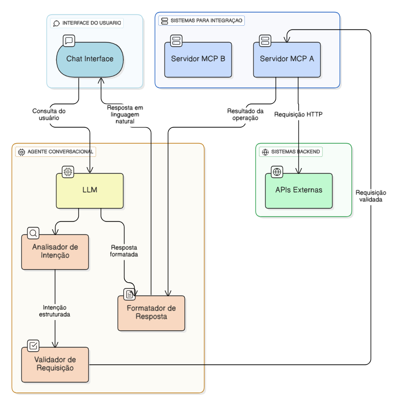
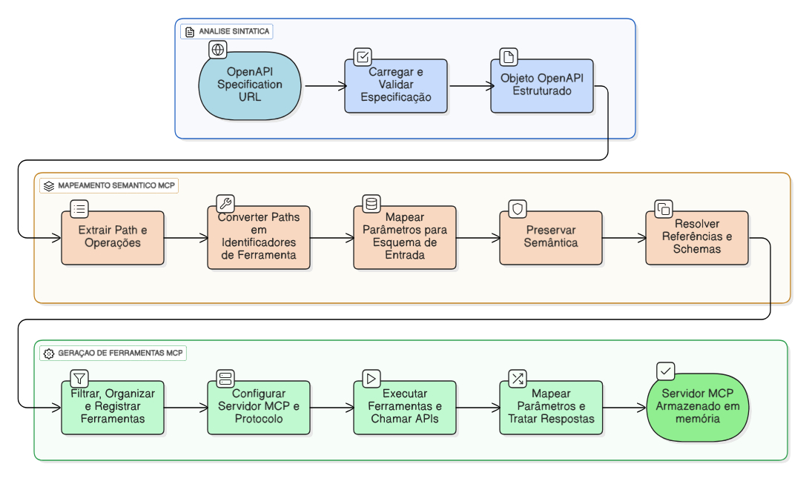
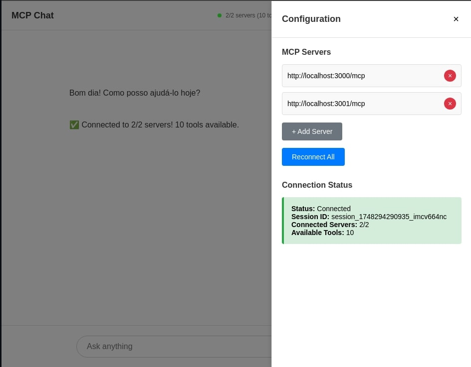
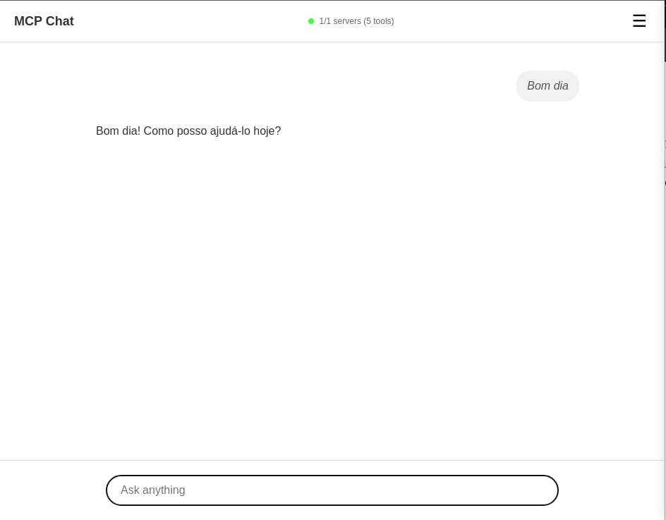
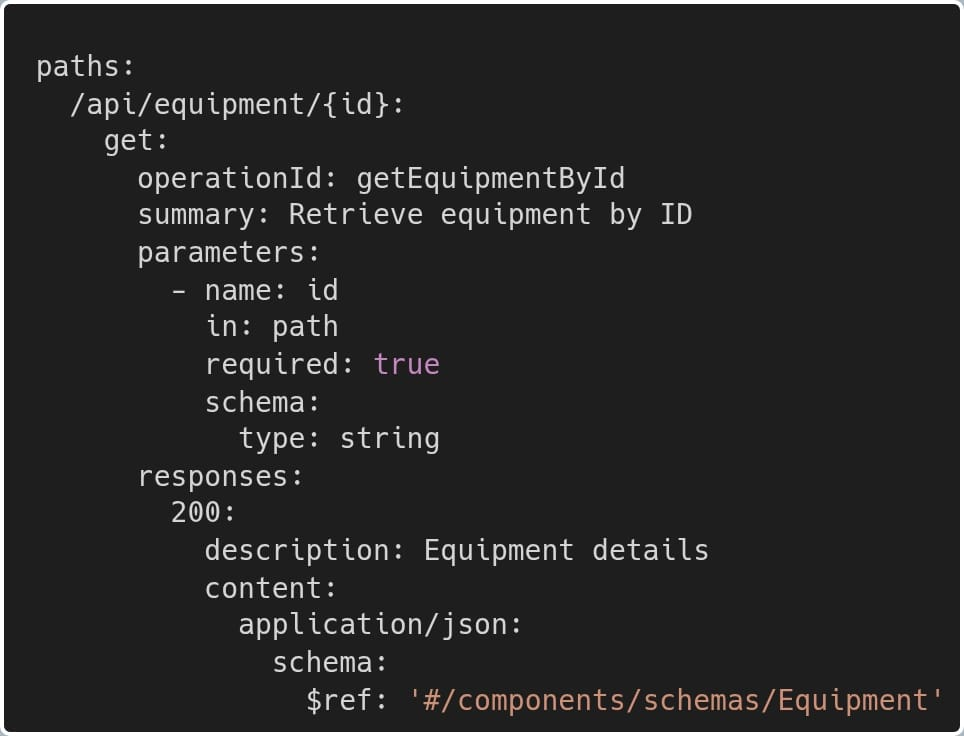
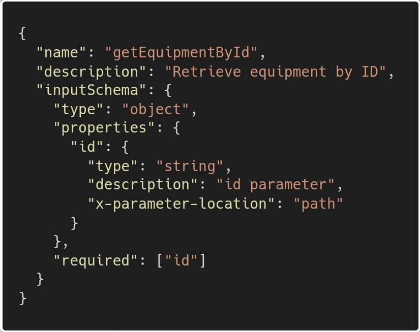
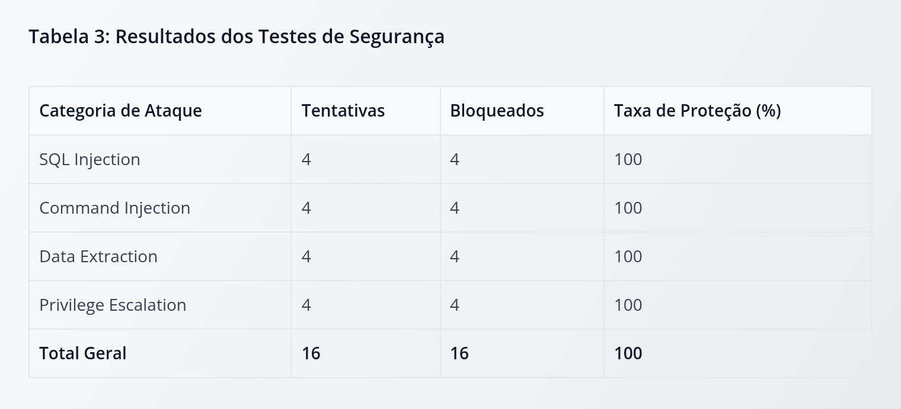

# Presentation Plan

## Editor guidelines
- This should be a exact copy of the content in the PowerPoint presentation, so only content that should be in the presentation should be here.
- The presentation should be in portuguese.
- The presentation should have the ABNT format.
- Slide definitions should be in the following format:
  - **Slide number: title**
    - **Title**
      - Title of the slide.
    - **Content (bullet points, images, tables, etc.):**
      - Bullet points example: (max 4 bullet points)
        - Sub-bullet point 1;
        - Sub-bullet point 2;
        - Sub-bullet point 3;
        - Sub-bullet point 3.
      - Images/Tables example:
        - 
    - **Why:**
      - Why the content is important.
    - **Speech script:**
      - Speech script for the slide.
    - **Speech instructions:**
      - Instructions, emphasis, timing, and delivery guidance.

# Presentation

### **Slide 1: Capa**
- **Title**
  - TRANSFORMANDO APIS EM INTERFACES CONVERSACIONAIS: VALIDAÇÃO DA ABORDAGEM OPENAPI-MCP PARA AGENTES BASEADOS EM IA
- **Content**
  - Orientando: Lucas de Castro Zanoni;
  - Orientador: Prof. Thyerri Fernandes Mezzari;
  - Centro Universitário UniSATC;
  - Criciúma;
  - 2025.
- **Why:**
  - Apresentação padrão para identificar claramente o tópico e participantes.
- **Speech script:**
  - Bom dia a todos. É com grande satisfação que apresento meu Trabalho de Conclusão de Curso intitulado "Transformando APIs em Interfaces Conversacionais: Validação da Abordagem OpenAPI-MCP para Agentes Baseados em IA". Meu nome é Lucas de Castro Zanoni, sou graduando em Engenharia de Software aqui no Centro Universitário UniSATC, em Criciúma. Este trabalho foi desenvolvido sob a orientação do Professor Thyerri Fernandes Mezzari, a quem agradeço pelo apoio e direcionamento durante toda esta jornada de pesquisa. Hoje vou apresentar os resultados de uma investigação experimental que explora como podemos democratizar o acesso a sistemas através de interfaces conversacionais naturais, utilizando um agente conversacional baseado em IA e a combinação inovadora entre especificações OpenAPI (ou mais conhecido como SWAGGER) e o protocolo Model Context Protocol (MCP).
- **Speech instructions:**
  - Cumprimentar a banca e audiência com tom respeitoso e confiante. Pausar após apresentar o título para dar ênfase. Falar o próprio nome claramente e agradecer ao orientador de forma sincera. Enfatizar "democratizar o acesso" e "interfaces conversacionais naturais" como conceitos centrais. Concluir com tom de expectativa positiva para a apresentação.

### **Slide 2: Introdução - Contexto e Problema**
- **Title**
  - Introdução
- **Content**
  - **Contexto:** Crescente complexidade das interfaces digitais modernas (RAPP et al., 2018; KOCABALLI et al., 2019);
  - **Problema:** Barreiras de acessibilidade e usabilidade para usuários (LISTER et al., 2020; DENG et al., 2023);
  - **Oportunidade:** Ascensão dos modelos de linguagem (LLMs) como GPT-4 (OPENAI, 2022; ANTHROPIC, 2024);
  - **Potencial:** Interfaces conversacionais naturais para democratização tecnológica (FAST et al., 2017; GUO et al., 2024);
- **Why:**
  - Estabelece o contexto do problema e justifica a relevância da pesquisa, apresentando a oportunidade tecnológica atual.
- **Speech script:**
  - Como investigado por Rapp, vivemos em uma era de crescente complexidade nas interfaces digitais, onde os sistemas web modernos, embora poderosos, frequentemente criam barreiras significativas para os usuários, especialmente aqueles com necessidades especiais ou menor proficiência tecnológica. Conforme demonstrado por Lister e alguns colegas, essas interfaces apresentam desafios significativos de acessibilidade, enquanto Deng destaca como a crescente complexidade da web dificulta o acesso pleno às suas funcionalidades. Paralelamente, hoje testemunhamos uma revolução com a ascensão das interfaces de conversação com inteligências artificiais, como o Chat GPT e outros que todos utilizamos, que consolidaram interfaces conversacionais como uma realidade robusta e eficaz. Como evidenciado por Fast e sua equipe, agentes conversacionais podem transformar tarefas complexas em interações naturais, e Guo demonstrou como estes sistemas podem melhorar significativamente a usabilidade em ambientes inteligentes. É esta convergência que abre uma oportunidade única para democratizar o acesso a tecnologias complexas através de interfaces naturais em linguagem humana.
- **Speech instructions:**
  - Enfatizar "crescente complexidade" e "barreiras significativas" para destacar o problema. Pausar brevemente após mencionar cada autor para dar credibilidade às afirmações. Pronunciar os nomes dos autores claramente. Concluir com tom inspirador sobre a "oportunidade única".

### **Slide 3: Introdução - Pergunta de Pesquisa**
- **Title**
  - Introdução
- **Content**
  - Como a combinação OpenAPI e MCP pode facilitar a integração de agentes conversacionais baseados em IA com sistemas web existentes?
- **Why:**
  - Apresenta claramente a pergunta central da pesquisa, dando foco e destaque necessário para que a audiência compreenda o objetivo principal do estudo.
- **Speech script:**
  - Esta convergência de oportunidades nos leva à pergunta central desta pesquisa: "Como a combinação da especificação OpenAPI com o protocolo MCP pode facilitar a integração eficiente e segura de agentes conversacionais baseados em IA com sistemas web existentes?" Esta questão condensa o desafio fundamental que a gente busca resolver: criar uma ponte padronizada entre sistemas existentes e a nova geração de interfaces conversacionais, democratizando o acesso a sistemas WEB. Para responder a esta questão, desenvolvemos uma abordagem experimental rigorosa através de uma prova de conceito que vai validar a viabilidade técnica desta integração.
- **Speech instructions:**
  - Pausar antes de apresentar a pergunta para criar expectativa. Ler a pergunta de pesquisa de forma clara e pausada, enfatizando "OpenAPI", "MCP" e "agentes conversacionais". Aumentar o tom na pergunta para destacar sua importância. Enfatizar "prova de conceito" como metodologia de validação.

### **Slide 4: Objetivos**
- **Title**
  - Objetivos
- **Content**
  - **Objetivo Geral:**
    - Investigar viabilidade técnica da abordagem OpenAPI-MCP para democratizar o acesso a sistemas WEB através de agentes conversacionais baseados em IA.
  - **Objetivos Específicos:**
    - Desenvolver um gerador automático de servidores MCP a partir de especificações OpenAPI 3.0+;
    - Implementar um client LLM chat capaz de gerenciar múltiplos servidores simultaneamente;
    - Validar experimentalmente a integração através de métricas de desempenho, segurança e usabilidade.
- **Why:**
  - Define claramente o escopo da pesquisa, estabelece objetivos mensuráveis e específicos, e demonstra a estrutura metodológica para validação experimental da hipótese central.
- **Speech script:**
  - Nossa pesquisa possui um objetivo geral ambicioso de investigar a viabilidade técnica da abordagem OpenAPI-MCP para democratizar o acesso a sistemas WEB. Esta democratização ocorre através da criação de agentes conversacionais baseados em inteligência artificial que permitem aos usuários interagir com sistemas complexos usando linguagem natural. Para alcançar este objetivo geral, definimos três objetivos específicos estruturados. Primeiro, desenvolver um gerador automático de servidores MCP a partir de especificações OpenAPI, eliminando a necessidade de desenvolvimento manual recorrente de integrações. Segundo, implementar um cliente de chat capaz de gerenciar múltiplos servidores MCP simultaneamente, demonstrando a viabilidade da orquestração distribuída de grandes sistemas. Terceiro, validar experimentalmente a integração através de métricas rigorosas de desempenho, segurança e usabilidade, garantindo avaliação científica objetiva. 
- **Speech instructions:**
  - Enfatizar "democratizar" e "linguagem natural" como conceitos centrais. Pausar brevemente após cada objetivo específico numerado.

### **Slide 5: Abordagem Teórica**
- **Title**
  - Abordagem Teórica
- **Content**
  - **Interfaces Conversacionais:** Teoria de interação humano-computador e usabilidade (KOCABALLI et al., 2019; LISTER et al., 2020);
  - **Modelos de Linguagem:** Arquitetura Transformer e function calling (OPENAI, 2023; ANTHROPIC, 2024);
  - **Padronização de APIs:** Especificação OpenAPI 3.0+ para interoperabilidade (OpenAPI Initiative, 2023);
  - **Protocolo MCP:** Comunicação padronizada entre LLMs e sistemas externos (ANTHROPIC, 2024);
  - **Avaliação Experimental:** Frameworks de segurança e testes end-to-end (NIST, 2023; OWASP, 2025).
- **Why:**
  - Estabelece fundamentos teóricos sólidos que sustentam a pesquisa, demonstrando conhecimento das principais teorias e frameworks relevantes para validação científica da abordagem proposta.
- **Speech script:**
  - Nossa pesquisa fundamenta-se em cinco pilares teóricos principais que convergem para viabilizar a integração OpenAPI-MCP. Primeiro, nos baseamos na teoria de interfaces conversacionais e interação humano-computador, conforme estudado por Kocaballi e Lister, que demonstraram como essas interfaces podem melhorar significativamente a usabilidade e acessibilidade de sistemas complexos. Segundo, utilizamos os avanços em modelos de linguagem baseados na arquitetura Transformer, especialmente as capacidades de function calling desenvolvidas pela OpenAI e Anthropic, que permitem conversão automática de linguagem natural em chamadas de função estruturadas. Terceiro, adotamos a especificação OpenAPI como padrão para documentação e interoperabilidade de APIs, amplamente reconhecida pela indústria como solução robusta para contratos de interface. Quarto, implementamos o protocolo MCP, um padrão emergente desenvolvido pela Anthropic que estabelece comunicação padronizada entre modelos de linguagem e sistemas externos, eliminando integrações customizadas. Por fim, aplicamos frameworks estabelecidos de avaliação experimental, incluindo diretrizes de segurança do NIST e OWASP para testes de robustez, além de metodologias de testes end-to-end que garantem validação científica rigorosa dos resultados obtidos.
- **Speech instructions:**
  - Enfatizar cada "pilar teórico" numerado para estruturar claramente a fundamentação. Pausar brevemente após mencionar cada framework/autor para dar credibilidade. Destacar "convergem" para mostrar integração teórica.

## Fundamentação Teórica

### **Slide 6: LLMs e Interfaces Conversacionais**
- **Title**
  - LLMs e Interfaces Conversacionais
- **Content**
  - **Evolução Tecnológica:** BERT (2018) para compreensão textual, GPT-3 (2020) para capacidades generativas;
  - **Arquitetura Transformer:** Base tecnológica que revolucionou o processamento de linguagem natural;
  - **Function Calling:** Conversão automática de linguagem natural em chamadas de funções estruturadas (GPT-4);
  - **Contexto Expandido:** Janelas de até 32.000 tokens para conversas prolongadas e processamento complexo;
- **Why:**
  - Apresenta a evolução histórica e as capacidades técnicas fundamentais dos LLMs que tornam possível a abordagem OpenAPI-MCP, demonstrando como avanços específicos habilitaram interfaces conversacionais robustas.
- **Speech script:**
  - Os modelos de linguagem de grande escala vem passando por uma evolução revolucionária nos últimos anos e estes são alguns dos principais marcos. O BERT, desenvolvido pelo Google em 2018, revolucionou a compreensão textual através de sua arquitetura transformer bidirecional. O GPT-3, lançado em 2020, ampliou dramaticamente as capacidades generativas e introduziu o paradigma de aprendizado com poucos exemplos, conhecido como few-shot learning. O GPT-4 trouxe uma capacidade fundamental para nossa pesquisa: o function calling, que permite conversão automática de instruções em linguagem natural em chamadas de funções estruturadas, possibilitando que o LLM decida interagir com o mundo externo de forma essencial para nossa integração OpenAPI-MCP. A evolução dos contextos expandidos também é notável: enquanto o GPT-4 suporta até 32 mil tokens, os modelos mais recentes de 2025, como GPT-4.1, Claude-4-Sonnet e Gemini-2.5-Pro, podem superar 1 milhão de tokens, permitindo processamento ainda mais complexo. Esses avanços consolidaram os LLMs como interfaces conversacionais robustas e eficazes, capazes de servir como ponte natural entre usuários e sistemas complexos.
- **Speech instructions:**
  - Enfatizar as datas (2018, 2020) para mostrar progressão temporal. Destacar "function calling" como conceito técnico crucial. Pausar após "Transformer" para dar ênfase à importância da arquitetura.

### **Slide 7: OpenAPI**
- **Title**
  - OpenAPI
- **Content**
  - **Padrão da Indústria:** Especificação OpenAPI 3.0+ amplamente adotada para documentação de APIs (OpenAPI, 2023);
  - **Esquemas de Segurança:** Suporte nativo para OAuth, API Key e Bearer Token, essencial para agentes conversacionais;
  - **Documentação Estruturada:** Formato legível por máquina;
  - **Interoperabilidade**: Porta de conexão e documentação entre o mundo externo e sistemas WEB.
- **Why:**
  - Demonstra por que OpenAPI é a escolha técnica ideal para a pesquisa, destacando características específicas que viabilizam a conversão automática para MCP e integração com agentes conversacionais.
- **Speech script:**
  - A especificação OpenAPI representa um dos pilares fundamentais da nossa abordagem de integração. A OpenAPI ou mais conhecido Swagger, consolidou-se como padrão da indústria para documentação estruturada de APIs RESTful, sendo amplamente adotada por empresas e desenvolvedores globalmente. Sua importância para nossa pesquisa reside em características técnicas específicas que a tornam ideal para integração com agentes conversacionais. Primeiro, OpenAPI oferece interoperabilidade excepcional, facilitando a integração entre sistemas heterogêneos através de contratos de interface padronizados que definem precisamente como diferentes sistemas podem se comunicar. Segundo, sua documentação estruturada em formato legível por máquina permite conversão para outros formatos como o ferramentas MCP. Por esses motivos, o OpenAPI se torna uma base técnica sólida para nosso trabalho, onde as especificações existentes são sistematicamente transformadas em servidores MCP funcionais, eliminando desenvolvimento manual recorrente de funções como por exemplo as funções de busca na web e geração de imagens nativas do ChatGPT.
- **Speech instructions:**
  - Enfatizar "padrão da indústria" para destacar a legitimidade técnica. Pausar após enumerar cada característica ("Primeiro", "Segundo", "Por fim") para estruturar claramente os benefícios. Destacar "geração automática" como conceito central da pesquisa.

### **Slide 8: Model Context Protocol**
- **Title**
  - Model Context Protocol (MCP)
- **Content**
  - **Padrão Aberto:** Introduzido pela Anthropic em novembro de 2024 como protocolo de comunicação (ANTHROPIC, 2024);
  - **Arquitetura Cliente-Servidor:** Conecta servidores a clientes que gerenciam a integração com LLMs;
  - **Conversão de Ferramentas:** Cliente converte ferramentas MCP para funcionalidade de function calling dos modelos de linguagem;
  - **Interoperabilidade:** Porta de conexão entre o mundo externo e sistemas de Inteligência artificia.
- **Why:**
  - Explica o protocolo MCP como inovação recente que tornou possível a abordagem da pesquisa, destacando como sua arquitetura padronizada resolve o problema histórico de integrações customizadas entre chats com LLMs e sistemas externos.
- **Speech script:**
  - O protocolo MCP ou Model Context Protocol representa o foco central da viabilidade desta pesquisa. Desenvolvido pela Anthropic e lançado como padrão aberto em novembro de 2024, o MCP surgiu para resolver um problema histórico na integração de aplicações conversacionais com sistemas externos. Antes do MCP, cada integração entre uma aplicação cliente e uma fonte de dados externa requeria desenvolvimento customizado específico de funções, criando barreiras significativas para a integração com sistemas. O MCP introduz uma arquitetura cliente-servidor padronizada onde servidores MCP se conectam a clientes que gerenciam a integração com os modelos de linguagem. Neste ponto, o cliente é responsável por converter as ferramentas MCP para a funcionalidades como a de "function calling" dos LLMs da familia GPT, criando uma ponte padronizada entre sistemas externos e capacidades conversacionais. Esta arquitetura é revolucionária porque permite que qualquer aplicação cliente compatível possa interagir com qualquer servidor MCP sem modificações específicas, facilitando a integração entre diferentes fontes de dados e aplicações sem necessidade de desenvolvimento customizado para cada combinação. Para nossa pesquisa, o MCP serve como fundamento técnico essencial que viabiliza tanto a conversão automática de especificações OpenAPI em servidores MCP funcionais quanto a coordenação eficiente de múltiplos servidores simultaneamente através de nossa aplicação cliente.
- **Speech instructions:**
  - Enfatizar "novembro de 2024" para destacar o quão recente e inovador é o protocolo. Pausar após "problema histórico" para dar ênfase ao desafio que o MCP resolve. Destacar "aplicação cliente" e "conversão de ferramentas" como conceitos centrais da arquitetura.

### **Slide 9: Critérios de Segurança e Usabilidade**
- **Title**
  - Critérios de Segurança e Usabilidade
- **Content**
  - **Segurança - Red Teaming:** Testes adversários incluindo SQL injection, command injection, data extraction e privilege escalation (NIST, 2023; OWASP, 2025);
- **Why:**
  - Estabelece os critérios científicos rigorosos para validação experimental, demonstrando como aspectos críticos de segurança e experiência do usuário são mensurados objetivamente para garantir validade científica dos resultados.
- **Speech script:**
  - Para garantir validação experimental rigorosa, a gente estabelecemos critérios objetivos de avaliação em duas dimensões críticas: segurança e usabilidade. Na dimensão de segurança, implementamos uma abordagem abrangente de red teaming baseada nos frameworks do NIST e OWASP, reconhecidos internacionalmente como padrões para avaliação de segurança em sistemas. 
- **Speech instructions:**
  - Enfatizar "validação experimental rigorosa" e "critérios objetivos" para destacar o rigor científico. Pausar após enumerar cada categoria de ataque para dar clareza. Destacar "NIST e OWASP" como autoridades reconhecidas. Enfatizar "reproduzível" como característica essencial da metodologia científica.

### **Slide 10: Metodologia**
- **Title**
  - Metodologia
- **Content**
  - **Revisão Sistemática:** Consolidação de conhecimentos científicos sobre integração OpenAPI-MCP;
  - **Prova de Conceito:** Desenvolvimento de gerador automático MCP, cliente multi-servidor e aplicações de teste;
  - **Validação Rigorosa:** Testes automatizados end-to-end com Playwright para métricas reproduzíveis sob usabilidade;
  - **Critérios Científicos:** Avaliação de desempenho, segurança e usabilidade.
- **Why:**
  - Estabelece o rigor metodológico científico necessário para validação experimental da hipótese, demonstrando como a pesquisa garante resultados objetivos e reproduzíveis através de instrumentação técnica precisa.
- **Speech script:**
  - Com base na fundamentação teórica, a metodologia foi estruturada para garantir rigor científico e reprodutibilidade dos resultados experimentais. Adotamos uma abordagem experimental estruturada em etapas sequenciais, começando com uma revisão sistemática da literatura para consolidar conhecimentos científicos sobre integração OpenAPI-MCP e embasar teoricamente nossa fase experimental. O núcleo da metodologia consistiu no desenvolvimento de uma prova de conceito abrangente, incluindo quatro componentes principais: primeiro, um gerador automático de servidores MCP a partir de especificações OpenAPI; segundo, um cliente de chat capaz de gerenciar múltiplos servidores simultaneamente; terceiro, aplicações de teste de ponta a ponta para validação da abordagem; e quarto, geração de métricas de avaliação para medir desempenho, segurança e experiência do usuário. Para assegurar resultados objetivos e reproduzíveis, implementamos validação rigorosa através de testes automatizados end-to-end utilizando Playwright, permitindo simulação realista das interações do usuário com coleta automática de dados. Nós estabelecemos critérios científicos específicos para avaliação em três dimensões críticas: desempenho através de métricas de tempo de resposta e taxa de sucesso, segurança através de testes de red teaming, e usabilidade através de métricas quantitativas e qualitativas em escala padronizada.
- **Speech instructions:**
  - Enfatizar "rigor científico" e "reprodutibilidade" como pilares metodológicos fundamentais. Pausar após enumerar cada componente da prova de conceito ("primeiro", "segundo", "terceiro", "quarto") para dar clareza estrutural. Destacar "Playwright" como ferramentas e frameworks reconhecidos.

## Desenvolvimento

### **Slide 11: Arquitetura Geral**
- **Title**
  - Arquitetura Geral
- **Content**
  - 
- **Why:**
  - Demonstra visualmente como os componentes da solução OpenAPI-MCP se integram para formar um sistema coeso, facilitando a compreensão da audiência sobre a complexidade técnica e a elegância da solução proposta.
- **Speech script:**
  - A arquitetura geral do nosso sistema foi projetada seguindo princípios de modularidade e separação de responsabilidades para garantir escalabilidade e manutenibilidade. Como podemos observar no diagrama, nossa solução é estruturada em múltiplas camadas que trabalham de forma integrada para responder às consultas feitas pelo usuário em linguagem natural. O fluxo de dados inicia na interface de Chat, que captura as consultas do usuário e as encaminha para o backend. Este backend atua como orquestrador central, gerenciando a comunicação com o modelo de linguagem GPT-4, que por sua vez utiliza sua capacidade de function calling para interpretar a intenção do usuário e determinar quais ferramentas devem ser utilizadas. Os servidores MCP, gerados automaticamente a partir das especificações OpenAPI, servem como ponte padronizada entre o modelo de linguagem e os sistemas externos, executando as operações solicitadas via APIs REST conforme as especificações OpenAPI originais. A arquitetura modular permite isolamento completo de responsabilidades, onde cada componente pode ser instrumentado, testado e mantido de forma independente, facilitando tanto o desenvolvimento quanto a operação em ambiente de produção. 
- **Speech instructions:**
  - Referir-se ao diagrama durante toda a explicação, apontando para os componentes conforme mencionados. Enfatizar "modularidade" e "separação de responsabilidades" como princípios arquiteturais fundamentais. Pausar após descrever cada camada do fluxo de dados para dar clareza. Destacar "function calling" e "especificações OpenAPI" como tecnologias-chave.

### **Slide 12: Gerador Automático MCP**
- **Title**
  - Gerador Automático MCP
- **Content**
  - 
- **Why:**
  - Demonstra visualmente o núcleo metodológico da contribuição científica proposta, mostrando como especificações OpenAPI são sistematicamente convertidas em servidores MCP funcionais através de três camadas funcionais bem definidas.
- **Speech script:**
  - O gerador automático de servidores MCP representa o núcleo metodológico da nossa contribuição científica, desenvolvido para abordar o principal desafio de padronização de integrações heterogêneas de APIs. Como podemos observar no diagrama, a arquitetura foi estruturada em três camadas funcionais. A primeira camada, denominada Análise Sintática ou Parsing, é responsável pela extração e validação de metadados de endpoints a partir de especificações OpenAPI, incluindo validação de conformidade com o padrão estabelecido, resolução de schemas referenciados externamente e preparação dos dados para processamento. A segunda camada, Mapeamento Semântico MCP, realiza a conversão de operações OpenAPI para ferramentas MCP, preservando a semântica original das operações enquanto adiciona metadados necessários para o protocolo, como informações de roteamento e parâmetros. A terceira camada, Geração de Ferramentas MCP, materializa o processo através da produção de servidores MCP armazenados em memória, prontos para serem utilizados por clientes MCP. Esta abordagem metodológica atende diretamente ao nosso primeiro objetivo específico de desenvolver um gerador automático de servidores MCP, estabelecendo um processo sistemático e reproduzível para conversão de especificações OpenAPI em ferramentas MCP.
- **Speech instructions:**
  - Referir-se constantemente ao diagrama, apontando para cada camada conforme mencionada. Enfatizar "núcleo metodológico" e "contribuição científica" para destacar a importância. Pausar após descrever cada camada ("primeira camada", "segunda camada", "terceira camada") para dar clareza estrutural. Destacar "sistemático e reproduzível" como características científicas fundamentais.

### **Slide 13: Cliente Multi-servidor MCP**
- **Title**
  - Cliente Multi-servidor MCP
- **Content**
  - 
- **Why:**
  - Demonstra visualmente a implementação metodológica do segundo objetivo específico da pesquisa, mostrando como a orquestração simultânea de múltiplos servidores MCP é viabilizada através de descoberta automática, roteamento inteligente e configuração dinâmica em ambiente conversacional.
- **Speech script:**
  - O cliente de chat multi-servidor representa a implementação metodológica do nosso segundo objetivo específico, desenvolvido como forma de validação experimental para demonstrar a viabilidade prática da orquestração simultânea de múltiplos servidores MCP. Nossa solução metodológica implementou um sistema de coordenação baseado em descoberta automática de ferramentas, criando um inventário dinâmico das funcionalidades acessíveis em cada servidor. O roteamento inteligente utiliza a análise do LLM para determinar qual servidor utilizar baseado nas ferramentas disponíveis e na natureza da solicitação, enquanto o mecanismo de agregação de resultados permite combinar informações de múltiplos servidores quando necessário, permitindo que múltiplas ferramentas sejam executadas em uma única consulta. A arquitetura de configuração foi concebida para proporcionar flexibilidade operacional através de mecanismos dinâmicos de adição e remoção de servidores, eliminando a necessidade de reinicialização do sistema durante modificações nos servidores, como adição de novos endpoints e ferramentas. A arquitetura suporta visualização em tempo real do estado dos servidores ativos, possibilitando monitoramento contínuo da saúde do sistema e identificação proativa de potenciais problemas de conectividade.
- **Speech instructions:**
  - Referir-se constantemente à interface de configuração mostrada no diagrama. Enfatizar "segundo objetivo específico" para conectar com os objetivos da pesquisa. Pausar após "sistemas distribuídos e coordenação de agentes" para destacar a complexidade teórica. Destacar "descoberta automática" e "roteamento inteligente" como inovações técnicas centrais. Enfatizar "flexibilidade operacional" e "dinâmicos" para mostrar as vantagens práticas da solução. Apontar para elementos específicos da interface conforme mencionados.

### **Slide 14: Interface Experimental**
- **Title**
  - Interface Experimental
- **Content**
  - 
- **Why:**
  - Demonstra visualmente o elemento metodológico essencial para controle rigoroso das variáveis experimentais, mostrando como a padronização da interface elimina diferenças de experiência do usuário que poderiam contaminar os resultados e garantir que as diferenças observadas sejam atribuíveis exclusivamente às tecnologias de integração testadas.
- **Speech script:**
  - A interface experimental representa um elemento metodológico essencial para assegurar a validade científica e reprodutibilidade dos nossos experimentos. A simplicidade da interface garante que as medições feitas por testes end-to-end sejam influenciadas apenas pelos componentes de integração, minimizando o impacto de fatores externos como frameworks de UI ou desings complexos. Como podemos observar na interface, desenvolvemos uma aplicação web simples de chat utilizando HTML e JavaScript, projetada de forma minimalista para proporcionar uma experiência consistente e objetiva. A interface é composta por uma seção principal que exibe o histórico de mensagens, onde as interações entre usuário e o agente aparecem de forma intercalada: as mensagens do agente são exibidas à esquerda e as do usuário à direita. Abaixo do histórico, há um campo de entrada de texto que permite ao usuário digitar e enviar novas consultas. A comunicação entre frontend e backend é estabelecida por meio de uma API REST síncrona invés de utilizar streaming de novas palavras. Isso simplifica o processo de envio e retorno de mensagens, mantendo o fluxo de comunicação claro e previsível para instrumentação científica precisa.
- **Speech instructions:**
  - Referir-se constantemente à interface mostrada na imagem, apontando para elementos específicos conforme mencionados. Enfatizar "elemento metodológico essencial" e "validade científica" para destacar a importância metodológica. Pausar após "variáveis experimentais" para dar ênfase ao rigor científico. Destacar "padronização" e "minimalista" como princípios de design científico. Apontar para a separação visual entre mensagens do usuário (direita) e agente (esquerda) conforme descrito. Enfatizar "instrumentação científica precisa" para conectar com os objetivos de validação experimental.

### **Slide 15: Demonstração do Sistema**
- **Title**
  - Demonstração do Sistema
- **Content**
  - **Demonstração Completa do Workflow:**
    - 
  - **Fluxo Demonstrado:**
    - **Consulta Inicial:** Verificação de equipamento existente no Swagger → Pergunta conversacional sobre o equipamento;
    - **Modificação:** Alteração do nome do equipamento via linguagem natural → Confirmação de persistência no Swagger;
    - **Simulação de Desenvolvimento:** Execução de novo serviço no terminal (npm start professionals-api) → Serviço disponível;
    - **Integração Dinâmica:** Adição do servidor MCP de profissionais → Configuração simples e rápida;
    - **Operações CRUD:** Consulta por profissional → Exclusão via chat → Verificação final no Swagger.
- **Why:**
  - Demonstra o ciclo completo desde desenvolvimento até integração, mostrando como um novo serviço pode ser facilmente incorporado ao sistema conversacional, validando empiricamente a simplicidade de integração, a viabilidade técnica, persistência de dados e capacidade de orquestração multi-servidor em um fluxo realista que comprova a aplicabilidade prática da abordagem OpenAPI-MCP.
- **Speech script:**
  - Agora vou demonstrar o sistema funcionando de forma completa através de um fluxo contínuo que simula um cenário real de desenvolvimento e integração. A demonstração inicia mostrando um equipamento já existente na aplicação pelo Swagger UI, estabelecendo o estado inicial dos dados. Em seguida, fazemos uma consulta conversacional sobre esse equipamento - o sistema interpreta a linguagem natural, acessa o servidor MCP gerado automaticamente, executa a consulta na API e retorna uma descrição detalhada em linguagem natural, demonstrando como nossa abordagem elimina barreiras técnicas para acesso aos dados. Na sequência, solicitamos uma modificação no nome do equipamento através de linguagem natural - observe como o sistema compreende a intenção, executa a operação de atualização e confirma o sucesso. Verificamos imediatamente na aplicação que a alteração foi efetivamente persistida, comprovando que nossa solução executa transações reais mantendo integridade total com as especificações OpenAPI originais. Agora vem uma parte crucial que simula um cenário real de desenvolvimento: executamos um novo serviço no terminal simulando exatamente o que aconteceria quando um desenvolvedor cria um novo sistema e o torna disponível. Este passo é fundamental porque mostra que nosso sistema pode integrar serviços desenvolvidos independentemente. Em seguida, demonstramos como é simples adicionar este novo serviço ao nosso cliente MCP - apenas configuramos o endpoint e imediatamente o sistema reconhece e disponibiliza as novas funcionalidades. Testamos imediatamente a nova funcionalidade consultando informações sobre um profissional, validando que o servidor foi corretamente integrado e está operacional sem necessidade de reinicialização ou desenvolvimento adicional. Por fim, demonstramos uma operação de exclusão via conversa natural, seguida pela verificação na aplicação para confirmar que o registro foi removido. Esta demonstração completa valida empiricamente todos os aspectos da pesquisa: desde a geração automática até a integração dinâmica de novos serviços.
- **Speech instructions:**
  - Permitir que o GIF rode completamente sem interrupção inicialmente, depois comentar as seções conforme se repetem. Enfatizar "cenário real de desenvolvimento" para mostrar aplicabilidade prática. Pausar após executar o serviço no terminal para destacar a importância deste passo. Destacar "facilidade de integração" e "sem reinicialização" como vantagens técnicas centrais. Enfatizar "npm start" como comando familiar aos desenvolvedores. Concluir com ênfase em "resolve problemas reais" para conectar com impacto prático.

### **Slide 16: Exemplo de Conversão OpenAPI→MCP**
- **Title**
  - Exemplo de Conversão OpenAPI→MCP
- **Content**
  - 
  - 
- **Why:**
  - Demonstra visualmente e concretamente como o processo de conversão automática preserva a integridade semântica da operação OpenAPI original, mostrando a transformação sistemática de contratos de API em ferramentas compreensíveis por modelos de linguagem através do mapeamento preciso de parâmetros, esquemas e metadados.
- **Speech script:**
  - Para demonstrar concretamente como nossa abordagem funciona na prática, apresentamos um exemplo real de conversão OpenAPI para MCP utilizando um endpoint de busca de equipamento por ID. Na primeira imagem, observamos a especificação OpenAPI original que define um endpoint GET para recuperar informações de um equipamento específico. Esta especificação inclui elementos fundamentais como o parâmetro 'id' do tipo número e sua localização. Na segunda imagem, vemos a ferramenta MCP correspondente gerada automaticamente pelo nosso sistema. O processo de conversão preservou completamente a semântica da operação original, transformando a especificação OpenAPI em uma ferramenta estruturada que o modelo de linguagem pode compreender e utilizar. A ferramenta MCP mantém informações essenciais como o nome da operação, descrição clara da funcionalidade, e o esquema de entrada que especifica precisamente quais parâmetros são esperados e como devem ser formatados. Esta estrutura permite que o modelo de linguagem GPT-4 compreenda exatamente quais parâmetros são necessários e como devem ser validados, habilitando a escolha e uso corretos da função a partir de instruções em linguagem natural. O processo de conversão realizou resolução automática de esquemas complexos, garantindo que a ferramenta gerada estivesse no formato válido para o protocolo MCP e contivesse todos os parâmetros necessários para execução correta da operação. Como podemos observar, o sistema de roteamento pode direcionar corretamente os valores durante a execução, mantendo total fidelidade à especificação original enquanto torna a funcionalidade acessível através de interface conversacional natural.
- **Speech instructions:**
  - Referir-se constantemente às duas imagens, apontando para elementos específicos conforme mencionados. Enfatizar "concretamente" e "exemplo real" para destacar a natureza prática da demonstração. Pausar após descrever cada imagem ("primeira imagem", "segunda imagem") para dar clareza. Destacar "preservou completamente a semântica" como garantia técnica fundamental. Enfatizar "resolução automática" e "total fidelidade" como características técnicas centrais da conversão.

### **Slide 17: Resultados Técnicos**
- **Title**
  - Resultados de Performance
- **Content**
  - 
- **Why:**
  - Apresenta evidências quantitativas objetivas da viabilidade operacional do sistema OpenAPI-MCP, demonstrando transparência científica sobre tanto os sucessos quanto as limitações identificadas durante a validação experimental.
- **Speech script:**
  - Os resultados de performance obtidos através de testes automatizados end-to-end forneceram evidências quantitativas objetivas sobre a viabilidade operacional do sistema OpenAPI-MCP em condições controladas. Como podemos observar na Tabela 1, nossa validação experimental processou 8 consultas diversificadas, alcançando uma taxa de sucesso de 100%, demonstrando que todas as operações foram completadas com êxito. O tempo médio de resposta foi de 3.757 segundos, incluindo todo o processamento do modelo de linguagem GPT-4, desde a interpretação da consulta até a formatação da resposta final. O tamanho médio das respostas foi de 312 caracteres, indicando que o sistema forneceu informações completas e estruturadas aos usuários. No entanto, é fundamental destacar uma limitação relevante identificada: a variação significativa de tempo de resposta, que oscilou entre 1.335 segundos e 5.823 segundos, representando uma variabilidade de 336%. Esta variabilidade refletiu principalmente a complexidade das consultas processadas e o tempo de processamento do modelo de linguagem, não indicando necessariamente instabilidade do sistema de integração. É importante contextualizar estes resultados dentro do escopo de uma prova de conceito experimental, onde o foco principal residiu principalmente em demonstrar a viabilidade técnica da abordagem proposta. A variabilidade de performance observada foi esperada e aceitável nesta fase inicial de validação. Os dados obtidos sugeriram que a integração OpenAPI-MCP é tecnicamente viável para cenários onde a precisão é prioritária em relação à velocidade consistente, fornecendo evidências iniciais promissoras para o desenvolvimento de soluções mais robustas. 
- **Speech instructions:**
  - Referir-se constantemente à tabela mostrada na imagem, apontando para métricas específicas conforme mencionadas. Enfatizar "evidências quantitativas objetivas" para destacar o rigor científico. Pausar após mencionar cada métrica principal (taxa de sucesso, tempo médio, tamanho médio) para dar clareza. Destacar "limitação relevante" ao mencionar a variabilidade para mostrar transparência científica. Enfatizar "336%" para mostrar a magnitude da variação. Destacar "prova de conceito experimental" para contextualizar adequadamente o escopo. Enfatizar "precisão prioritária" como característica identificada da solução.

### **Slide 18: Resultados de Usabilidade**
- **Title**
  - Resultados de Usabilidade
- **Content**
  - 
- **Why:**
  - Apresenta evidências quantitativas objetivas da experiência do usuário através de 13 cenários de teste estruturados com métricas padronizadas, demonstrando que a interface conversacional OpenAPI-MCP proporcionou experiência satisfatória com pontuação geral de 4,0/5,0 e destacando a utilidade das informações (4,3) como ponto forte da solução.
- **Speech script:**
  - A avaliação de experiência do usuário constituiu uma dimensão fundamental da nossa validação experimental, conduzida através de 13 cenários de teste estruturados com métricas padronizadas em escala de 1 a 5. Como podemos observar na Tabela 2, os resultados indicaram experiência do usuário satisfatória, com pontuação geral de 4,0 em escala de 1 a 5, demonstrando que nossa interface conversacional OpenAPI-MCP efetivamente atendeu às expectativas dos usuários. A análise detalhada das métricas revela aspectos importantes sobre a qualidade da interação. A precisão das respostas obteve pontuação de 3,5 com desvio de ±0,5, indicando interpretação correta das intenções dos usuários na maioria dos casos, embora com espaço para melhorias na compreensão de consultas mais complexas. A clareza da comunicação alcançou 4,0 com desvio de ±0,3, confirmando que a interface conversacional apresentou informações de forma bem estruturada e compreensível aos usuários. O destaque principal foi a utilidade das informações, que emergiu como ponto forte com pontuação de 4,3 e desvio de ±0,4, demonstrando que o sistema forneceu respostas relevantes que efetivamente se relacionam as intenções do usuário. A taxa de sucesso manteve-se em 100%, com todas as 13 consultas sendo respondidas adequadamente, validando a robustez operacional da solução. O tempo médio de resposta foi de 4.861 segundos com desvio de ±2.400, indicando responsividade adequada embora com variabilidade que reflete a complexidade das consultas processadas. Estes resultados confirmam que a abordagem proporciona uma experiência do usuário satisfatória.
- **Speech instructions:**
  - Referir-se constantemente à tabela mostrada na imagem, apontando para métricas específicas conforme mencionadas. Enfatizar "13 cenários de teste estruturados" e "métricas padronizadas" para destacar o rigor metodológico. Pausar após mencionar cada métrica principal (precisão, clareza, utilidade) para dar clareza. Destacar "4,3 para utilidade das informações" como ponto forte principal. Enfatizar "100% de taxa de sucesso" para mostrar robustez. Destacar "experiência satisfatória" e "4,0/5,0" como resultado geral positivo. Enfatizar "evidências empíricas" para conectar com a validação científica.

### **Slide 19: Resultados de Segurança**
- **Title**
  - Resultados de Segurança
- **Content**
  - 
- **Why:**
  - Demonstra a robustez da abordagem OpenAPI-MCP contra vetores de ataque fundamentais através de testes sistemáticos de red teaming, validando a eficácia da proteção em múltiplas camadas tanto no nível do LLM quanto na validação via schemas OpenAPI.
- **Speech script:**
  - A análise de segurança constituiu uma dimensão crítica da nossa validação experimental, conduzida através de 16 cenários de ataque estruturados em 4 categorias principais de red teaming. Como podemos observar na tabela, nossa implementação demonstrou proteção básica inicial satisfatória contra todos os vetores de ataque fundamentais testados. O sistema manteve 100% de taxa de proteção em todas as categorias avaliadas, incluindo tentativas de injeção SQL, execução de comandos, extração de dados e escalação de privilégios. Na categoria de SQL Injection, testamos 4 tentativas diferentes incluindo ataques básicos e injeção por comentários, todas efetivamente bloqueadas pelo sistema. Para Command Injection, avaliamos tentativas de execução de comandos do sistema, leitura de arquivos, encadeamento de comandos e execução em background, novamente com 100% de proteção. Os testes de Data Extraction incluíram solicitações de credenciais, configurações do sistema, dados de usuários e tokens secretos, todos adequadamente rejeitados. Por fim, os ataques de Privilege Escalation testaram tentativas de obter acesso administrativo, mudança de papéis e override de segurança, mantendo proteção completa. A validação baseada em schemas OpenAPI comprovou-se eficaz como primeira linha de defesa contra tentativas de intrusão básicas. É fundamental destacar que os testes realizados abrangeram exclusivamente ataques básicos e cenários de segurança fundamentais, não incluindo ameaças avançadas ou ataques persistentes sofisticados. Adicionalmente, a maioria dos LLMs modernos já incorpora mecanismos internos de proteção contra ataques básicos de injeção de prompts e tentativas de jailbreak, contribuindo para os resultados positivos observados. Esta proteção em múltiplas camadas - tanto no nível do LLM quanto na validação via schemas OpenAPI - demonstrou a robustez da abordagem, embora pesquisas futuras devam investigar ameaças mais sofisticadas.
- **Speech instructions:**
  - Referir-se constantemente à tabela, apontando para cada categoria de ataque conforme mencionada. Enfatizar "16 cenários de ataque" e "4 categorias principais" para mostrar abrangência dos testes. Destacar "100% de taxa de proteção" como resultado principal. Pausar após descrever cada categoria (SQL Injection, Command Injection, Data Extraction, Privilege Escalation) para dar clareza. Enfatizar "proteção em múltiplas camadas" como característica técnica importante. Destacar "ataques básicos" para contextualizar adequadamente o escopo dos testes. Enfatizar "evidências iniciais encorajadoras" para mostrar o valor científico dos resultados.

## Considerações Finais

### **Slide 20: Considerações Finais**
- **Title**
  - Considerações Finais
- **Content**
  - **Pergunta de Pesquisa Respondida:** "Como a combinação OpenAPI-MCP pode facilitar integração eficiente e segura?" - Validada positivamente através de evidências quantitativas;
  - **Viabilidade Técnica Confirmada:** Conversão automática OpenAPI→MCP alcançou 100% de sucesso (10/10 endpoints), eliminando desenvolvimento manual recorrente;
  - **Contribuição Científica:** Primeira validação experimental sistemática da integração OpenAPI-MCP com metodologia reproduzível e métricas objetivas;
  - **Limitações Identificadas:** Variabilidade de performance (336%), escopo experimental restrito e necessidade de testes de segurança mais abrangentes;
  - **Direções Futuras:** Base sólida estabelecida para pesquisas em maior escala, otimizações de performance e validação empresarial.
- **Why:**
  - Consolida os principais achados da pesquisa, responde definitivamente à pergunta central, destaca as contribuições científicas e práticas, reconhece limitações com transparência científica e estabelece direções claras para trabalhos futuros.
- **Speech script:**
  - Chegamos ao final desta apresentação com resultados que confirmam de forma categórica nossa hipótese central de pesquisa. A pergunta que norteou todo nosso trabalho - "Como a combinação da especificação OpenAPI com o protocolo MCP pode facilitar a integração eficiente e segura de agentes conversacionais baseados em IA com sistemas web existentes?" - foi respondida positivamente através de evidências quantitativas obtidas em nossa validação experimental além de confirmarmos a viabilidade técnica da abordagem de forma inequívoca: nossa conversão automática OpenAPI para MCP alcançou 100% de eficácia, com todos os endpoints testados sendo convertidos com sucesso, confirmando que é possível eliminar completamente o desenvolvimento manual recorrente tradicionalmente necessário para cada nova integração. Nossa contribuição científica principal reside em ser a primeira validação experimental sistemática da integração OpenAPI-MCP, estabelecendo uma metodologia reproduzível com métricas objetivas que servirá como base para pesquisas futuras na área. Demonstramos concretamente o potencial de democratização tecnológica: através de interfaces conversacionais naturais, conseguimos tornar sistemas WEB acessíveis a usuários que podem interagir com eles usando simplesmente linguagem natural, eliminando barreiras tradicionais de complexidade. É fundamental reconhecer as limitações identificadas durante nossa pesquisa, mantendo transparência científica. A variabilidade de performance de 336% nos tempos de resposta indica necessidade de otimizações futuras, nosso escopo experimental foi deliberadamente restrito para validação inicial, e nossos testes de segurança abrangeram apenas ataques básicos, requerendo avaliações mais abrangentes contra ameaças sofisticadas. Apesar dessas limitações, estabelecemos uma base sólida e promissora para pesquisas futuras. Criamos fundamentos metodológicos e técnicos que abrem caminho para investigações em maior escala, desenvolvimento de otimizações de performance e validação em ambientes complexos. Esta pesquisa representa um avanço significativo na integração entre sistemas existentes e modelos de linguagem, abrindo portas para uma transformação fundamental na forma como humanos interagem com sistemas, tornando-as acessíveis através de conversação natural.
- **Speech instructions:**
  - Enfatizar "confirmam de forma categórica" para destacar a solidez dos resultados. Pausar após a pergunta de pesquisa para dar ênfase. Destacar "100% de eficácia" e "primeira validação experimental sistemática" como conquistas principais. Enfatizar "democratização tecnológica" como impacto transformador. Destacar "transparência científica" ao abordar limitações. Enfatizar "base sólida e promissora" para mostrar o valor duradouro da contribuição. Concluir com tom inspirador sobre "transformação fundamental".

### **Slide 21: Referências Bibliográficas**
- **Title**
  - Referências Bibliográficas
- **Content**
  - ANTHROPIC. **Model Context Protocol (MCP): A Standard for AI Context Integration**. 2024. Disponível em: <https://www.anthropic.com/news/model-context-protocol>. Acesso em: 12 abr. 2025;
  - DENG, X. A More Accessible Web with Natural Language Interface. **Proceedings of the 20th International Web for All Conference**, 2023;
  - FAST, E. et al. **Iris: A Conversational Agent for Complex Tasks**. 2017. Disponível em: <https://arxiv.org/abs/1707.05015>. Acesso em: 15 jan. 2025;
  - GUO, S. et al. Collaborating with my Doppelgänger: The Effects of Self-similar Appearance and Voice of a Virtual Character during a Jigsaw Puzzle Co-solving Task. **Proceedings of the ACM on Computer Graphics and Interactive Techniques**, 2024;
  - KOCABALLI, A. B. et al. The Personalization of Conversational Agents in Health Care: Systematic Review. **Journal of Medical Internet Research**, v. 21, n. 11, p. e15360, 2019;
  - LISTER, K. et al. Accessible conversational user interfaces: considerations for design. **Proceedings of the 17th International Web for All Conference**, 2020;
  - OPENAI. **GPT-4 Technical Report**. 2023. Disponível em: <https://arxiv.org/abs/2303.08774>. Acesso em: 10 jan. 2025;
  - RAPP, A. et al. Designing technology for spatial needs: Routines, control and social competences of people with autism. **International Journal of Human-Computer Studies**, v. 120, p. 49-65, 2018.
- **Why:**
  - Demonstra rigor acadêmico através da apresentação das principais referências bibliográficas que fundamentaram a pesquisa, seguindo padrões ABNT e destacando a base científica sólida do trabalho sem sobrecarregar a audiência com todas as referências.
- **Speech script:**
  - Nossa pesquisa se apoiou em uma base bibliográfica sólida e diversificada, abordando acessibilidade, interfaces conversacionais, personalização de agentes e protocolos de integração, com destaque para os trabalhos da Anthropic, OpenAI, Deng, Lister, Fast, Guo, Kocaballi e Rapp, que fundamentaram tanto o embasamento teórico quanto as soluções técnicas aplicadas. 
- **Speech instructions:**
  - Enfatizar "base bibliográfica sólida e diversificada" para destacar o rigor acadêmico. Destacar "Anthropic", "OpenAI" e outros nomes de organizações para mostrar a relevância das fontes.

### **Slide 22: Capa Final**
- **Title**
  - TRANSFORMANDO APIS EM INTERFACES CONVERSACIONAIS: VALIDAÇÃO DA ABORDAGEM OPENAPI-MCP PARA AGENTES BASEADOS EM IA
- **Content**
  - Orientando: Lucas de Castro Zanoni;
  - Orientador: Prof. Thyerri Fernandes Mezzari;
  - Centro Universitário UniSATC;
  - Criciúma;
  - 2025.
- **Why:**
  - Duplicação do slide de capa para formalidade acadêmica padrão.
- **Speech script:**
  - Gostaria de agradecer novamente ao Professor Thyerri Fernandes Mezzari pela orientação durante todo este processo, ao Centro Universitário UniSATC pelo suporte institucional, e a todos os presentes pela atenção dispensada. Esta pesquisa abre portas para uma transformação fundamental na forma como usuários interagem com sistemas, tornando-as acessíveis através de conversação natural. Estou à disposição para responder às perguntas da banca e discutir os aspectos técnicos e científicos apresentados. Muito obrigado pela atenção de todos.
- **Speech instructions:**
  - Agradecer de forma sincera e específica ao orientador e instituição. Destacar "transformação fundamental" como impacto futuro. Concluir com disponibilidade respeitosa para perguntas e agradecimento final caloroso.
